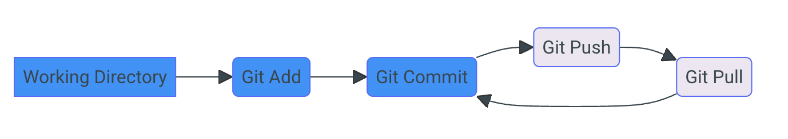

--- 

# **S**ource **C**ontrol **M**anagement

Outil qui permet de suivre les modifications apportées à une collection de fichiers.

Le terme **V**ersion **C**ontrol **S**ystem (VCS) est parfois utilisé.

---

# Objectifs d'un SCM

- Suivre les modifications apportées à un projet (quand, qui)
- Inclure un message descriptif pour chaque modification pour expliquer le pourquoi
- Permettre de revenir à une version antérieure du projet ou d'un fichier
- Travailler en parallèle sur différentes branches de développement (__feature__, __bugfix__...) par des personnes différentes sans affecter la branche principale (__main__, __develop__...)
- Marquer des versions stables du projet (__release__)

---

# **D**istributed **V**ersion **C**ontrol **S**ystem

- Système de gestion de version distribué
- Chaque utilisateur possède une copie complète de l'historique du projet
- Permet de travailler en local sans connexion à un serveur contrairement aux anciens systèmes de gestion de version centralisés (CVS, Subversion), qui nécessitent une connexion permanente au serveur

---
# **G**it - https://git-scm.com/

- Système de gestion de version distribué créé par Linus Torvalds en 2005, le créateur de Linux
- Rapide, simple, léger, performant, open source
- Utilisé par de nombreux projets open source et en entreprise
- Services en ligne (GitHub, GitLab, Bitbucket, Azure DevOps) viennent ajouter des fonctionnalités (gestion de projet, CI/CD, wiki, issues, pull requests...)
- Intégration dans les IDEs (VSCode, IntelliJ, Eclipse...)

---


Comparaison entre **git**, **mercurial** et **subversion** en terme de recherche Google depuis 2004

Source : https://www.google.com/trends/explore?date=all&q=git,mercurial,subversion

---

# **G**it - installation

Afin de vérifier que **git** est bien installé, ouvrir un terminal et taper la commande `git --version`

Si **git** n'est pas installé, télécharger et installer la dernière version depuis le site officiel :

- Windows : https://git-scm.com/download/win
- MacOS : https://git-scm.com/download/mac

---

# **G**it - configuration 1/2

Avant de commencer à utiliser **git**, il est nécessaire de configurer son identité :

```bash
git config --global user.name "<USER_NAME>"
git config --global user.email "<USER_EMAIL>"
```

Ces informations seront utilisées pour chaque **commit**. Il est possible de les surcharger pour un projet spécifique en utilisant la commande `git config` sans l'option `--global`.

---

# **G**it - configuration 2/2

Il est possible de configurer d'autres options, comme l'éditeur de texte utilisé pour les messages de **commit** :

```bash
git config --global core.editor "code --wait"
```

Pour vérifier la configuration actuelle, utiliser la commande `git config --list`

---
# **G**it - initialisation

Pour initialiser un nouveau **repository** **git** dans un répertoire existant, utiliser la commande `git init` :

```bash
cd /path/to/your/project
git init
git checkout -b main
```

La commande `git checkout -b main` permet de créer une nouvelle branche appelée **main**. Cette branche est créée par défaut depuis **git** 2.28.0. Avant cette version, la branche par défaut s'appelait **master**.

---

# **G**it - initialisation (suite)

Cela va créer un répertoire caché `.git` qui contiendra l'historique des modifications et les informations nécessaires pour suivre les modifications apportées au projet.

```bash
Initialized empty Git repository in /private/tmp/Cats/.git/
Switched to a new branch 'main'
```

```bash
ls -a
. .. .git
```
---

# **G**it - initialisation (suite)

Contient les informations nécessaires pour suivre les modifications apportées au projet.

```bash
ls -la .git
.  ..  HEAD  config  description  hooks  info  objects  refs
```
---

# **G**it - Aide

Pour obtenir de l'aide sur une commande **git**, utiliser la commande `git help <command>` ou `git <command> --help`

```bash
git help status
```
Donne accès à la documentation de la commande `git status`

---

# **G**it - status

La commande `git status` permet de voir l'état actuel du **repository** **git**.

```bash
git status
```

```bash
On branch main

No commits yet

nothing to commit (create/copy files and use "git add" to track)
```

---

# **G**it - terminologie

- **Working tree** : répertoire de travail, contient les fichiers du projet
- **Staging area** : zone de transit, contient les fichiers qui seront inclus dans le prochain **commit**
- **commit** : enregistrement des modifications dans l'historique du projet

---

# **G**it - cycle de vie des fichiers

Le cas d'usage basique de git est de modifier des fichiers en local, puis de les envoyer vers un dépôt distant. Il est ensuite possible de récupérer les modifications du dépôt distant en local.



---

# **G**it - cycle de vie des fichiers (suite)

- Les fichiers sont modifiés en local, puis ajoutés à l'index avec la commande `git add`
- Les fichiers de l'index sont commités avec la commande `git commit` 
- Les commits sont ensuite envoyés vers le dépôt distant avec la commande `git push` 
- Les commits du dépôt distant sont récupérés avec la commande `git pull`
