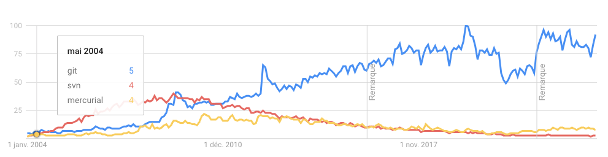

--- 

# **S**ource **C**ontrol **M**anagement

Outil qui permet de suivre les modifications apportées à une collection de fichiers.

Le terme **V**ersion **C**ontrol **S**ystem (VCS) est parfois utilisé.

---

# Objectifs d'un SCM

- Suivre les modifications apportées à un projet (quand, qui)
- Inclure un message descriptif pour chaque modification pour expliquer le pourquoi
- Permettre de revenir à une version antérieure du projet ou d'un fichier
- Travailler en parallèle sur différentes branches de développement (__feature__, __bugfix__...) par des personnes différentes sans affecter la branche principale (__main__, __develop__...)
- Marquer des versions stables du projet (__release__)

---

# **D**istributed **V**ersion **C**ontrol **S**ystem

- Système de gestion de version distribué
- Chaque utilisateur possède une copie complète de l'historique du projet
- Permet de travailler en local sans connexion à un serveur contrairement aux anciens systèmes de gestion de version centralisés (CVS, Subversion), qui nécessitent une connexion permanente au serveur

---
# **G**it - https://git-scm.com/

- Système de gestion de version distribué créé par Linus Torvalds en 2005, le créateur de Linux
- Rapide, simple, léger, performant, open source
- Utilisé par de nombreux projets open source et en entreprise
- Services en ligne (GitHub, GitLab, Bitbucket, Azure DevOps) viennent ajouter des fonctionnalités (gestion de projet, CI/CD, wiki, issues, pull requests...)
- Intégration dans les IDEs (VSCode, IntelliJ, Eclipse...)

---

Comparaison entre **git**, **mercurial** et **subversion** en terme de recherche Google depuis 2004

Source : https://www.google.com/trends/explore?date=all&q=git,mercurial,subversion

---

# **G**it - installation

Afin de vérifier que **git** est bien installé, ouvrir un terminal et taper la commande `git --version`

Si **git** n'est pas installé, télécharger et installer la dernière version depuis le site officiel :

- Windows : https://git-scm.com/download/win
- MacOS : https://git-scm.com/download/mac

---
# **G**it - terminologie

- **Repository** : répertoire de stockage des fichiers et de l'historique des modifications, c'est ici que **git** stocke toutes les informations nécessaires pour suivre les modifications apportées au projet, généralement dans un répertoire caché `.git`
- **Commit** : enregistrement d'une modification dans l'historique du projet
