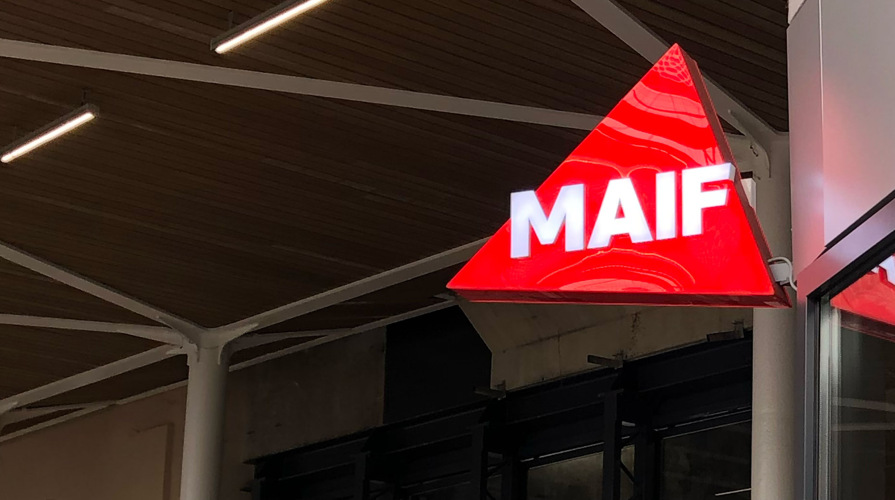
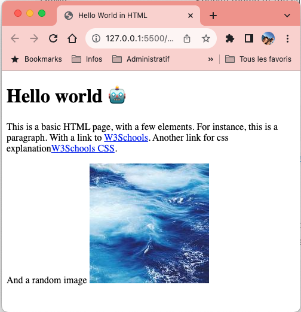

# # 1. HTML to App

## Construction d'une application web

---

<!-- Add this CSS in your Markdown file to style the two-column layout -->

# Structure minimale pour créer une page **html** valide

<!-- Use this HTML structure for a two-column layout in your content -->

  

    <ul>
      <li>DOCTYPE: définit le type de document comme étant un document HTML</li>
      <li>html: définit le document comme étant un document HTML</li>
      <li>head: définit un ensemble d'informations sur le document</li>
      <li>body: définit le corps du document</li>
    </ul>
    
  

  

    
  

Il est possible de valider une page HTML en utilisant le service en ligne [validator.w3.org](https://validator.w3.org/)

---

# Exercice
## Création d'une page HTML

    

        <ul>
            <li>Créer un fichier `index.html`</li>
            <li>Ajouter la structure minimale</li>
            <li>Ajouter un titre</li>
            <li>Ajouter un paragraphe</li>
        </ul>
    

    

        
    

---

# Enrichissement de la page HTML

    

        <ul>
            <li>Ajouter un paragraphe</li>
            <li>Ajouter des liens hypertextes</li>
            <li>Ajouter une image</li>
        </ul>
    

    

        
    

---

# Problématique

* Page web statique basique

* Développement "complexe" 

## Il est temps de s'outiller

---

# IDE

Un **IDE** (**I**ntegrated **D**evelopment **E**nvironment) est un environnement de développement intégré qui regroupe un ensemble d'outils pour faciliter le développement de logiciels.

Par exemple, un IDE peut proposer :
* Coloration syntaxique
* Auto-complétion

---

# Visual Studio Code

 **V**isual **S**tudio Code est un IDE gratuit et open-source développé par Microsoft. Il est disponible sur Windows, Linux et macOS. Il fonctionne avec un système d’extension qui permettent d'ajouter des fonctionnalités à l'IDE

 https://code.visualstudio.com/

---

---