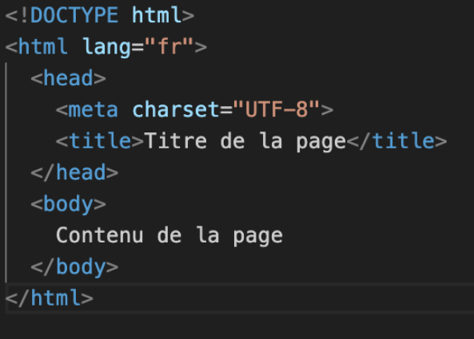
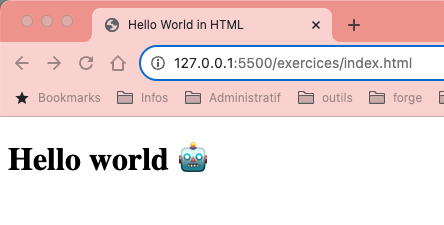
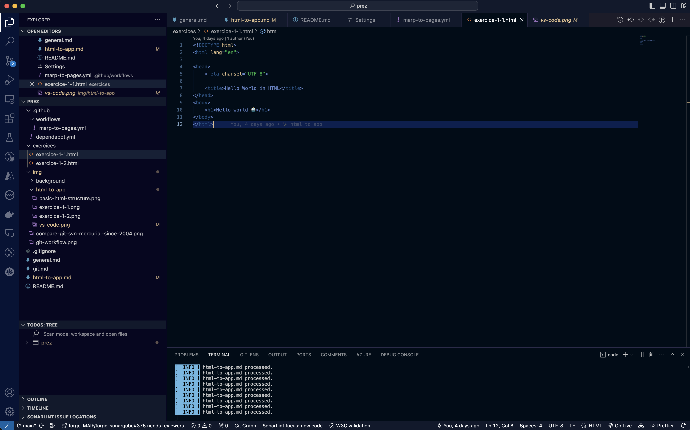
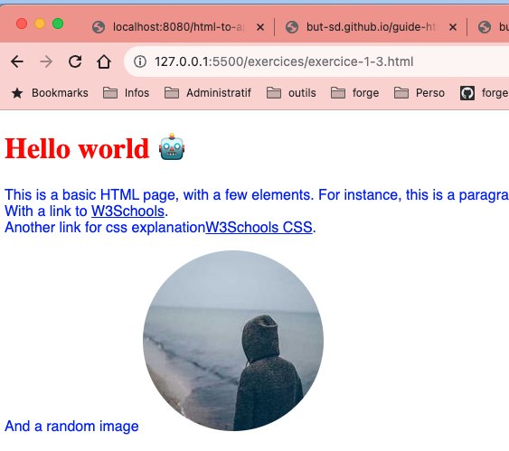

# # 1. HTML to App

## Construction d'une application web

---

<!-- Add this CSS in your Markdown file to style the two-column layout -->

# Structure minimale pour créer une page **html** valide

<!-- Use this HTML structure for a two-column layout in your content -->

  

    <ul>
      <li><b>DOCTYPE:</b> définit le type de document comme étant un document HTML</li>
      <li><b>html:</b> définit le document comme étant un document HTML</li>
      <li><b>head:</b>  définit un ensemble d'informations sur le document</li>
      <li><b>body:</b>  définit le corps du document</li>
    </ul>
    
  

  

    
  

Il est possible de valider une page HTML en utilisant le service en ligne [validator.w3.org](https://validator.w3.org/)

---

# Exercice
## Création d'une page HTML statique

    

        <ul>
            <li>Créer un fichier `index.html`</li>
            <li>Ajouter la structure minimale</li>
            <li>Ajouter un titre</li>
            <li>Ajouter un paragraphe</li>
        </ul>
    

    

        
    

### Support de cours : [https://but-sd.github.io/guide-html](https://but-sd.github.io/guide-html)

---

# Exercice
# Enrichissement de la page HTML statique

    

        <ul>
            <li>Ajouter un paragraphe</li>
            <li>Ajouter des liens hypertextes</li>
            <li>Ajouter une image grâce à l'url https://picsum.photos/200</li>
        </ul>
    

    

        
    

---

# Problématique

Bien que la page développée soit relativement simple, on rencontre déjà quelques problèmatiques :
* Difficulté à différencier dans la page les différents éléments (balises, attributs, texte)
* Pour voir une modification, il faut recharger la page
* Vérifier la validité de la page HTML n'est pas évident

---

# IDE

Un **IDE** (**I**ntegrated **D**evelopment **E**nvironment) est un environnement de développement intégré qui regroupe un ensemble d'outils pour faciliter le développement de logiciels.

Par exemple, un IDE peut proposer :
* Coloration syntaxique
* Auto-complétion
* Vérification de la validité du code

---

# Visual Studio Code

 **V**isual **S**tudio Code est un IDE gratuit et open-source développé par Microsoft. Il est disponible sur Windows, Linux et macOS. Il fonctionne avec un système d’extension qui permettent d'ajouter des fonctionnalités à l'IDE

 https://code.visualstudio.com/

---

---

# Visual Studio Code - extensions

* **Live Server** : permet de lancer un serveur local pour visualiser le rendu de la page web
* **W3C Web Validator** : permet de valider une page HTML

---

# Exercice
# Appliquer du style à la page HTML statique

    

        <ul>
            <li>Passer le titre en rouge</li>
            <li>Passer le paragraphe en bleu avec la police Lucida Sans ou par défaut sans-serif</li>
            <li>Arrondir les coins de l'image</li>
        </ul>
    

    

        
    

