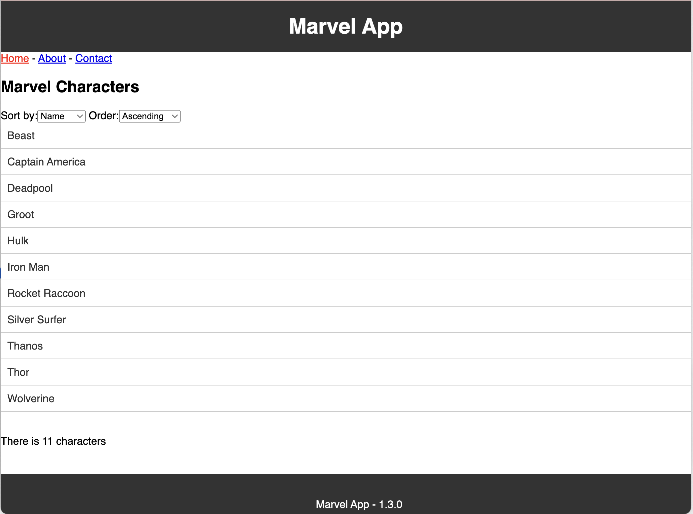

#  Alexandre GIRARD
## Conseiller en Nouvelles Technologies
###### alexandre.girard@maif.fr

--- 

# Gestion de la forge logicielle

Ensemble des outils pour le développement logiciel mis à la disposition des équipes de développement

- **GitHub** : gestion des dépôts de code source
- **Jenkins** : intégration continue
- **SonarQube** : qualité du code
- **Nexus** : gestion des artefacts
---

# Regroupement de 2 modules
## **Développement logiciel**
Présenter les approches et les outils qui permettent de mener à bien un projet informatique

## **Développement web**
Programmation web pour la visualisation de données

# 24 séances de 2H
Mélangeant de la théorie et surtout beaucoup de pratique pour mettre en application les concepts abordés

---

# Objectifs

## **Mettre en place une application web en suivant les bonnes pratiques de développement**

Les technologies utilisées sont celles actuellement utilisées dans le monde professionnel, l'objectif est de vous __préparer__ au mieux pour votre future insertion professionnelle.

L'objectif est de vous donner les __bases__ pour que vous puissiez continuer à apprendre par vous-même par la suite. Les technologies évoluent très vite, il est important de __savoir s'adapter__.

---

<!-- Add this CSS in your Markdown file to style the two-column layout -->

  

    
  

  

    
  

https://hilarious-panda-a1ea49.netlify.app/

---

# Concepts manipulés

* __agilité__ : méthode de développement
* __développement web__ : html, css, javascript, react
* __aide au développement__: github copilot, eslint, prettier
* __travail collaboratif__: git, github
* __tests unitaires, tests d'intégration__: jest, cypress, playwright
* __intégration continue__: github actions
* __déploiement continu__: github actions
* __documentation__: markdown, mkdocs
* __qualimétrie__: sonarqube

---

# Évaluation

* Deux dernières séances consacrées à l'évaluation (dernière semaine de cours)
* Réalisation de différentes tâches sur l'application web développée tout au long des séances sur ordinateur
* Quelques questions théoriques sur les concepts abordés pendant les séances sur papier

---

# Ressources

https://but-sd.github.io/prez/ - Différents supports de cours disponibles

<!-- ---

TODO Ajouter image / lien vers l'application web finale

# Différents supports de cours disponibles :

- Git: 
    - Présentation: [https://but-sd.github.io/prez/git](https://but-sd.github.io/prez/git) - [version pdf](https://but-sd.github.io/prez/git.pdf)
    - Guide: [https://but-sd.github.io/guide-git/](https://but-sd.github.io/guide-git/)
 -->
