<!-- Add this CSS in your Markdown file to style the two-column layout -->
<style>
  .two-columns {
    display: flex;
  }
  .column {
    flex: 1;
    padding: 0 20px;
  }

  span {
    color: grey;
  }
</style>


--- 

# **S**ource **C**ontrol **M**anagement

Outil qui permet de suivre les modifications apportées à une collection de fichiers.

Le terme **V**ersion **C**ontrol **S**ystem (VCS) est parfois utilisé.

---

# Objectifs d'un **S**ource **C**ontrol **M**anagement

* Suivre les modifications apportées à un projet (quand, qui)
* Inclure un message descriptif pour chaque modification pour expliquer le pourquoi
* Permettre de revenir à une version antérieure du projet ou d'un fichier
* Travailler en parallèle sur différentes branches de développement (__feature__, __bugfix__...) par des personnes différentes sans affecter la branche principale (__main__, __develop__...)
* Marquer des versions stables du projet (__release__)

---

# **D**istributed **V**ersion **C**ontrol **S**ystem

* Système de gestion de version distribué
* Chaque utilisateur possède une copie complète de l'historique du projet
* Permet de travailler en local sans connexion à un serveur contrairement aux anciens systèmes de gestion de version centralisés (CVS, Subversion), qui nécessitent une connexion permanente au serveur

---
# **Git** - https://git-scm.com/

* Système de gestion de version distribué créé par Linus Torvalds en 2005, le créateur de Linux
* Rapide, simple, léger, performant, open source
* Utilisé par de nombreux projets open source et en entreprise
* Services en ligne (GitHub, GitLab, Bitbucket, Azure DevOps) viennent ajouter des fonctionnalités (gestion de projet, CI/CD, wiki, issues, pull requests...)
* Intégration dans les IDEs (VSCode, IntelliJ, Eclipse...)

---

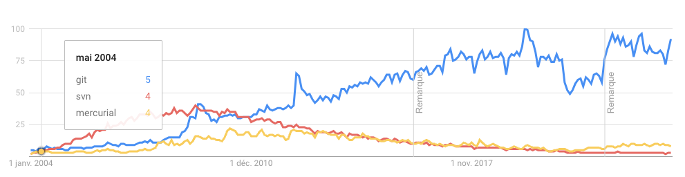

Comparaison entre **git**, **mercurial** et **subversion** en terme de recherche Google depuis 2004

Source : https://www.google.com/trends/explore?date=all&q=git,mercurial,subversion

---

# **Git** - installation

Afin de vérifier que **git** est bien installé, ouvrir un terminal et taper la commande `git --version`

Si **git** n'est pas installé, télécharger et installer la dernière version depuis le site officiel :

- Windows : https://git-scm.com/download/win
- MacOS : https://git-scm.com/download/mac

---

# **Git** - configuration 1/3

Avant de commencer à utiliser **git**, il est nécessaire de configurer son identité :

```bash
git config --global user.name "John Doe"
git config --global user.email johndoe@example.com
```

Ces informations seront utilisées pour chaque **commit**. Il est possible de les surcharger pour un projet spécifique en utilisant la commande `git config` sans l'option `--global`.

---

# **Git** - configuration 2/3 (spécifique université de Poitiers)

```bash
git config --global http.proxy http://proxy.iutn.univ-poitiers.fr:3128
```

---

# **Git** - configuration 3/3

Il est possible de configurer d'autres options, comme l'éditeur de texte utilisé pour les messages de **commit** :

```bash
git config --global core.editor "code --wait"
```

---

# **Git** - Vérification de la configuration

Pour vérifier la configuration actuelle, utiliser la commande :

```bash
git config --global --list
```

---

# Exercice - Git - configuration

* Configurer git avec votre nom et votre email

* Configurer l'éditeur de texte de VSCode pour les messages de commit

* Configurer le proxy de l'université de Poitiers

* Puis vérifier votre configuration

---

# **Git** - initialisation

Pour initialiser un nouveau **repository** **git** dans un répertoire existant, utiliser la commande `git init` :

```bash
cd /path/to/your/project
git init
git checkout -b main
```

La commande `git checkout -b main` permet de créer une nouvelle branche appelée **main**. Cette branche est créée par défaut depuis **git** 2.28.0. Avant cette version, la branche par défaut s'appelait **master**.

---

# **Git** - initialisation (suite)

Cela va créer un répertoire caché `.git` qui contiendra l'historique des modifications et les informations nécessaires pour suivre les modifications apportées au projet.

```bash
ls -a
. .. .git
```

Il n'est pas nécessaire de modifier ce répertoire, **git** s'en occupe automatiquement. 

Nous n'aurions pas à le modifier manuellement.

Ne pas le supprimer, cela supprimerait l'historique du projet.

---
# **Git** - initialisation (suite)

Contient les informations nécessaires pour suivre les modifications apportées au projet.

```bash
ls -la .git
.  ..  HEAD  config  description  hooks  info  objects  refs
```

---

# **Git** - Aide

Pour obtenir de l'aide sur une commande **git**, utiliser la commande `git help <command>` ou `git <command> --help`

```bash
git help status
```
Donne accès à la documentation de la commande `git status`

---

# **Git** - status

La commande `git status` permet de voir l'état actuel du **repository** **git**.

```bash
git status
```

```bash
On branch main

No commits yet

nothing to commit (create/copy files and use "git add" to track)
```

---

# Exercice - Git - initialisation 

* Initialiser un nouveau **repository** **git** dans un répertoire nommé **html-to-app** (un répertoire local vide sur le disque du poste de travail, pas un répertoire synschronisé avec un service de stockage en ligne cela pourrait poser des problèmes de synchronisation)
* Copier les fichiers sur lesquels vous avez travaillé pour l'application html dans ce répertoire
* Vérifier l'état du **repository** avec la commande `git status`

---

# Exercice - Git - initialisation (suite)
```bash
git status
```

```bash
On branch main

No commits yet

Untracked files:
  (use "git add <file>..." to include in what will be committed)
        pages/
        styles/

nothing added to commit but untracked files present (use "git add" to track)
```

---

# **Git** - terminologie

* **Working tree** : répertoire de travail, contient les fichiers du projet
*  **Staging area** : zone de transit, contient les fichiers qui seront inclus dans le prochain **commit**
* **commit** : enregistrement des modifications dans l'historique du projet

---

# **Git** - cycle de vie des fichiers

Le cas d'usage basique de git est de modifier des fichiers en local, puis de les envoyer vers un dépôt distant. Il est ensuite possible de récupérer les modifications du dépôt distant en local.

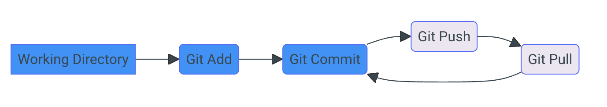

---

# **Git** - cycle de vie des fichiers (suite)

* Les fichiers sont modifiés en local, puis ajoutés à l'index avec la commande `git add`
* Les fichiers de l'index sont commités avec la commande `git commit` 
* Les commits sont ensuite envoyés vers le dépôt distant avec la commande `git push` 
* Les commits du dépôt distant sont récupérés avec la commande `git pull`

---

# **Git** - VSCode

Il est possible d'utiliser **git** directement depuis **VSCode**. Cela permet de visualiser les modifications apportées aux fichiers, de les ajouter à l'index, de commiter les modifications, de pousser les commits vers le dépôt distant, de récupérer les commits du dépôt distant... 

---

# **Git** - VSCode (suite)

Pour activer **git** dans **VSCode**, il est nécessaire d'ouvrir un projet **git** dans **VSCode**. **VSCode** va alors détecter que le projet est un **repository git** et afficher les informations relatives à **git** dans la barre latérale.

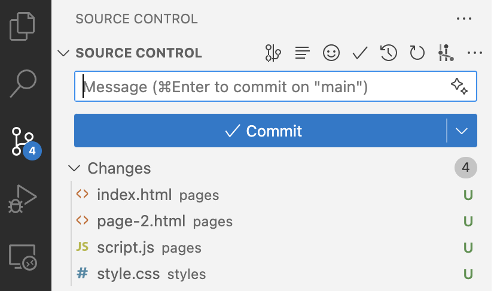

---

# **Git** - add

Pour ajouter un fichier à l'index, utiliser la commande `git add <file>` :

```bash
git add pages/index.html
```

Ou un répertoir complet :

```bash
git add pages/
```

Ou tous les fichiers modifiés :

```bash
git add .
```

---

# **Git** - add (suite)

Suite à l'ajout des fichiers à l'index, la commande `git status` affiche les fichiers ajoutés à l'index :

```bash
git status
```

```bash
On branch main

No commits yet

Changes to be committed:
  (use "git rm --cached <file>..." to unstage)
        new file:   pages/index.html

Untracked files:
  (use "git add <file>..." to include in what will be committed)
        pages/page-2.html
        pages/script.js
        styles/
```

---

# **Git** - add (suite)

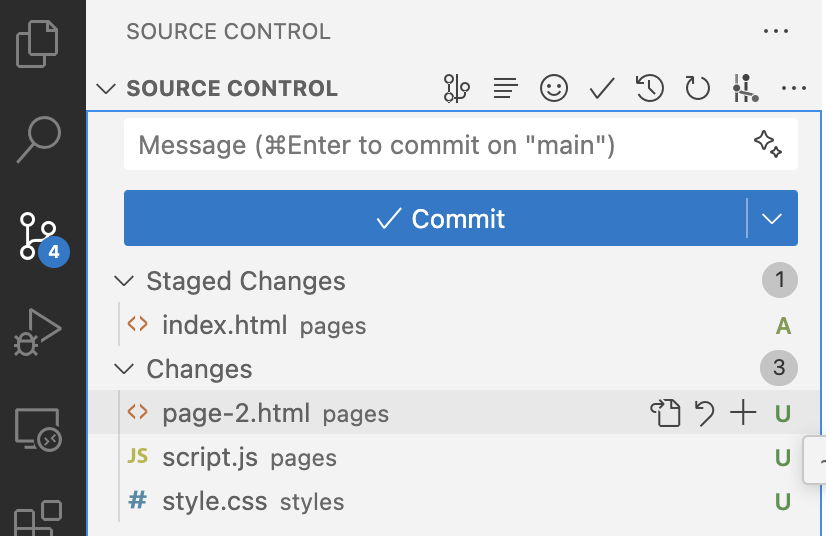

---

# **Git** - remove

Pour retirer un fichier de l'index, utiliser la commande `git rm --cached <file>` :

```bash
git rm --cached pages/index.html
```

On est alors de retour à l'état initial :

```bash
git status
```

```bash
On branch main

No commits yet

Untracked files:
  (use "git add <file>..." to include in what will be committed)
        pages/index.html
        pages/page-2.html
        pages/script.js
        styles/
```

---

# **Git** - VsCode - git add, git rm

Il est possible d'ajouter ou de retirer des fichiers de l'index directement depuis **VSCode** en cliquant sur les boutons **+** ou **-** à côté des fichiers dans l'explorateur.

<div class="two-columns">
    <div class="column">
        
    </div>
    <div class="column">
        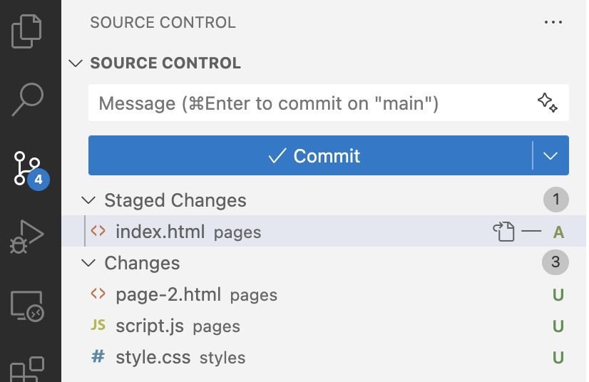
    </div>
</div>

---

# **Git** - commit

Pour enregistrer les modifications dans l'historique du projet, utiliser la commande `git commit` :

```bash
git commit -m "message de commit"
```

Le message de commit est obligatoire. Il doit être court et descriptif pour expliquer les modifications apportées.

---

# **Git** - commit (suite)

Dans **VSCode**, il est possible de commiter les modifications directement depuis l'explorateur en saisissant le message de commit dans la zone de texte en haut de l'explorateur, puis en cliquant sur le bouton **✓ Commit**.

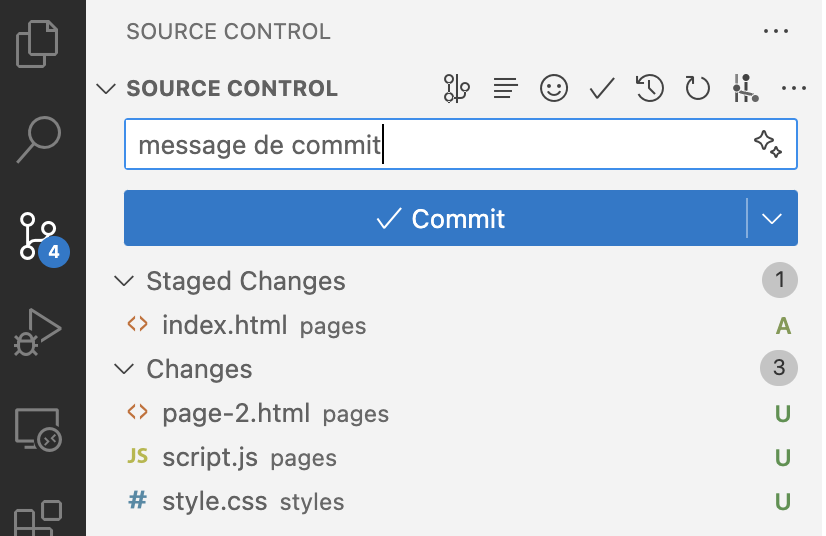

---

# Exercice - Git - commit

* Ajouter l'ensemble des fichiers à l'index
* Commiter les modifications avec un message descriptif "Initial commit"
* Vérifier l'état du **repository** avec la commande `git status`

---

# **Git** - log

Pour afficher l'historique des commits, utiliser la commande `git log` :

```bash
git log
```

```bash
commit 22547b427c475a1bcb17a116190fa10e40535d23 (HEAD -> main)
Author: alexandre-girard <alexandre.girard@maif.fr>
Date:   Tue Jul 23 16:10:37 2024 +0200

    Initial commit
```

---

# **Git** - log (suite)

Il est possible de personnaliser l'affichage de l'historique des commits avec des options :

```bash
git log --oneline --graph --decorate
```

```bash
* 22547b4 (HEAD -> main) Initial commit
```

---

# **Git** - VSCode - git log

Il est possible de visualiser l'historique des commits directement depuis **VSCode** dans l'élément **Graph** de l'explorateur.

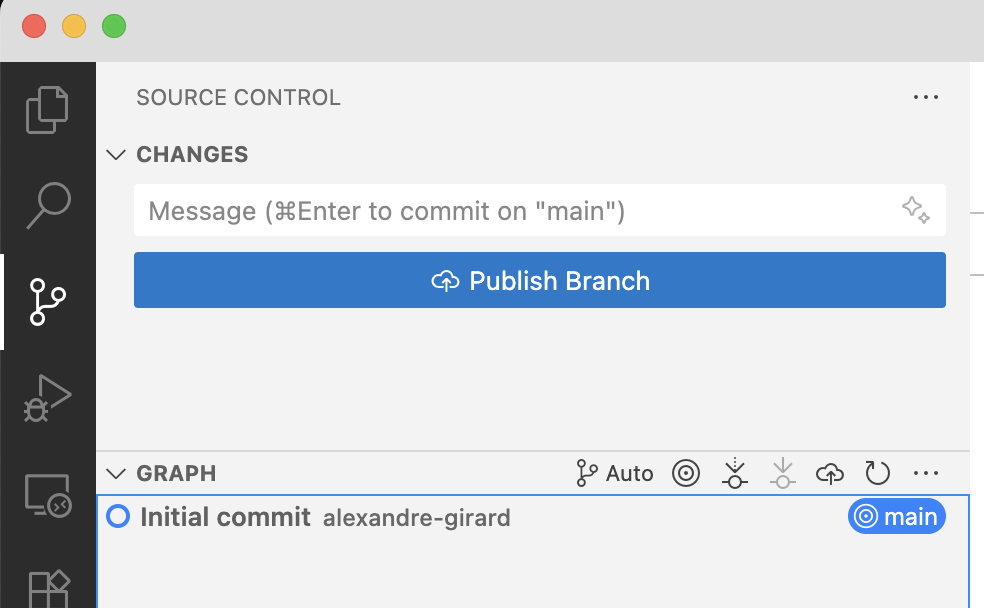

---

# **Git** - Bonnes pratiques - commit

- Faire des commits réguliers et atomiques
    - Un commit par fonctionnalité
    - Eviter les commits trop gros (trop de fichiers modifiés, trop de lignes modifiées)

Si vous commitez trop de fichiers en même temps, il est difficile de savoir ce qui a été modifié et pourquoi. Il est préférable de faire plusieurs commits pour des modifications différentes.

---

# **Git** - Bonnes pratiques - messages de commit

- Les messages de commit doivent être courts et descriptifs
- Ils doivent expliquer les modifications apportées par le commit
    - Quoi : modifications apportées
    - Pourquoi : pourquoi ces modifications ont été apportées

Si vous avez des difficultés à écrire un message de commit, c'est peut-être que vous devriez faire plusieurs commits pour des modifications différentes.

Un bon message de commit doit permettre de comprendre les modifications apportées sans avoir à lire le code.

---

# **Git** - Bonnes pratiques - messages de commit (suite)

Les messages de commit permettent de comprendre l'historique du projet et de savoir qui a fait quoi et pourquoi.
On doit pouvoir comprendre l'historique du projet sans avoir à lire le code.

Des messages de commit clairs et concis permettent de faciliter la collaboration entre les membres d'une équipe et de faciliter la maintenance du code.

Des messages trop génériques ou trop vagues rendent l'historique du projet difficile à comprendre et n'apportent pas d'informations utiles.

---

# **Git** - Bonnes pratiques - messages de commit (suite)

- Commencer le message de commit par un verbe à l'impératif avec une majuscule
    - "Ajoute la fonctionnalité xxx"
    - "Modifie le style de la page d'accueil"
    - "Supprime le fichier xxx devenu inutile"
- Limiter la longueur du titre à environ 70 caractères
- Ajouter une ligne vide entre le titre et le corps du message si le corps est nécessaire
- Utiliser le corps du message pour expliquer les modifications plus en détail si nécessaire
    - Expliquer le pourquoi des modifications
    - Expliquer les conséquences des modifications

---

**Git** - diff

Pour afficher les modifications apportées, utiliser la commande `git diff` :

```bash
git diff
```

```bash
diff --git a/pages/index.html b/pages/index.html
index 7b3b3d4..f7b3b3d 100644
--- a/pages/index.html
+++ b/pages/index.html
@@ -1,5 +1,5 @@
 <!DOCTYPE html>
 <html>
 <head>
-    <title>Page d'accueil</title>
+    <title>Accueil</title>
 </head>
``` 

---

# **Git** - diff (suite)

Il est possible de limiter l'affichage des modifications à un fichier spécifique :

```bash
git diff pages/index.html
```

---

# **Git** - diff (suite)

Dans **VSCode**, il est possible de visualiser les modifications apportées à un fichier en cliquant sur le fichier dans la vue **Source Control**.

Les lignes supprimées sont affichées en rouge, les lignes ajoutées en vert.

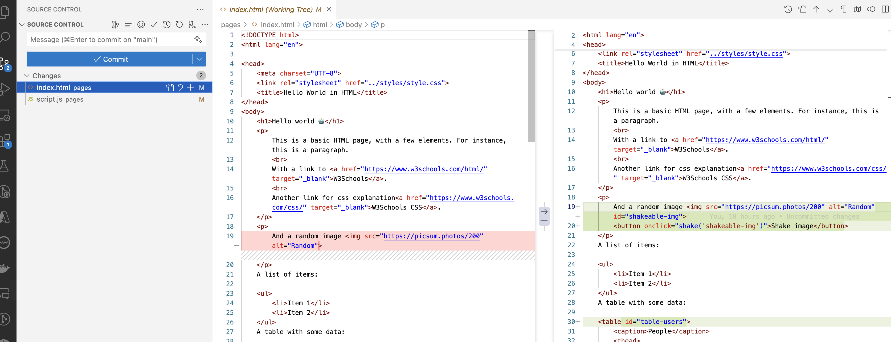

---

# **Git** - remote

Afin de travailler en collaboration avec d'autres personnes ou de sauvegarder son travail sur un serveur distant, il est nécessaire de configurer un dépôt distant. Nous allons utiliser **GitHub** pour cela. Les étapes sont les suivantes :

* Créer un compte sur **GitHub**
* Créer un nouveau dépôt sur **GitHub** nommé **html-to-app**
* Ajouter le dépôt distant à notre **repository** local

---

# **Git** - remote (suite)

Pour ajouter un dépôt distant à notre **repository** local, utiliser la commande `git remote add <name> <url>` :

```bash
git remote add origin https://github.com/your-login/your-repo.git
```

Remplacer `your-login` par votre nom d'utilisateur **GitHub** et `your-repo` par le nom du dépôt que vous avez créé sur **GitHub**.
Ces informations sont aussi fournies par **GitHub** lors de la création du dépôt.

---

# **Git** - remote (suite)

Pour vérifier les dépôts distants configurés, utiliser la commande `git remote -v` :

```bash
git remote -v
```

```bash
origin  https://github.com/your-login/yout-repo.git (fetch)
origin  https://github.com/your-login/yout-repo.git (push)
```

---

# **Git** - remote (suite)

Dans **VSCode**, il est possible de visualiser les dépôts distants configurés dans la vue **Source Control**.

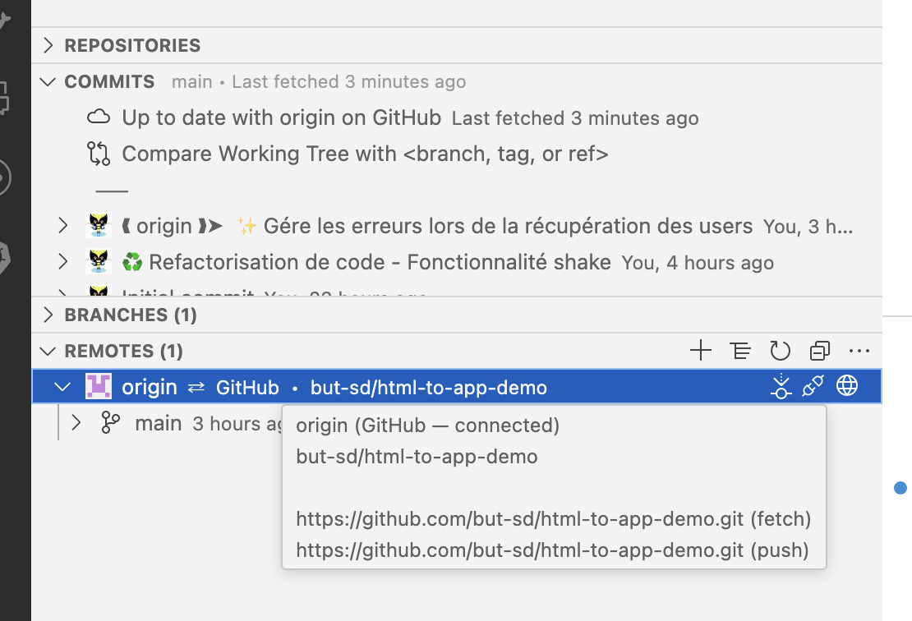

---

# **Git** - push

Pour envoyer les commits vers le dépôt distant, utiliser la commande `git push` :

```bash
git push -u origin main
```

La première fois, il est nécessaire de spécifier la branche distante et la branche locale à associer avec l'option `-u`.

---

# **Git** - push (suite)

Dans **VSCode**, il est possible de pousser les commits vers le dépôt distant en cliquant sur le bouton **↥ Push** dans la vue **Source Control**.

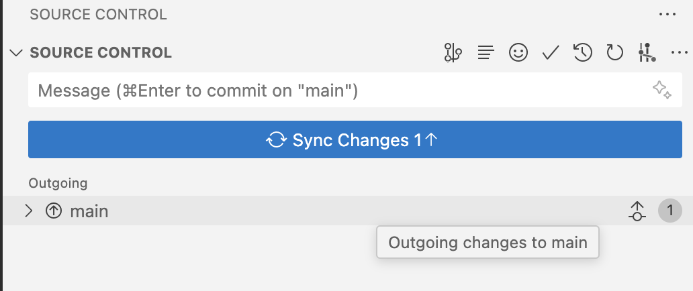

---

# **Git** - push (suite)

Les modifications sont alors envoyées vers le dépôt distant et sont visibles sur **GitHub**.

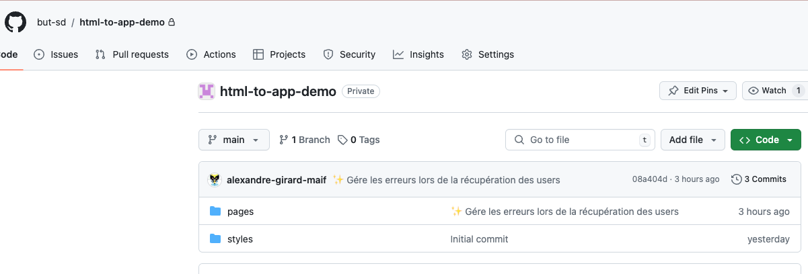

---