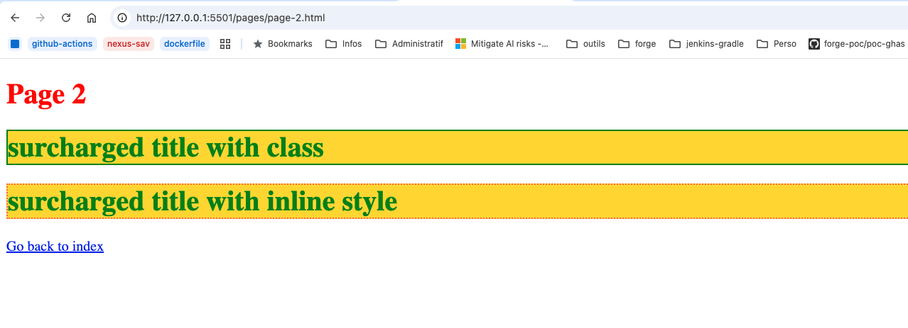

# # 1. HTML to App

## Construction d'une application web

---

<!-- Add this CSS in your Markdown file to style the two-column layout -->

# Structure minimale pour créer une page **html** valide

<!-- Use this HTML structure for a two-column layout in your content -->

  

    <ul>
      <li><b>DOCTYPE:</b> définit le type de document comme étant un document HTML</li>
      <li><b>html:</b> définit le document comme étant un document HTML</li>
      <li><b>head:</b>  définit un ensemble d'informations sur le document</li>
      <li><b>body:</b>  définit le corps du document</li>
    </ul>
    
  

  

    
  

Il est possible de valider une page HTML en utilisant le service en ligne [validator.w3.org](https://validator.w3.org/)

---

# Exercice 1
## Création d'une page HTML statique

    

        <ul>
            <li>Créer un fichier `index.html`</li>
            <li>Ajouter la structure minimale</li>
            <li>Ajouter un titre</li>
        </ul>
    

    

        
    

### Support de cours : [https://but-sd.github.io/guide-html](https://but-sd.github.io/guide-html)

---

# Exercice 2
## Enrichissement de la page HTML statique

    

        <ul>
            <li>Ajouter un paragraphe</li>
            <li>Ajouter des liens hypertextes</li>
            <li>Ajouter une image grâce à l'url https://picsum.photos/200</li>
        </ul>
    

    

        
    

---

# Problématique

Bien que la page développée soit relativement simple, on rencontre déjà quelques problèmatiques :
* Difficulté à différencier dans la page les différents éléments (balises, attributs, texte)
* Pour voir une modification, il faut recharger la page
* Vérifier la validité de la page HTML n'est pas évident

---

# IDE

Un **IDE** (**I**ntegrated **D**evelopment **E**nvironment) est un environnement de développement intégré qui regroupe un ensemble d'outils pour faciliter le développement de logiciels.

Par exemple, un IDE peut proposer :
* Coloration syntaxique
* Auto-complétion
* Vérification de la validité du code

---

# Visual Studio Code

 **V**isual **S**tudio Code est un IDE gratuit et open-source développé par Microsoft. Il est disponible sur Windows, Linux et macOS. Il fonctionne avec un système d’extension qui permettent d'ajouter des fonctionnalités à l'IDE

 https://code.visualstudio.com/

---

---

# Visual Studio Code - extensions

* **Live Server** : permet de lancer un serveur local pour visualiser le rendu de la page web
* **W3C Web Validator** : permet de valider une page HTML

---

# CSS

Le **C**ascading **S**tyle **S**heets (CSS) est un langage de style utilisé pour décrire la présentation d'un document écrit en HTML.

Il permet de séparer le contenu de la présentation.

### Support de cours : [https://but-sd.github.io/guide-html/css/](https://but-sd.github.io/guide-html/css/)

---

# Exercice 3
## Appliquer du style à la page HTML statique

    

        <ul>
            <li>Utiliser un fichier CSS externe (style.css)</li>
            <li>Passer le titre en rouge</li>
            <li>Passer le paragraphe en bleu avec la police Lucida Sans ou par défaut sans-serif</li>
            <li>Arrondir les coins de l'image</li>
        </ul>
    

    

        
    

---

# CSS - Bonnes pratiques

* **Sélectionner les éléments à styliser** : utiliser les sélecteurs CSS
  * **classes** : permet de réutiliser un style
  * **identifiants** : permet de cibler un élément unique
  
* **Utiliser le bon type de style** : inline, interne ou externe
  * **inline ou interne** : pour des styles spécifiques à une page
  * **externe** : pour des styles communs à plusieurs pages

* **Organiser le code** : pour faciliter la maintenance

* **Utiliser des commentaires** : pour expliquer le code

---

# Exercice 4

## Structurer son code

    

        <ul>
            <li>Ajouter une page</li>
            <li>Pouvoir naviguer entre les 2 pages</li>
            <li>Tester l'ordre d'application des styles inline, interne, externe</li>
            <li>En appliquant la structure suivante :</li>
        </ul>
        
    

    

        
    

---

# JavaScript

Le **JavaScript** est un langage de programmation qui permet de rendre les pages web interactives. Il est souvent utilisé pour ajouter des fonctionnalités à une page web.

### Support de cours : [https://but-sd.github.io/guide-html/js/](https://but-sd.github.io/guide-html/js/)

---

# Exercice 5

## Manipuler le DOM en JavaScript

    

        <ul>
            <li>Afficher <i>Hello world from script.js</i> dans la console</li>
            <li>Ajouter à la fin de l'élement h1 le texte " from JavaScript"</li>
            <li>Ajouter un élément h2 <i>Welcome to the DOM</i> sous l'élément h1</li>
        </ul>
    

    

        
    

---

# Chrome DevTools

Les **Chrome DevTools** sont un ensemble d'outils de développement intégrés à Google Chrome. Ils permettent de déboguer, de profiler et d'analyser les performances des applications web.

Accessible via le menu **Plus d'outils** > **Outils de développement** ou en appuyant sur `F12` ou `Ctrl+Shift+I` (Windows/Linux) ou `Cmd+Opt+I` (Mac)

---

# Exercice 5 - Suite

## Manipuler le DOM en JavaScript

    

        <ul>
          <li>Ajouter un élément h3 affichant l'heure actuelle sous l'élément h2</li>
          <li>Faire en sorte que l'heure s'affiche toutes les secondes, la fonction <b>setInterval</b> sera utile</li>
        </ul>
    

    

        
    

---

# Exercice 5 - Suite

## Manipuler le DOM en JavaScript

    

        <ul>
          <li>Ajouter une liste de 2 éléments en html</li>
          <li>Supprimer le premier élément de la liste en javascript</li>
          <li>Ajouter un élément à la fin de la liste en javascript</li>
        </ul>
    

    

        
    

---

# Exercice 6

## Gestions des événements

    

        <ul>
            <li>Ajouter un événement lors du survol de l'élement caption</li>
        </ul>
    

    

        
    

---

# Exercice 6 - Suite

## Gestions des événements

    

        <ul>
            <li>Ajouter des boutons (en javascript) pour faire bouger l'image et le tableau</li>
        </ul>
    

    

        
    

---

# Exercice 7

## Récupérer des données depuis une API

    

        <ul>
            <li>Récupérer des données depuis une API (https://jsonplaceholder.typicode.com/users)</li>
            <li>Afficher les données dans le tableau</li>
        </ul>
    

    

        
    

---

# Analyse de ce que nous avons fait

* Outillage pour le développement web
    * IDE et extensions
    * Chrome DevTools
    
* Création d'une page HTML statique

* Enrichissement de la page avec du CSS

* Utilisation de JavaScript pour manipuler le DOM et gérer des événements

* Récupération de données depuis une API

---

# Analyse de ce que nous avons fait - Suite

* Structuration du code
    * Séparation du HTML, CSS et JavaScript
    * Utilisation de classes et d'identifiants
    * Utilisation de fichiers externes pour le CSS et le JavaScript

* Respect des bonnes pratiques
    * Commentaires
    * Organisation du code
    * Utilisation des sélecteurs CSS
---

# Analyse de ce qu'il reste à faire

* Factoriser le code
    * Réutiliser les styles communs
    * Réutiliser les fonctions JavaScript

* Gérer les erreurs
    * Vérifier que les données récupérées sont bien celles attendues
    * Gérer les cas où les données ne sont pas disponibles

* Tester le code sur différents navigateurs
    * Chrome, Firefox, Edge, Safari

---

# Analyse de ce qu'il reste à faire - Suite

Avant de refactoriser le code, il est important d'utiliser un système de contrôle de version comme Git pour pouvoir revenir en arrière en cas de problème.

---

# Refactorisation du code

Utiliser git pour versionner le code et apporter des modifications en toute sécurité.

* Refactoriser le code JavaScript pour utiliser des fonctions et rendre le code plus lisible et maintenable
* Commiter régulièrement les modifications par fonctionnalité ou par tâche
    - Ajouter un message de commit explicite pour expliquer les modifications apportées

---

# Exercice 8 - Refactorisation du code - git

## Refactorisation du code - Fonctionnalité **shake**

* Ajouter des ids aux éléments à faire bouger (image et tableau)
* Utiliser des boutons dans la page html plutôt que des boutons dans le code JavaScript
* Factoriser les fonctions **shake** et **unshake** en une seule permettant de shake ou unshake un élément en fonction de son id et de son état actuel

---

# Exercice 8 - Refactorisation du code - git (suite)

## Refactorisation du code - Fonctionnalité **shake**

* Préparer un commit pour l'ensemble des modifications
    * Il serait possible de ne pas tout commiter en une seule fois, cependant les 3 modifications sont liées, il est donc préférable de les regrouper dans un seul commit
    * Analyser les modifications apportées pour s'assurer qu'elles sont cohérentes et fonctionnent correctement, on ne commit pas du code instable
* Ajouter un message de commit explicite 
    * Exemple : "Refactorisation de code - Fonctionnalité shake"

---

# Exercice 8 - Refactorisation du code - git (suite)

## Refactorisation du code - Fonctionnalité **shake**

---

# Exercice 9 - Amélioration de la récupération des données - Gestion des erreurs

* Gérer les cas où les données ne sont pas disponibles (erreur 404 ou autre)
    * Afficher un message d'erreur à l'utilisateur pour l'informer que les données ne sont pas disponibles
* Gérer le cas où il n'y a pas de données à afficher
    * Afficher un message à l'utilisateur pour l'informer qu'il n'y a pas de données à afficher

* Préparer et effectuer un commit pour l'ensemble des modifications
    * Analyser les modifications
    * Ajouter un message de commit explicite

---

# Exercice 9 - Amélioration de la récupération des données - Gestion des erreurs (suite)

---

# Exercice - Fin

* Poussez vos modifications sur votre dépôt distant pour les sauvegarder.

* Nous avons maintenant une application web basique mais fonctionnelle qui récupère des données depuis une API et les affiche dans une page web.

* Le code est versionné et peut être partagé avec d'autres personnes. Les modifications apportées sont enregistrées et peuvent être consultées à tout moment.

* Il serait possible de continuer à améliorer l'application en ajoutant de nouvelles fonctionnalités ou en améliorant les fonctionnalités existantes.

---

# Pour aller plus loin

On atteint ici les limites de la programmation front-end. Pour aller plus loin, il est possible de se tourner vers des frameworks ou des bibliothèques JavaScript comme React, Angular ou Vue.js qui permettent de développer des applications web plus complexes.

* **Responsive Design** : adapter la page web à différents supports (mobile, tablette, desktop)

* **Performance** : optimiser le temps de chargement de la page

* **Tests** : écrire des tests unitaires et d'intégration pour garantir le bon fonctionnement de l'application

* **Accessibilité** : rendre la page accessible à tous
