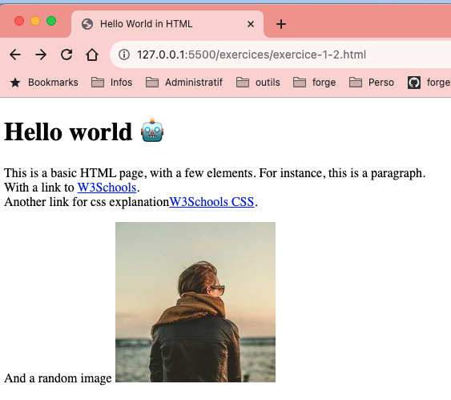

# # 1. HTML to App

## Construction d'une application web

---

<!-- Add this CSS in your Markdown file to style the two-column layout -->
<style>
  .two-columns {
    display: flex;
  }
  .column {
    flex: 1;
    padding: 0 20px;
  }

  span {
    color: grey;
  }
</style>

# Structure minimale pour créer une page **html** valide

<!-- Use this HTML structure for a two-column layout in your content -->
<div class="two-columns">
  <div class="column">
    <ul>
      <li><b>DOCTYPE:</b><span> définit le type de document comme étant un document HTML</span></li>
      <li><b>html:</b><span> définit un document HTML</span></li>
      <li><b>head:</b> <span> définit un ensemble d'informations sur le document</span></li>
      <li><b>body:</b> <span> définit le corps du document</span></li>
    </ul>
    
  </div>
  <div class="column">
    
  </div>
</div>

Il est possible de valider une page HTML en utilisant le service en ligne [validator.w3.org](https://validator.w3.org/)

---

# Exercice 1
## Création d'une page HTML statique

<div class="two-columns">
    <div class="column">
        <ul>
            <li>Créer un fichier `index.html`</li>
            <li>Ajouter la structure minimale</li>
            <li>Ajouter un titre</li>
        </ul>
    </div>
    <div class="column">
        
    </div>
</div>

Vérifiez que la page est valide en utilisant le service en ligne [validator.w3.org](https://validator.w3.org/#validate_by_input)

---

# Exercice 2
## Enrichissement de la page HTML statique

<div class="two-columns">
    <div class="column">
        <ul>
            <li>Ajouter un paragraphe</li>
            <li>Ajouter des liens hypertextes vers d'autres pages (https://www.w3schools.com/html/, et https://www.w3schools.com/css/)</li>
            <li>Ajouter une image grâce à l'url https://picsum.photos/200</li>
        </ul>
    </div>
    <div class="column">
        
    </div>
</div>

---

# Problématique

Bien que la page développée soit relativement simple, on rencontre déjà quelques problèmatiques :
* Difficulté à différencier dans la page les différents éléments (balises, attributs, texte)
* Pour voir une modification, il faut recharger la page
* Vérifier la validité de la page HTML n'est pas évident

---

# IDE

Un **IDE** (**I**ntegrated **D**evelopment **E**nvironment) est un environnement de développement intégré qui regroupe un ensemble d'outils pour faciliter le développement de logiciels.

Par exemple, un IDE peut proposer :
* Coloration syntaxique
* Auto-complétion
* Vérification de la validité du code

---

# Visual Studio Code

 **V**isual **S**tudio Code est un IDE gratuit et open-source développé par Microsoft. Il est disponible sur Windows, Linux et macOS. Il fonctionne avec un système d’extensions qui permettent d'ajouter des fonctionnalités à l'IDE

 https://code.visualstudio.com/

---


---

# Visual Studio Code - extensions

* **Live Server** : permet de lancer un serveur local pour visualiser le rendu de la page web
* **W3C Web Validator** : permet de valider une page HTML

---

# CSS

Le **C**ascading **S**tyle **S**heets (CSS) est un langage de style utilisé pour décrire la présentation d'un document écrit en HTML.

Il permet de séparer le contenu de la présentation.

---

# Exercice 3
## Appliquer du style à la page HTML statique

<div class="two-columns">
    <div class="column">
        <ul>
            <li>Utiliser un fichier CSS externe (style.css)</li>
            <li>Passer le titre en rouge</li>
            <li>Passer le paragraphe en bleu avec la police Lucida Sans ou par défaut sans-serif</li>
            <li>Arrondir les coins de l'image grâce à la propriété CSS <code>border-radius</code></li>
        </ul>
    </div>
    <div class="column">
        
    </div>
</div>

---

# Bonnes pratiques - CSS

* **Sélectionner les éléments à styliser** : utiliser les sélecteurs CSS
  * **classes** : permet de réutiliser un style
  * **identifiants** : permet de cibler un élément unique
  
* **Utiliser le bon type de style** : inline, interne ou externe
  * **inline ou interne** : pour des styles spécifiques à une page
  * **externe** : pour des styles communs à plusieurs pages

* **Utiliser des noms de classes et d'identifiants explicites** : pour faciliter la compréhension du code
    * Exemples : `header`, `footer`, `title`, `paragraph`, `image`, `button`
---

# Bonnes pratiques - De développement

* **Organiser le code** : pour faciliter la maintenance

* **Utiliser des commentaires** : pour expliquer le code

* **K**eep **i**t **s**imple, **s**tupid (KISS) : On doit pouvoir comprendre le code sans avoir à le lire en détail et sans avoir à se souvenir de ce qu'il fait, être capable de le faire évoluer même plusieurs mois après l'avoir écrit.

---

# Exercice 4

## Structurer son code

<div class="two-columns">
    <div class="column">
        <ul>
            <li>Ajouter une page</li>
            <li>Pouvoir naviguer entre les 2 pages</li>
            <li>Tester, valider que l'application des styles est correcte</li>
            <li>En appliquant la structure suivante :</li>
        </ul>
        
    </div>
    <div class="column">
        
    </div>
</div>

---

# JavaScript - Ajouter du dynamisme à une page web

Le HTML et le CSS permettent de créer des pages web statiques mais ne permettent pas d'ajouter de la logique ou de l'interactivité.C'est là qu'intervient le **JavaScript**. 

Le **JavaScript** est un langage de programmation qui permet de rendre les pages web interactives en manipulant le DOM (**D**ocument **O**bject **M**odel) et en gérant des événements comme les clics, les survols, le chargement de la page, etc.

---

# Exercice 5

## Initialisation du JavaScript

Dans un fichier `script.js`, ajouter du code JavaScript pour manipuler le DOM de la page HTML. Inclure le fichier `script.js` dans la page HTML en ajoutant la balise `<script src="./scripts.js"></script>` avant la balise de fermeture `</body>`.

---

# Exercice 5.0

## Manipuler le DOM en JavaScript
<div class="two-columns">
    <div class="column">
        <ul>
            <li>Afficher <i>Hello world from script.js</i> dans la console</li>
            <li>Ajouter à la fin de l'élement h1 le texte " from JS" et changer la couleur en JavaScript</li>
            <li>Ajouter un élément h2 <i>Welcome to the DOM</i> sous l'élément h1</li>
        </ul>
    </div>
    <div class="column">
        
    </div>
</div>

---

# Chrome DevTools

Les **Chrome DevTools** sont un ensemble d'outils de développement intégrés à Google Chrome. Ils permettent de déboguer, de profiler et d'analyser les performances des applications web.

Accessible via le menu **Plus d'outils** > **Outils de développement** ou en appuyant sur `F12` ou `Ctrl+Shift+I` (Windows/Linux) ou `Cmd+Opt+I` (Mac)

---

# Exercice 5.1 

## Manipuler le DOM en JavaScript

<div class="two-columns">
    <div class="column">
        <ul>
          <li>Ajouter un élément h3 affichant l'heure actuelle sous l'élément h2</li>
          <li>Faire en sorte que l'heure s'affiche toutes les secondes, la fonction <b>setInterval</b> sera utile</li>
        </ul>
    </div>
    <div class="column">
        
    </div>
</div>

---

# Exercice 5.2

## Manipuler le DOM en JavaScript

<div class="two-columns">
    <div class="column">
        <ul>
          <li>Ajouter une liste de 2 éléments en html</li>
          <li>Supprimer le premier élément de la liste en JavaScript</li>
          <li>Ajouter un élément à la fin de la liste en JavaScript</li>
        </ul>
    </div>
    <div class="column">
        
    </div>
</div>

---

# Exercice 6.0

## Gestions des événements

<div class="two-columns">
    <div class="column">
        <ul>
            <li>Ajouter un événement lors du survol de l'élement caption (la méthode <b>addEventListener</b> sera utile)</li>
        </ul>
        <br />
        Le code html et css sont fournis dans les slides suivant.
    </div>
    <div class="column">
        
    </div>
</div>

---

```html
<table id="table-users">
    <caption>People</caption>
    <thead>
        <tr>
            <th>Name</th>
            <th>User name</th>
            <th>Email</th>
        </tr>
    </thead>
    <tbody>
        <tr>
            <td>John Doe</td>
            <td>johndoe</td>
            <td>john@example.com</td>
        </tr>
        <tr>
            <td>Jane Smith</td>
            <td>janesmith</td>
            <td>jane@example.com</td>
        </tr>
    </tbody>
</table>
```
---

```css
table {
    border-collapse: collapse;
    width: 100%;
    margin-bottom: 1rem;
    font-size: 1rem;
    font-weight: 400;
    line-height: 1.5;
    color: #212529;
}

th,
td {
    padding: 0.75rem;
    vertical-align: top;
    border-top: 1px solid #dee2e6;
}

th {
    text-align: inherit;
    background-color: #e9ecef;
    border-bottom: 2px solid #dee2e6;
}

tbody tr:nth-of-type(odd) {
    background-color: rgba(101, 147, 44, 0.05);
}

tbody tr:hover {
    background-color: rgba(101, 147, 44, 0.1);
}

caption {
    font-size: 1.2rem;
    font-weight: bold;
    margin-bottom: 0.5rem;
}

```
---

# Exercice 6.1

## Gestions des événements

<div class="two-columns">
    <div class="column">
        <ul>
            <li>Ajouter des boutons (en javascript) pour faire bouger l'image et le tableau (ajouter ou supprimer la classe 'shake')</li>
        </ul>
        Des fonctions JavaScript <b>shakeImage()</b>, <b>unShakeImage()</b>, <b>shakeTable()</b>, <b>unShakeTable()</b> sont à créer pour faire bouger ou arrêter de faire bouger l'image et le tableau.
    </div>
    <div class="column">
        
    </div>
</div>

---
```css
.shake {
    /* Démarre l'animation d'une durée de 0.5s */
    animation: shake 0.5s;

    /* Quand l'animation est terminée, on recommence */
    animation-iteration-count: infinite;
}

@keyframes shake {
    0% { transform: translate(1px, 1px) rotate(0deg); }
    10% { transform: translate(-1px, -2px) rotate(-1deg); }
    20% { transform: translate(-3px, 0px) rotate(1deg); }
    30% { transform: translate(3px, 2px) rotate(0deg); }
    40% { transform: translate(1px, -1px) rotate(1deg); }
    50% { transform: translate(-1px, 2px) rotate(-1deg); }
    60% { transform: translate(-3px, 1px) rotate(0deg); }
    70% { transform: translate(3px, 1px) rotate(-1deg); }
    80% { transform: translate(-1px, -1px) rotate(1deg); }
    90% { transform: translate(1px, 2px) rotate(0deg); }
    100% { transform: translate(1px, -2px) rotate(-1deg); }
}
```
---

# Exercice 7 - Bonus

## Récupérer des données depuis une API

<div class="two-columns">
    <div class="column">
        <ul>
            <li>Récupérer des données depuis une API (https://jsonplaceholder.typicode.com/users) grâce à la méthode <b>fetch</b></li>
            <li>Afficher les données dans le tableau, pour cela il faut créer des lignes de tableau dynamiquement en JavaScript.</li>
        </ul>
    </div>
    <div class="column">
        
    </div>
</div>

---

# Analyse de ce que nous avons fait

* Outillage pour le développement web
    * IDE et extensions
    * Chrome DevTools
    
* Création d'une page HTML statique

* Enrichissement de la page avec du CSS

* Utilisation de JavaScript pour manipuler le DOM et gérer des événements

* Récupération de données depuis une API

---

# Analyse de ce que nous avons fait - Suite

* Structuration du code
    * Séparation du HTML, CSS et JavaScript
    * Utilisation de classes et d'identifiants
    * Utilisation de fichiers externes pour le CSS et le JavaScript

* Respect des bonnes pratiques
    * Commentaires
    * Organisation du code
    * Utilisation des sélecteurs CSS
---

# Analyse de ce qu'il reste à faire

* Refactoriser le code
    * Rendre le code plus lisible et maintenable
    * Réutiliser les styles communs
    * Réutiliser les fonctions JavaScript

* Gérer les erreurs
    * Vérifier que les données récupérées sont bien celles attendues
    * Gérer les cas où les données ne sont pas disponibles

---

# Problématique - Faire évoluer le code

Bien qu'il s'agisse d'une application web relativement simple, nous commençons à avoir quelques lignes de code. Modifier ce code peut rapidement devenir problématique :
* Difficulté à revenir en arrière en cas de problème
* Difficulté à suivre les modifications apportées au code

---

# Problématique - Faire évoluer le code (suite)

De plus, si l'on se place dans un contexte **professionnel**, où l'on pourrait être amené à travailler en équipe, on rencontre d'autres difficultés :
* Comment partager le code avec d'autres personnes
* Comment collaborer sur le code
* Comment gérer les conflits de code
* Comment suivre les modifications apportées par les autres membres de l'équipe
* Comment savoir qui a apporté quelles modifications
* Comment savoir quelles modifications ont été apportées et pourquoi

---

# Outil de gestion de sources

Afin de répondre à ces problématiques, on utilise un outil de gestion de sources. Il permet de versionner le code, de suivre les modifications apportées, de collaborer avec d'autres personnes et de gérer les conflits de code. 

Nous allons donc explorer le fonctionnement de **Git** (outil le plus utilisé en entreprise) et comment l'utiliser pour versionner notre code.

[https://but-sd.github.io/prez/guide-git.html](https://but-sd.github.io/prez/guide-git.html)

---

# Refactorisation du code

Utiliser git pour versionner le code et apporter des modifications en toute sécurité.

* Refactoriser le code JavaScript pour utiliser des fonctions et rendre le code plus lisible et maintenable
* Commiter régulièrement les modifications par fonctionnalité ou par tâche
    - Ajouter un message de commit explicite pour expliquer les modifications apportées

---

# Exercice 8 - Fonctionnalité **shake**

* Refactoriser les fonctions **shake** et **unshake** en une seule permettant de shake ou unshake un élément en fonction de son id passé en paramètre et de son état actuel
* Remplacer les 2 boutons présents pour l'image et le tableau par un seul bouton permettant de faire l'action inverse de l'état actuel de l'élément
    * Si l'élément est en train de shaker, le bouton permet de le déshaker
    * Si l'élément n'est pas en train de shaker, le bouton permet de le shaker

---

# Exercice 8 - Fonctionnalité **shake** (suite)

* Préparer un commit pour l'ensemble des modifications
    * Il serait possible de ne pas tout commiter en une seule fois, cependant les 2 modifications sont liées, il est donc préférable de les regrouper dans un seul commit, en effet 1 modification sans l'autre ne serait pas fonctionnelle, il faut donc les regrouper dans un seul commit **atomique**
    * Analyser les modifications apportées pour s'assurer qu'elles sont cohérentes et fonctionnent correctement, on ne commit pas du code instable
* Ajouter un message de commit explicite 
    * Exemple : "Refactorisation de code - Fonctionnalité shake"

---

# Exercice 8 - Fonctionnalité **shake** (suite)


---

# Exercice 9 - Amélioration de la récupération des données - Gestion des erreurs

* Gérer les cas où les données ne sont pas disponibles (erreur 404 ou autre)
    * Afficher un message d'erreur à l'utilisateur pour l'informer que les données ne sont pas disponibles
* Gérer le cas où il n'y a pas de données à afficher
    * Afficher un message à l'utilisateur pour l'informer qu'il n'y a pas de données à afficher

* Préparer et effectuer un commit pour l'ensemble des modifications
    
---

# Exercice 9 - Amélioration de la récupération des données - Gestion des erreurs (suite)


---

# Exercice - Fin

* Poussez vos modifications sur votre dépôt distant pour les sauvegarder.

* Nous avons maintenant une application web basique mais fonctionnelle qui récupère des données depuis une API et les affiche dans une page web.

* Le code est versionné et peut être partagé avec d'autres personnes. Les modifications apportées sont enregistrées et peuvent être consultées à tout moment.

* Il serait possible de continuer à améliorer l'application en ajoutant de nouvelles fonctionnalités ou en améliorant les fonctionnalités existantes.

---

# Pour aller plus loin

On atteint ici les limites de la programmation front-end en pur JavaScript. 

Pour aller plus loin, il est possible de se tourner vers des frameworks ou des bibliothèques JavaScript comme React, Angular ou Vue.js qui permettent de développer des applications web plus complexes.

* **Responsive Design** : adapter la page web à différents supports (mobile, tablette, desktop)

* **Performance** : optimiser le temps de chargement de la page

* **Tests** : écrire des tests unitaires et d'intégration pour garantir le bon fonctionnement de l'application

* **Accessibilité** : rendre la page accessible à tous
