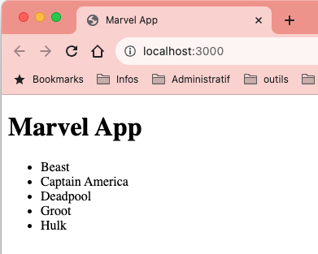
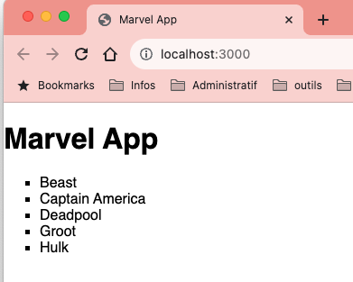
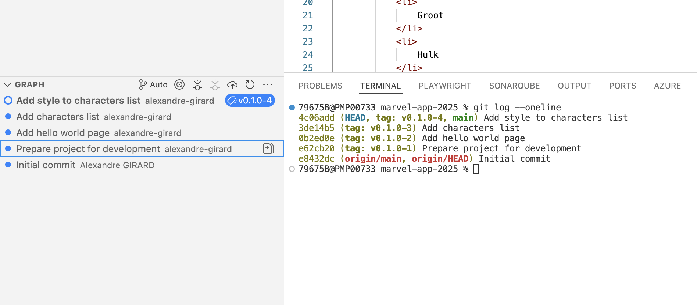
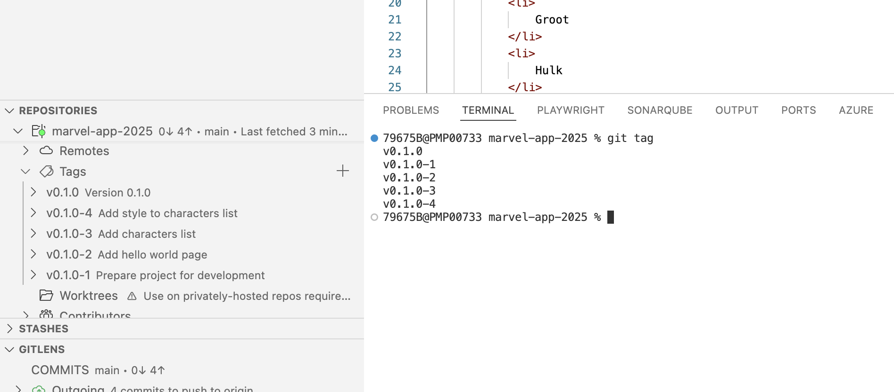
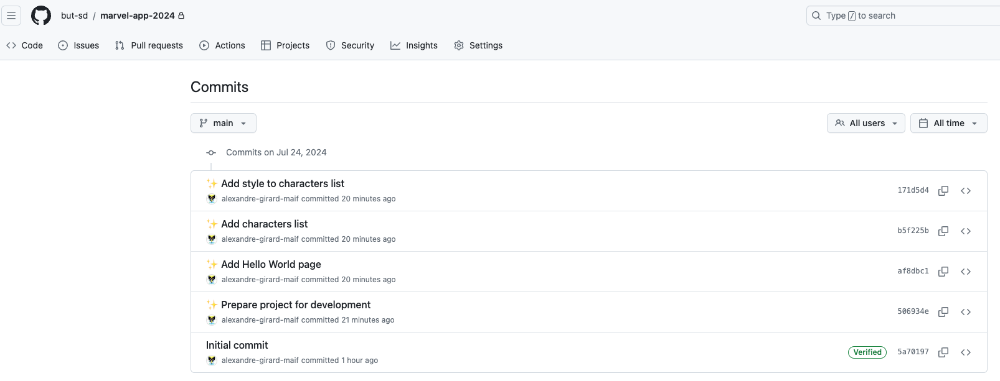
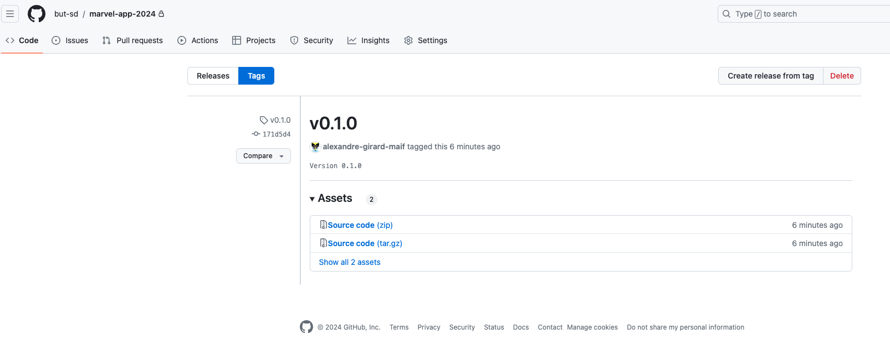

<!-- Add this CSS in your Markdown file to style the two-column layout -->
<style>
  .two-columns {
    display: flex;
  }
  .column {
    flex: 1;
    padding: 0 20px;
  }

  span {
    color: grey;
  }
</style>


# Marvel - Version 0.1.0

---

# semver - Semantic Versioning

Le système de versionnement sémantique est un standard pour numéroter les versions des logiciels. 

Pour plus d'informations, consulter le site [semver.org](https://semver.org/lang/fr/)

Il est basé sur trois nombres séparés par des points: `MAJOR.MINOR.PATCH`

* `MAJOR` - Version majeure: changements incompatibles avec les versions précédentes
* `MINOR` - Version mineure: ajouts de fonctionnalités compatibles avec les versions précédentes
* `PATCH` - Version de correction: corrections de bugs compatibles avec les versions précédentes

---

# semver - Semantic Versioning (suite)

Il est possible d'ajouter des informations supplémentaires à la version en utilisant des préfixes:

* `alpha` - Version alpha: version instable en cours de développement
* `beta` - Version beta: version de test avant la version finale
* `rc` - Version release candidate: version candidate pour la version finale
* `latest` - Version la plus récente

---

# semver - Semantic Versioning (suite)

Exemple de versionnement sémantique:

* `0.1.0` - Version 0.1.0: première version du logiciel, version non stable en cours de développement
* `0.2.0` - Version 0.2.0: ajout de fonctionnalités compatibles avec la version 0.1.0, version non stable en cours de développement
* `1.0.0.beta` - Version 1.0.0 beta: version de test avant la version finale
* `1.0.0.rc` - Version 1.0.0 release candidate: version candidate pour la version finale
* `1.0.0` - Version 1.0.0: première version stable du logiciel
* `1.1.0` - Version 1.1.0: ajout de fonctionnalités compatibles avec la version 1.0.0
* `1.1.1` - Version 1.1.1: correction de bugs compatibles avec la version 1.1.0

---

# semver - Semantic Versioning (suite)

Le semver est à l'origine utilisé pour numéroter les versions des librairies utilisées dans un projet. Si le semver est respecté, il est possible de mettre à jour les librairies sans risque de casser le projet, par exemple on sait que la version `1.2.3` est compatible avec la version `1.2.0`

--- 

# semver - Semantic Versioning (suite)

Ce système de versionnement est également utilisé pour numéroter les versions d'applications. Même si les applications ne sont pas des librairies et que rien ne dépends d'elles, il est possible de suivre le semver pour indiquer le niveau de stabilité de l'application.

Par exemple la version `0.1.0` est une version instable en cours de développement, la version `1.0.0` est la première  version stable de l'application.

La version 1.1.0 est une version mineure avec des ajouts de fonctionnalités.

Une version 2.0.0 est une version majeure avec des changements fonctionnels importants.

---

# Gestion des dépendances

La plupart des applications modernes utilisent des dépendances pour fonctionner. Les dépendances sont des librairies tierces qui sont utilisées par l'application pour ajouter des fonctionnalités. On ne réinvente pas la roue, on utilise des librairies existantes pour gagner du temps et faciliter le développement.

Les dépendances sont gérées par un gestionnaire de dépendances qui permet de les installer, de les mettre à jour, de les supprimer, de les lister...

---

# Gestion des dépendances (suite)

Il est important de gérer les dépendances pour s'assurer que l'application fonctionne correctement et que les dépendances sont à jour. Privilégier les dépendances maintenues et actives pour éviter les problèmes de sécurité.

Attention à la notion de licence, certaines dépendances peuvent être payantes ou soumises à des restrictions d'utilisation. 

--- 

# npm - Node Package Manager

`npm` est le gestionnaire de paquets officiel de Node.js. Il permet d'installer, de mettre à jour, de supprimer, de lister les paquets installés, de gérer les dépendances d'un projet.

La description des dépendances est stockée dans un fichier `package.json` à la racine du projet. Ce fichier contient la liste des dépendances, des scripts, des métadonnées du projet (version, auteur, licence...).

* Créer un fichier `package.json` à la racine du projet avec la commande:
    * `npm init -y`
    * Modifier la version du projet en `0.1.0`

---

# Dépendances - Browser Sync

* Installer le module `browser-sync` pour créer un serveur web local avec la commande:
    * `npm install browser-sync --save-dev`
    * Le module `browser-sync` permet de créer un serveur web local pour visualiser le projet en cours de développement

* Exclure le répertoire `node_modules` du projet en créant un fichier `.gitignore` à la racine du projet avec le contenu:
    * `node_modules/`
    * Ce fichier permet d'ignorer les fichiers et répertoires dans le dépôt git. Il n'est pas nécessaire de les sauvegarder dans le dépôt car ils peuvent être générés à partir des fichiers sources et vont alourdir le dépôt.

---

# Scripts - Browser Sync

* Ajouter un script `start` dans le fichier `package.json` pour lancer le serveur web local avec la commande:
    * `"start": "browser-sync start --server './src' --files '**/*.html, **/*.css'"`
    * Ce script permet de lancer le serveur web local avec le module `browser-sync` et de surveiller les fichiers HTML et CSS pour les recharger automatiquement en cas de modification

* Commiter les modifications avec la commande:
    * `git add .`
    * `git commit -m "Prepare project for development"`
---

# Hello World

* Créer un fichier `src/index.html`, le dossier `src` contiendra le code source de notre application

* Ajouter le contenu HTML suivant:
    ```html
    <!DOCTYPE html>
    <html lang="en">
    <head>
        <meta charset="UTF-8">
        <title>Marvel App</title>
    </head>
    <body>
        <h1>Hello World!</h1>
    </body>
    </html>
    ```
---

# Lancement du serveur

* Lancer le serveur web local avec la commande:
    * `npm start`
    * Ouvrir un navigateur web à l'adresse `http://localhost:3000` pour visualiser la page web
    * Vérifier que le serveur web se relance automatiquement en cas de modification du fichier HTML

* Commiter avec le message "Add hello world page"
---

# Characters

<div class="two-columns">
  <div class="column">
    <ul>
        <li>
            Modifier le fichier <b>src/index.html</b> pour afficher la liste des personnages de Marvel sous la forme d'une liste non ordonnée <b>ul</b> avec des éléments de liste <b>li</b>, identifier la liste avec l'attribut <b>id="characters"</b> 
        </li>
        <li>
            Commiter avec le message "Add characters list"  
        </li>
  </div>
  <div class="column">
    
  </div>
</div>

---

# Style

<div class="two-columns">
  <div class="column">
    <ul>
        <li>
            Créer un fichier <b>src/style.css</b> pour ajouter du style à la page web
        </li>
        <li>
            Commiter avec le message "Add style to characters list"
        </li>
    </ul>
  </div>
  <div class="column">
    
  </div>

---

# Liste des commits

- Visualiser la liste des commits avec la commande:
    - `git log --oneline`
- La liste devrait équivalente à:


---

# Tag

- Créer un tag pour la version 0.1.0 avec le message "Version 0.1.0" avec la commande:
    - `git tag v0.1.0 -m "Version 0.1.0"`

- Visualiser la liste des tags avec la commande:
    - `git tag`

- Visualiser les détails du tag avec la commande:
    - `git show v0.1.0`

---

# Tag (suite)

Dans vscode, les tags sont visibles dans la vue __Source Control__:



---

# Sauvegarde sur GitHub

- Sauvegarder les modifications sur GitHub avec la commande:
    - `git push origin main`
    - `git push origin v0.1.0`

---

# Sauvegarde sur GitHub (suite)

- Visualiser les commits sur GitHub:



---

# Sauvegarde sur GitHub (suite)

- Visualiser les tags sur GitHub:


