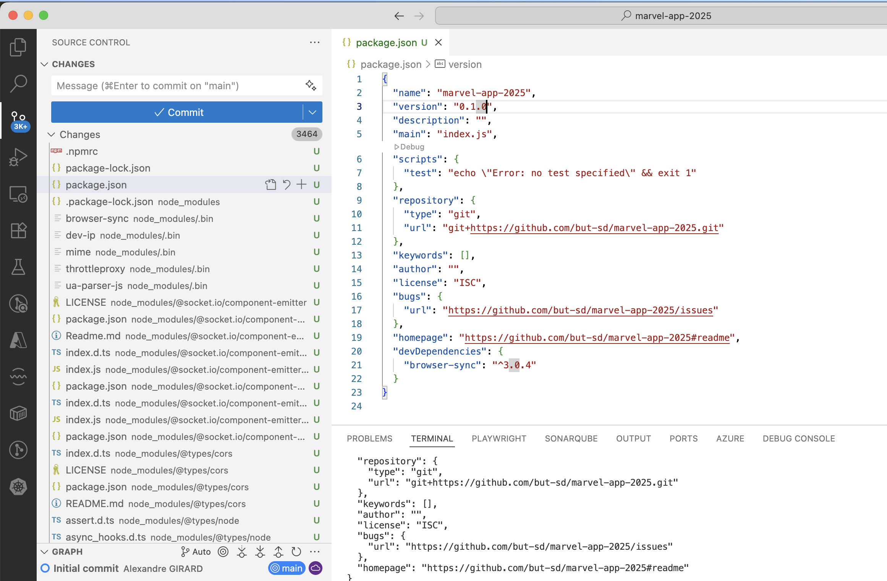
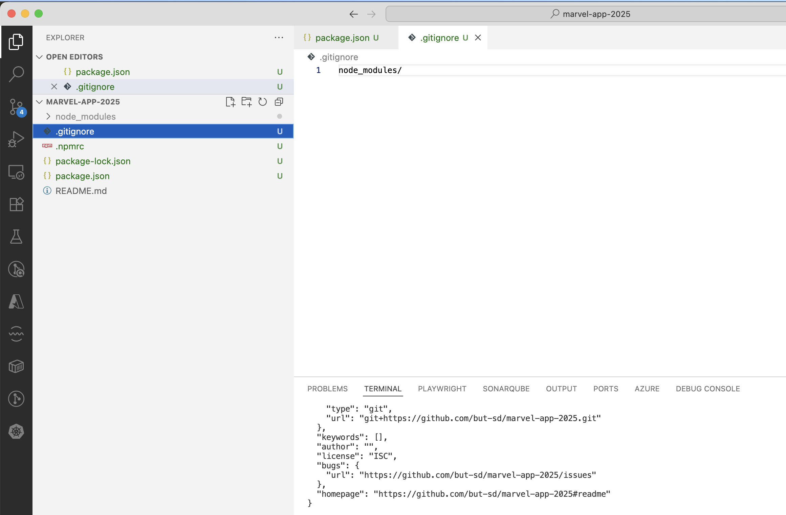
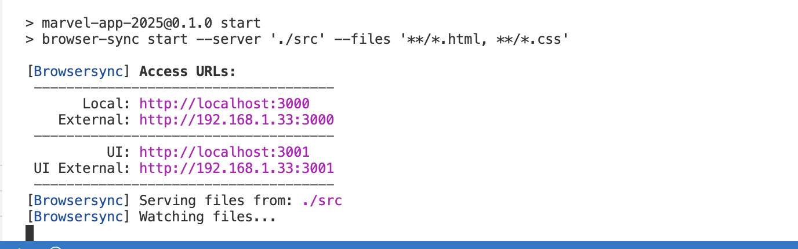

<!-- Add this CSS in your Markdown file to style the two-column layout -->
<style>
  .two-columns {
    display: flex;
  }
  .column {
    flex: 1;
    padding: 0 20px;
  }

  span {
    color: grey;
  }
</style>


# Marvel - Version 0.1.0

---

# Librairies

La plupart des applications modernes utilisent des dépendances pour fonctionner. 

Les dépendances sont des **librairies** tierces qui sont utilisées par l'application pour ajouter des fonctionnalités.

Quand cela est possible, on utilise des **librairies** existantes pour gagner du temps et faciliter le développement (on ne réinvente pas la roue).

Elles sont souvent publiées sur des dépôts publics comme npm (Node Package Manager), pypi (Python Package Index), Maven Central, etc.

---

# Librairies (suite)

Les librairies sont souvent utilisées pour:
* Gérer des fonctionnalités spécifiques (par exemple, la gestion des dates, la manipulation du DOM, la gestion des requêtes HTTP, etc.)
* Ajouter des fonctionnalités de sécurité (par exemple, la gestion des sessions, l'authentification, etc.)
* Ajouter des fonctionnalités de style (par exemple, les frameworks CSS, les bibliothèques de composants, etc.)
* etc...

---

# Librairies - Gestion des dépendances

Généralement les librairies sont installées via un gestionnaire de paquets (package manager).

Les gestionnaires de paquets sont des outils qui permettent de gérer les dépendances d'un projet. Ils permettent de télécharger les librairies depuis un dépôt public, de les installer dans le projet, de les mettre à jour, de les supprimer, de les lister...

---

# Librairies - Gestion des dépendances (suite)

Les gestionnaires de paquets les plus courants sont:
* npm (Node Package Manager), yarn pour les projets JavaScript
* pip (Python Package Index), poetry pour les projets Python, plus récemment `uv`
* Maven pour les projets Java
* etc...

---

# Librairies - Gestion des dépendances (suite)

Il est important de gérer les dépendances pour s'assurer que l'application fonctionne correctement et que les dépendances sont à jour. Privilégier les dépendances maintenues et actives pour éviter les problèmes de sécurité.

Attention à la notion de licence, certaines dépendances peuvent être payantes ou soumises à des restrictions d'utilisation. 

Il est important de lire la documentation des librairies pour comprendre comment les utiliser et quelles sont les limitations.

---

# Librairies - Gestion des dépendances (suite)

Généralement afin de pouvoir suivre les évolutions des librairies utilisées dans un projet, les librairies utilisent un système de versionnement sémantique **semver**. 

Ce système de versionnement permet de savoir si une librairie est compatible avec une autre, si elle a été mise à jour, si elle a été corrigée, etc.

---

# semver - Semantic Versioning

Le système de versionnement sémantique **semver** est devenu un standard pour numéroter les versions des logiciels, il est aussi utilisé pour numéroter les versions des applications.

Pour plus d'informations, consulter le site [semver.org](https://semver.org/lang/fr/)

Il est basé sur trois nombres séparés par des points: `MAJOR.MINOR.PATCH`

* `MAJOR` - __Version majeure__: changements incompatibles avec les versions précédentes
* `MINOR` - __Version mineure__: ajouts de fonctionnalités compatibles avec les versions précédentes
* `PATCH` - __Version de correction__: corrections de bugs compatibles avec les versions précédentes

---

# semver - Semantic Versioning (suite)

Il est possible d'ajouter des informations supplémentaires à la version en utilisant des préfixes:

* `alpha` - __Version alpha__: version instable en cours de développement
* `beta` - __Version beta__: version de test avant la version finale
* `rc` - __Version release candidate__: version candidate pour la version finale
* `latest` - __Version la plus récente__

---

# semver - Semantic Versioning (suite)

* `0.1.0` - __Version 0.1.0__: première version du logiciel, version non stable en cours de développement
* `0.2.0` - __Version 0.2.0__: ajout de fonctionnalités compatibles avec la version 0.1.0, version non stable en cours de développement
* `1.0.0.beta` - __Version 1.0.0 beta__: version de test avant la version finale
* `1.0.0.rc` - __Version 1.0.0 release candidate__: version candidate pour la version finale
* `1.0.0` - __Version 1.0.0__: première version stable du logiciel
* `1.1.0` - __Version 1.1.0__: ajout de fonctionnalités compatibles avec la version 1.0.0
* `1.1.1` - Version 1.1.1: correction de bugs compatibles avec la version 1.1.0

---

# semver - Semantic Versioning (suite)

Le **semver** est à l'origine utilisé pour numéroter les versions des librairies utilisées dans un projet.

 Si le **semver** est respecté, il est possible de mettre à jour les librairies sans risque de casser le projet, par exemple on sait que la version `1.2.3` est compatible avec la version `1.2.0`

--- 

# semver - Semantic Versioning (suite)

Ce système de versionnement est également utilisé pour numéroter les versions d'applications. 

Même si les applications ne sont pas des librairies et que rien ne dépends d'elles, il est possible de suivre le **semver** pour indiquer le niveau de stabilité de l'application.

Par exemple la version `0.1.0` est une version instable en cours de développement, la version `1.0.0` est la première  version stable de l'application.

La version 1.1.0 est une version mineure avec des ajouts de fonctionnalités.

Une version 2.0.0 est une version majeure avec des changements fonctionnels importants.

--- 

# npm - Node Package Manager

`npm` est le gestionnaire de paquets officiel de Node.js et est utilisé pour gérer les dépendances des projets JavaScript. 

La description des dépendances est stockée dans un fichier `package.json` à la racine du projet **marvel-app**. Ce fichier contient la liste des dépendances, des scripts, des métadonnées du projet (version, auteur, licence...).

* Créer un fichier `package.json` à la racine du projet avec la commande:
    * `npm init -y`
    * Modifier la version du projet en `0.1.0`

---

# Dépendances - Browser Sync

Le module `browser-sync` permet de créer un serveur web local pour visualiser le projet en cours de développement, il va nous permettre de ne plus utiliser l'extension Live Server de VSCode.

Installer le module `browser-sync` avec la commande:
* `npm install browser-sync --save-dev`
    

---

# Dépendances - Browser Sync (suite)

La commande `npm install` permet d'installer les dépendances du projet. 

L'option `--save-dev` permet d'ajouter la dépendance dans la section `devDependencies` du fichier `package.json`. 

Une dépendance dans cette section est une dépendance de développement, elle n'est pas nécessaire pour exécuter l'application en production, mais est nécessaire pour le développement.

---

# Dépendances - Browser Sync (suite)

L'execution de la commande `npm install` va créer un répertoire `node_modules` à la racine du projet, ce répertoire contient les dépendances du projet.

C'est un répertoire qui peut être volumineux avec de nombreux fichiers et sous-répertoires.

Ce répertoire peut être recréé à partir du fichier `package.json` en exécutant la commande `npm install`. Il n'est donc pas nécessaire, même déconseillé,  de le versionner dans le dépôt git.

---

# .gitignore

Le fichier `.gitignore` permet de spécifier les fichiers et répertoires à ignorer par git lors de la gestion des versions.

Il est utilisé pour éviter de versionner des fichiers ou répertoires qui ne sont pas nécessaires au projet ou qui sont générés automatiquement, c'est le cas du répertoire `node_modules`.

---

# .gitignore (suite)



---

# .gitignore (suite)

Exclure le répertoire `node_modules` du projet en créant un fichier `.gitignore` à la racine du projet avec le contenu `node_modules/`



---

# Scripts - Browser Sync

Ajouter le script `start` dans le fichier `package.json` avant le script `test` pour lancer le serveur web local avec la commande `"start": "browser-sync start --server './src' --files './src/**/*''",`

Ce script permet de lancer le serveur web local avec le module `browser-sync` et de surveiller les fichiers présents dans le répertoire `src` pour les recharger automatiquement en cas de modification

---

# Scripts - Browser Sync (suite)

Exécuter le script `start` avec la commande `npm start`



Ouvrir un navigateur web à l'adresse `http://localhost:3000` pour visualiser la page web. 

Pour l'instant, la page affiche `Cannot GET /`, c'est normal, il n'y a pas de fichier HTML à la racine du répertoire `src`.

---

# Scripts - Browser Sync (suite)

Commiter les modifications avec les commandes `git add .` et `git commit -m "Prepare project for development"`

Pour rappel on commit des modifications de manière atomique, c'est à dire que chaque commit doit correspondre à une modification logique du projet. 

C'est bien le cas ici, on a préparé le projet pour le développement en ajoutant les dépendances et les scripts nécessaires.

---

# Hello World

* Créer un fichier `src/index.html`, le dossier `src` contiendra le code source de notre application

* Ajouter le contenu HTML suivant:
    ```html
    <!DOCTYPE html>
    <html lang="en">
    <head>
        <meta charset="UTF-8">
        <title>Marvel App</title>
    </head>
    <body>
        <h1>Hello World!</h1>
    </body>
    </html>
    ```
---

# Hello World - Suite

Lancer ou relancer le serveur web local avec la commande `npm start`

Ouvrir un navigateur web à l'adresse `http://localhost:3000` pour visualiser la page web et vérifier que le serveur web se relance automatiquement en cas de modification du fichier HTML

Commiter avec le message `Add hello world page`, vous pouvez le faire en ligne de commande ou avec l'interface graphique de VSCode

---

# Characters

<div class="two-columns">
  <div class="column">
    <ul>
        <li>
            Modifier le fichier <b>src/index.html</b> pour afficher la liste des personnages de Marvel sous la forme d'une liste non ordonnée <b>ul</b> avec des éléments de liste <b>li</b>, identifier la liste avec l'attribut <b>id="characters"</b> 
        </li>
        <li>
            Commiter avec le message "Add characters list"  
        </li>
  </div>
  <div class="column">
    
  </div>
</div>

---

# Style

Créer un fichier <b>src/style.css</b> avec le contenu suivant:

```css
body {
    font-family: sans-serif;
    margin: 0;
    padding: 0;
}

li {
    list-style-type: square;
}
```

---

# Style (suite)

<div class="two-columns">
  <div class="column">
    <ul>
        <li>
            Inclure le fichier <b>src/style.css</b> dans le fichier <b>src/index.html</b> avec la balise <b>link</b> dans la section <b>head</b> du fichier HTML
        </li>
        <li>
            Vérifier que le style est appliqué à la liste des personnages
        </li>
        <li>
            Commiter avec le message "Add style to characters list"
        </li>
    </ul>
  </div>
  <div class="column">
    
  </div>

---

# Liste des commits

- Visualiser la liste des commits avec la commande:
    - `git log --oneline`
- La liste devrait équivalente à:


---

# Git - Tag

Un **tag** est une référence à un commit spécifique dans l'historique de git, il permet de retrouver facilement un commit particulier.

Les tags sont souvent utilisés pour marquer les versions stables du projet, par exemple la version 0.1.0 du projet Marvel.

Les tags sont stockés dans le dépôt git et peuvent être utilisés pour revenir à une version spécifique du projet.

---

# Git - Tag (suite)

- Créer un tag pour la version 0.1.0 avec le message "Version 0.1.0" avec la commande:
    - `git tag v0.1.0 -m "Version 0.1.0"`

- Visualiser la liste des tags avec la commande:
    - `git tag`

- Visualiser les détails du tag avec la commande:
    - `git show v0.1.0`

---

# Tag (suite)

Dans vscode, les tags sont visibles dans la vue __Repositories/Tags__:


---

# Sauvegarde sur GitHub

- Sauvegarder les modifications sur GitHub avec la commande:
    - `git push origin main` permet de pousser les commits sur la branche `main` du dépôt distant
    - `git push origin v0.1.0` permet de pousser le tag `v0.1.0` sur le dépôt distant

---

# Version 0.1.0 - Objectif

* Création de la page d'accueil de l'application
* Création d'une liste de personnages Marvel
* Mise en place du style de la page d'accueil
* Mise en place du système de versionnement avec git
* Création d'un tag pour la version 0.1.0

---

# Version 0.1.0 - Objectif (suite)


---

# Version 0.1.0 - Objectif (suite)

- Visualiser les commits sur GitHub:


---

# Version 0.1.0 - Objectif (suite)

- Visualiser les tags sur GitHub:


