<!-- Add this CSS in your Markdown file to style the two-column layout -->
<style>
  .two-columns {
    display: flex;
  }
  .column {
    flex: 1;
    padding: 0 20px;
  }

  span {
    color: grey;
  }

  .highlight {
            background-color: lightgrey;
            padding: 2px 4px;
            border-radius: 3px;
  }
</style>

<!-- Add script to support mermaid -->
<script src="https://unpkg.com/pako@1.0.10/dist/pako_deflate.min.js" async></script>
<script>
document.addEventListener('DOMContentLoaded', function() {
    setTimeout(function() {
        Array.from(document.querySelectorAll('.language-mermaid')).map(function(pre) {
            const encoded = new TextEncoder('utf-8').encode(pre.textContent);
            const compressed = window.pako.deflate(encoded, { level: 9, to: 'string' });
            const urlencoded = btoa(compressed).replace(/\+/g, '-').replace(/\//g, '_');
            const url = `https://kroki.io/mermaid/svg/${urlencoded}`;
            const img = document.createElement('img');
            img.src = url;
            pre.replaceWith(img);
        });
    // Give marp some time to load itself etc...
    }, 1000);
});
</script>


# Marvel - Version 0.2.0

---

# git - Branches

* Les branches constituent un élément central de Git. 
* Permettent de travailler sur plusieurs aspects d'un projet en parallèle.
* Très utiles pour travailler sur des fonctionnalités en cours de développement sans impacter le code de production.
* Permet de développer une nouvelle fonctionalité sur une branche dédiée sans risquer d’altérer le code de la branche principale, qui reste stable à tout moment.

---

# git - Branches (suite)

Lors de la création d'une branche, celle-ci est dupliquée à partir de la branche courante. Les modifications apportées à cette branche n'impactent pas les autres branches. Une fois les modifications terminées, il est possible de fusionner la branche avec la branche courante.

* Les branches sont des pointeurs vers un commit.
* Créer une nouvelle branche revient à créer un nouveau pointeur sur le commit courant.
* Les branches sont très légères et peu coûteuses en ressources.
* Les branches sont locales par défaut.
* Les branches peuvent être partagées avec d'autres développeurs en les poussant sur le dépôt distant.

---

# git - Branches (exemple)
<!-- 
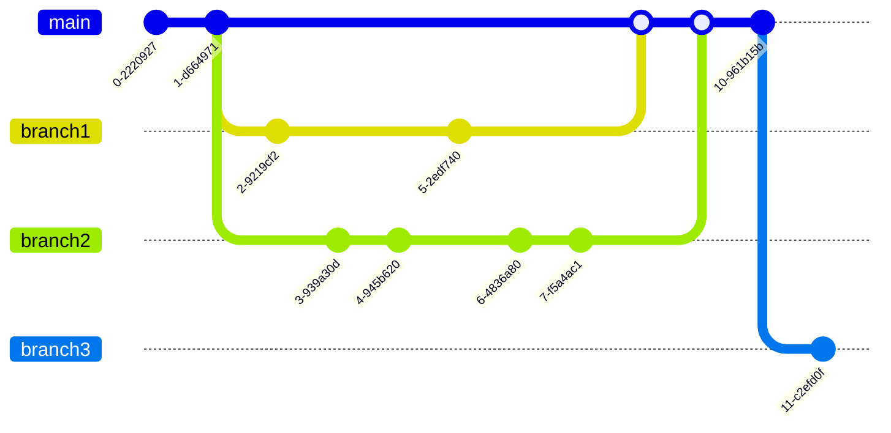
 -->

 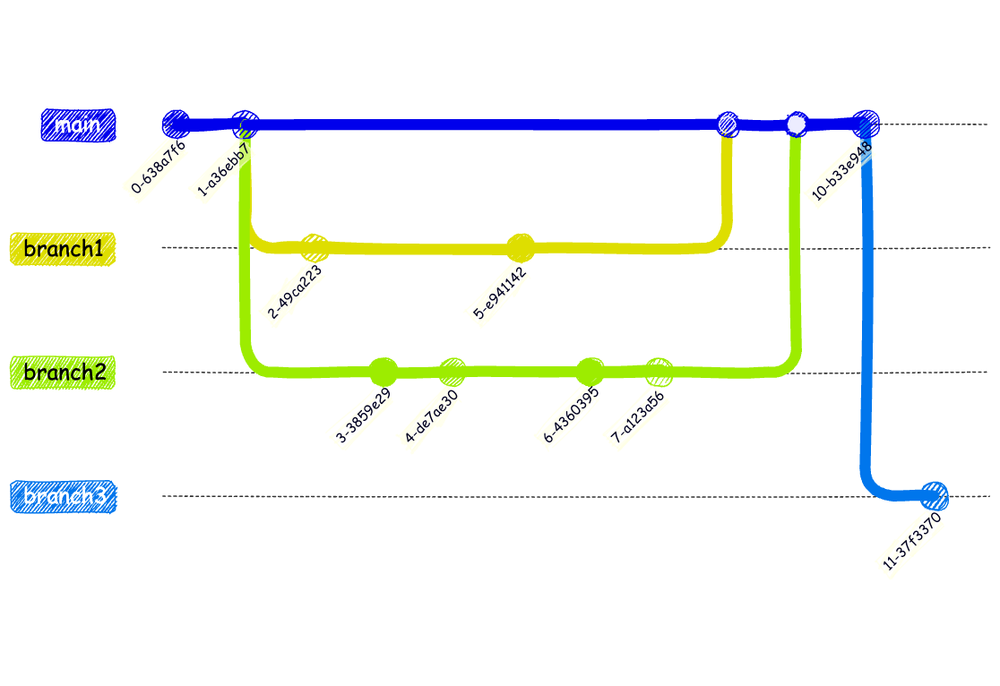

---

# gitflow

* Méthode de gestion des branches en utilisant Git.
* Permet de structurer le développement logiciel en définissant des règles pour les branches.
* Utilise des branches spécifiques pour les fonctionnalités, les correctifs, les versions, les releases...
* Permet de travailler sur plusieurs fonctionnalités en même temps sans impacter le code de production.

---

# gitflow - branche **develop**

La branche **develop** est la branche de développement. Elle contient les fonctionnalités en cours de développement, ainsi la branche **main** reste stable et contient le code de production. 

On ne travaille jamais directement sur la branche **main**, afin de ne pas impacter involontairement le code de production (risque de bugs, de régressions...).

---

# gitflow - branches **feature**

Lorsque l'on souhaite ajouter une nouvelle fonctionnalité, on crée une branche spécifique **feature/nom-fonctionnalite** à partir de la branche **develop**. 

Une fois la fonctionnalité terminée, on fusionne la branche avec la branche **develop**.

Le fait de travailler sur des branches **feature** permet de travailler sur plusieurs fonctionnalités en même temps pour une même version en cours de développement.

---

# gitflow - Mise en pratique

* Créer une nouvelle branche **develop** à partir de la branche principale
    * `git checkout -b develop`
* Créer une branche **feature/style** pour le style
    * `git checkout -b feature/style`
* Créer une branche **feature/data** pour les données
    * `git checkout -b feature/data`

---

# gitflow - Mise en pratique (suite)

Nous sommes maintenant sur les branches **feature-style** et **feature-data**. Nous pouvons travailler sur ces branches en parallèle pour ajouter les fonctionnalités de style et de données.

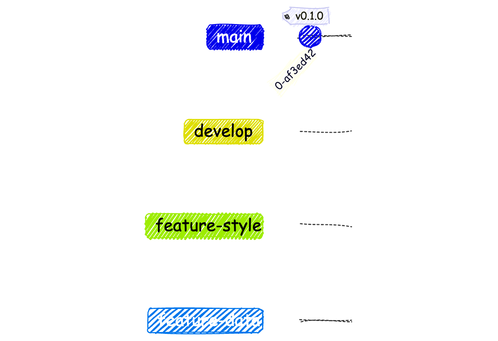
<!-- ```mermaid
gitGraph
    checkout main
    commit tag: "v0.1.0"
    branch develop
    checkout develop
    branch feature-style
    branch feature-data
    checkout feature-style
    checkout feature-data
``` -->

---

# gitflow - Mise en pratique (suite)

<div class="two-columns">
  <div class="column">
    <ul>
        <li>
            Lister les branches avec la commande: <mark class="highlight">git branch -v</mark>
        <li>
            L'option <b>-v</b> affiche le dernier commit de chaque branche. On voit ici que toutes les branches sont au même niveau (même commit)
        </li>
        <li>
            La branche courante est indiquée par un astérisque
        </li>
    </ul>
  </div>
  <div class="column">
    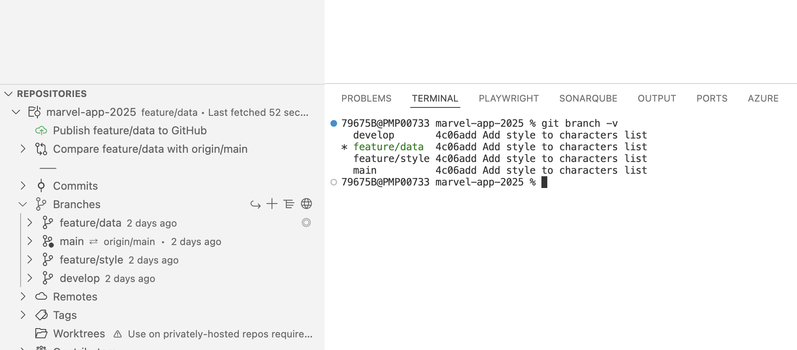
  </div>
</div>

---

# Fonctionnalités - Style

<div class="two-columns">
  <div class="column">
    <ul>
        <li>
            Se positionner sur la branche <b>feature/style</b> avec la commande: <br>
            <mark class="highlight">git checkout feature/style</mark>
        </li>
        <li>
            Modifier le fichier <b>src/style.css</b> pour ajouter du style à la page web
        </li>
        <li>
            Commiter avec le message "Modify style for characters list"
        </li>
    </ul>
  </div>
  <div class="column">
    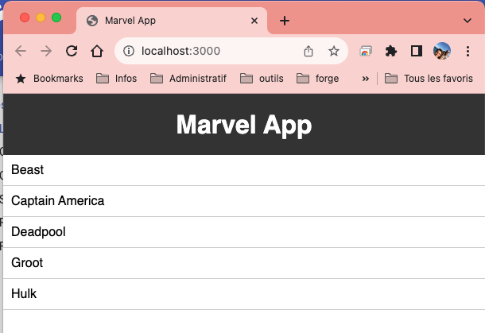
  </div>

---

# gitflow - Mise en pratique (suite)

L'état des branches après les modifications de style devrait être le suivant:

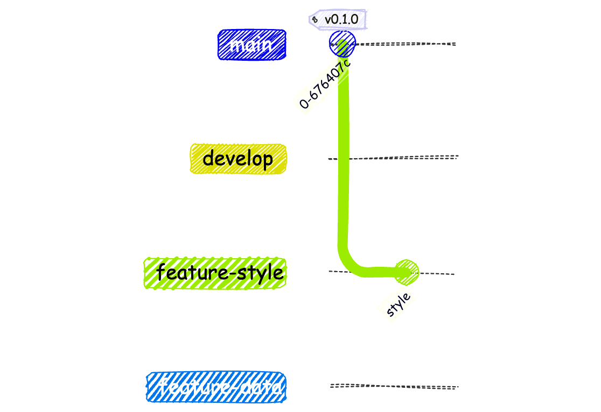

<!-- ```mermaid
gitGraph
    checkout main
    commit tag: "v0.1.0"
    branch develop
    checkout develop
    branch feature-style
    branch feature-data
    checkout feature-style
    commit id: "style"
    checkout feature-data
``` -->

---

# gitflow - Mise en pratique (suite)

L'extension **Git Graph** de **Visual Studio Code** permet de visualiser les branches et les commits.

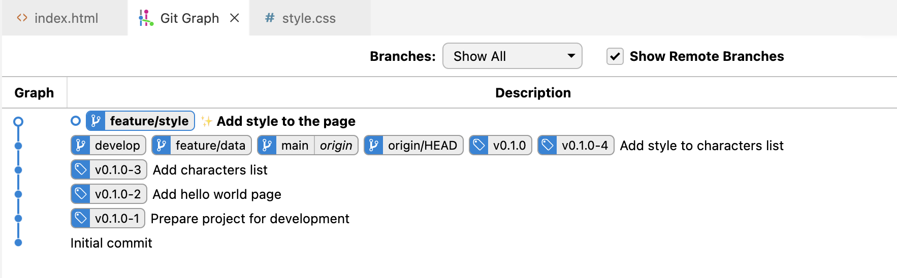

---

# Fonctionnalités - Données

* Se positionner sur la branche <b>feature/data</b> avec la commande:<br>
  <mark class="highlight">git checkout feature/data</mark>
* Créer un fichier <b>src/data/characters.json</b> pour ajouter des données sur les personnages Marvel et simuler une API
    * Le fichier characters.json contient un tableau d'objets. Chaque objet représente un personnage. Chaque personnage a un attribut name qui contient le nom du personnage.
* Vous pouvez récupérer les données des personnages <a href="https://but-sd.github.io/prez/characters.json" target="_blank">ici</a>
* Les données sont ensuite accessibles http://localhost:3000/data/characters.json

---

# Fonctionnalités - Données (suite)

* Créer un fichier <b>src/script.js</b> pour ajouter du code JavaScript pour récupérer les données depuis le fichier characters.json dans une fonction **getCharacters**
    * Appeler l'API http://localhost:3000/data/characters.json pour récupérer les données
    * Afficher les données dans la console du navigateur
* Modifier le fichier <b>src/index.html</b> pour ajouter une balise <b>script</b> pour charger le fichier <b>script.js</b> et appeler la fonction pour récupérer les données.
* Vérifier que les données s'affichent dans la console du navigateur
* Commiter avec le message "Add script to get characters data"

---

# Fonctionnalités - Données (suite)

* Modifier l'appel de la fonction **getCharacters** pour modifier le contenu de la liste des personnages avec les données récupérées
    * Utiliser un identifiant **characters** pour récupérer l'élément **ul** de la liste des personnages
    * Ajouter un élément **li** pour chaque personnage
* Commiter avec le message "Update characters list with data"

---

# gitflow - Mise en pratique (suite)

L'état des branches après les modifications de données devrait être le suivant:

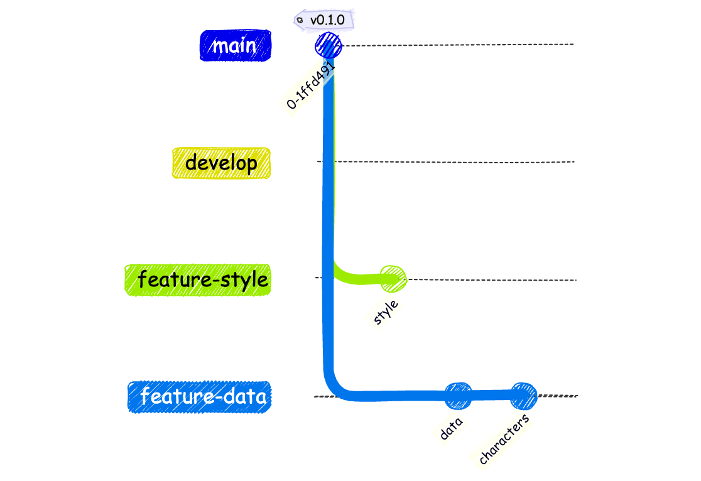

<!-- ```mermaid
gitGraph
    checkout main
    commit tag: "v0.1.0"
    branch develop
    checkout develop
    branch feature-style
    branch feature-data
    checkout feature-style
    commit id: "style"
    checkout feature-data
    commit id: "data"
    commit id: "characters"
``` -->

---

# gitflow - Mise en pratique (suite)

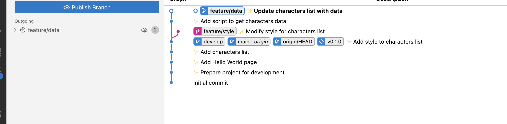

---

# git - Merge

* Une fois les fonctionnalités terminées, il est possible de fusionner les branches avec la branche **develop**.
* La fusion des branches se fait avec la commande **git merge**.
* La fusion des branches peut générer des conflits si les mêmes fichiers ont été modifiés sur les branches à fusionner.
* Les conflits doivent être résolus manuellement.
* Dans le cas de notre exemple, il ne devrait pas y avoir de conflits. Nous verrons comment les résoudre dans un exemple ultérieur.

---

# git - Merge (suite)

* Se positionner sur la branche **develop** avec la commande: `git checkout develop`
* Fusionner la branche **feature-style** avec la branche **develop** avec la commande: `git merge feature/style`

---

# git - Merge (suite)

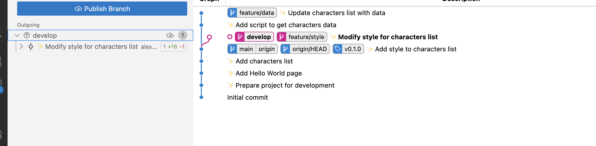

---

# git - Merge (suite)

* Fusionner la branche **feature-data** avec la branche **develop** avec la commande: `git merge feature/data`

---

# git - Merge (suite)

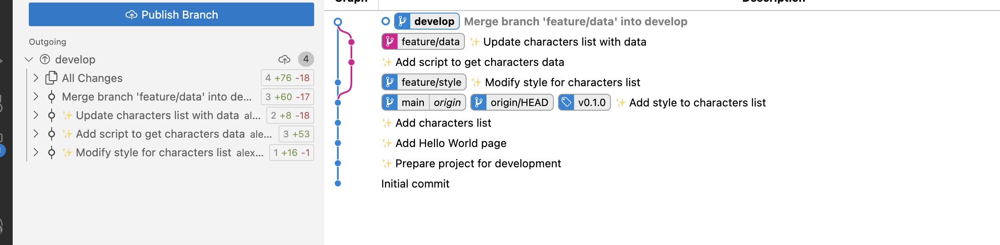

---

# git - Merge (suite)

Les deux branches **feature/style** et **feature/data** ont été fusionnées avec la branche **develop**.

Ayant terminé les 2 fonctionnalités, nous pouvons supprimer les branches **feature/style** et **feature/data**.

* Supprimer la branche **feature/style** avec la commande: `git branch -d feature/style`
* Supprimer la branche **feature/data** avec la commande: `git branch -d feature/data`

---

# git - Merge (suite)

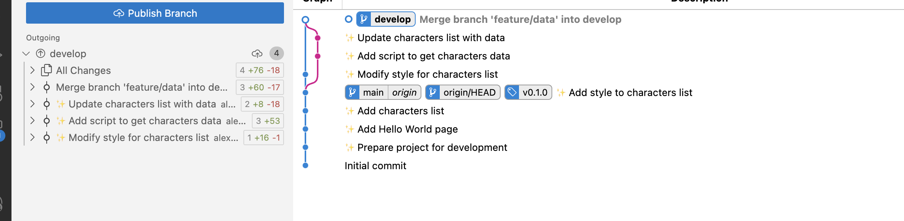

---

# git - Merge (suite)

Nous avons atteint l'objectif de la version 0.2.0 de l'application Marvel.

Nous avons ajouté du contenu JavaScript pour récupérer des données depuis un fichier JSON et du style CSS pour améliorer l'affichage.

Nous sommes maintenant prêts à fusionner la branche **develop** avec la branche principale **main**.

---

# git - Merge (suite)

* Avant de fusionner la branche **develop** avec la branche **main**, il est recommandé de vérifier que tout est fonctionnel.
* Tester l'application en local pour vérifier que les fonctionnalités ajoutées fonctionnent correctement.
* Vérifier que les modifications sont cohérentes avec les objectifs de la version 0.2.0.
* Modifier la version dans le fichier **package.json** pour refléter la nouvelle version de l'application et commiter la modification.

---

# git - Merge (suite)

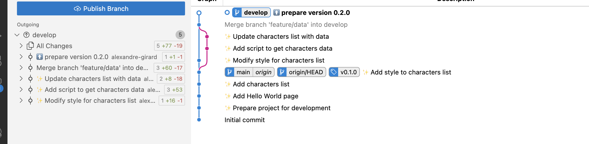

---

# git - Merge (suite)

* Se positionner sur la branche **main** avec la commande: `git checkout main`
* Fusionner la branche **develop** avec la branche **main** avec la commande: `git merge develop`

---

# git - Merge (suite)

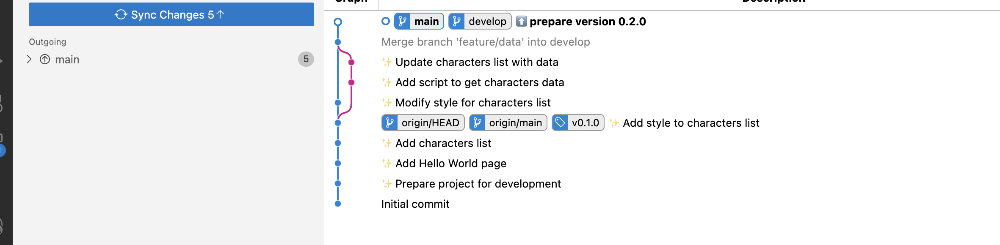

---

# git - Merge (suite)

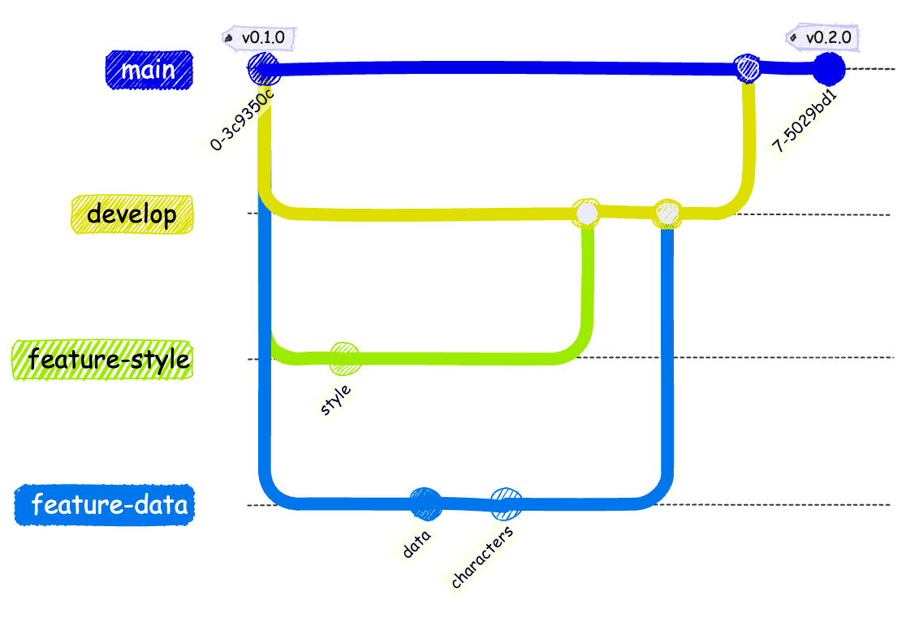

---

# git - push

* Une fois la branche **main** fusionnée avec la branche **develop**, il est possible de pousser les modifications sur le dépôt distant.
* Pousser les modifications sur le dépôt distant avec la commande: `git push origin main`
* Créer un tag pour la version 0.2.0 avec la commande: `git tag -a v0.2.0 -m "Version 0.2.0"`
* Pousser le tag sur le dépôt distant avec la commande: `git push origin v0.2.0`
