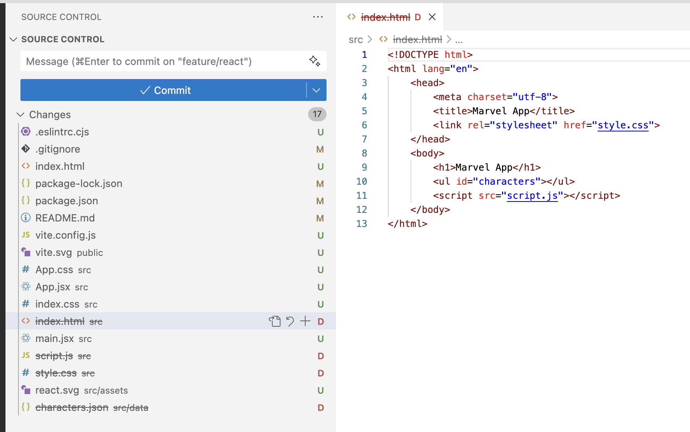
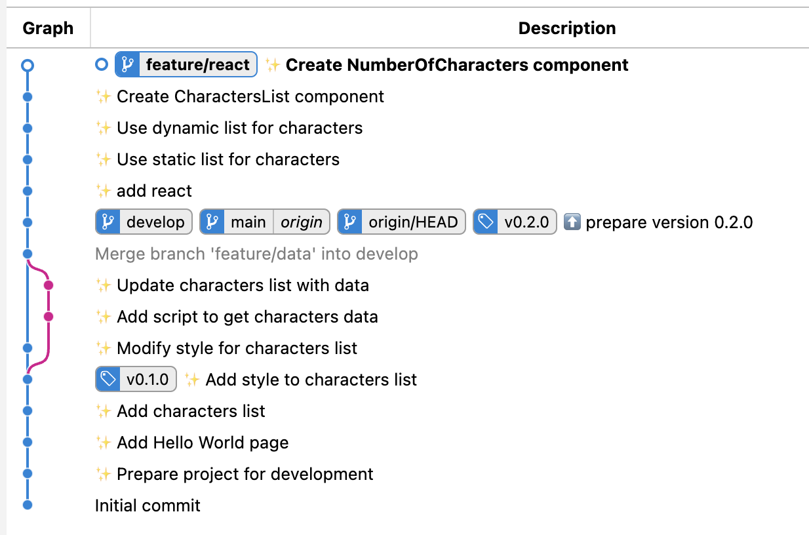
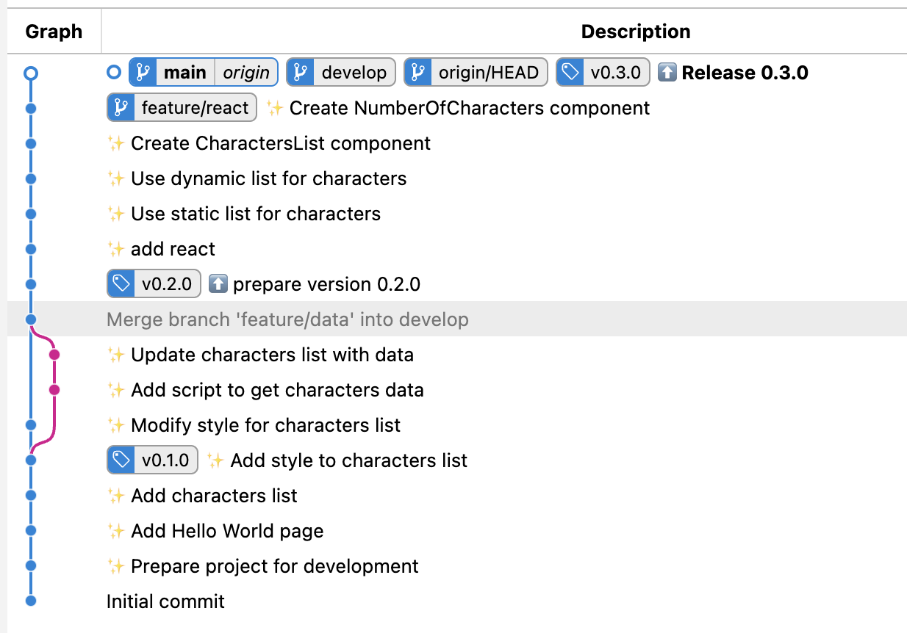
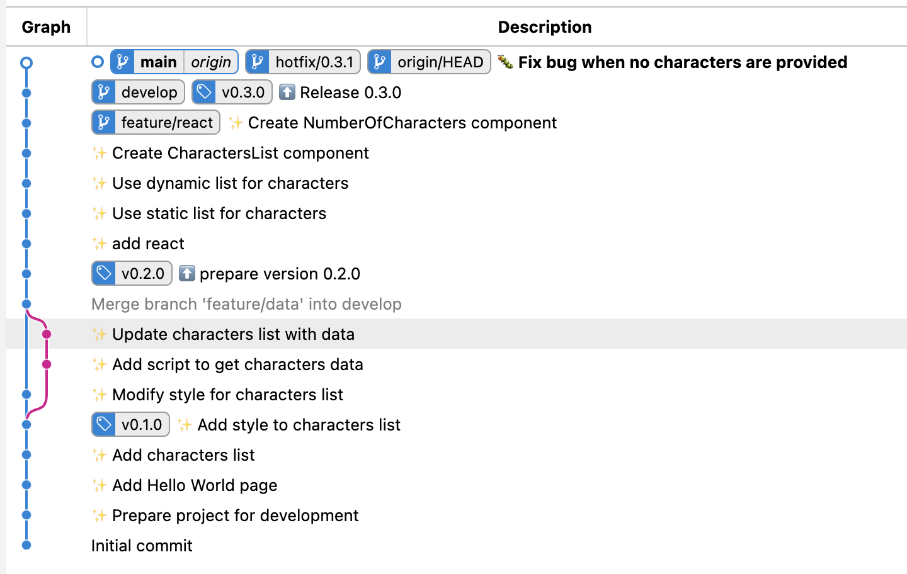
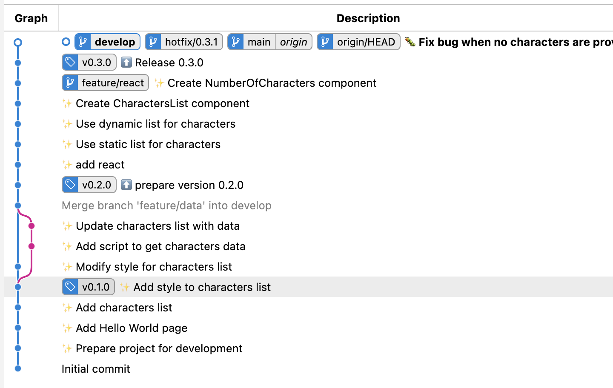

<!-- Add this CSS in your Markdown file to style the two-column layout -->
<style>
  .two-columns {
    display: flex;
  }
  .column {
    flex: 1;
    padding: 0 20px;
  }

  span {
    color: grey;
  }
</style>


# Marvel - Version 0.3.0

---

# Librairies et Frameworks

* Développer une application web en pure html/css/js
    * code difficile à maintenir, voir illisible
    * gestion des fonctionnalités complexes difficile
        * gestion des pages, de la navigation, des états, des événements, des composants, des données...

* Utiliser une librairie ou un framework
    * React
    * Angular
    * Vue
    * ...

---

# React

* librairie javascript développée par Facebook
* permet de construire des interfaces utilisateurs de manière déclarative et modulaire
* très populaire, utilisée par de nombreux sites web (Facebook, Instagram, Netflix, Airbnb...)
    * maintenue par une large communauté
    * nombreux tutoriels, exemples, articles
    * nombreux outils et librairies tierces

---

# React - Concepts

* composants
* états
* propriétés
* événements

---

# Composants

```text
+-----------------------+
|       App Component   |
|                       |
|   +---------------+   |
|   |   Header      |   |
|   +---------------+   |
|   |   Main        |   |
|   +---------------+   |
|   |   Footer      |   |
|   +---------------+   |
|                       |
+-----------------------+
```

* éléments de base de React
* permettent de découper l'interface en éléments indépendants
* réutilisables
* encapsulent le code html, css et javascript

---

# Etats

* données internes à un composant
* permettent de stocker des informations
* modifiables
* déclenchent le rendu du composant

---

# Propriétés

* données passées à un composant
* permettent de personnaliser le composant
* non modifiables

---

# Evénements

* actions déclenchées par l'utilisateur
* permettent de modifier les états des composants
* déclenchent le rendu du composant

---

# react - Installation

* Créer une branche **feature/react** à partir de la branche **develop** via la commande `git checkout -b feature/react develop`
* Installer React grâce à l'outil **vite** via la commande `npm create vite@latest . -- --template react`
    * Permet de créer un projet React avec un template de base minimal
    * Choisir l'option `Remove existing files and continue`
    * Installer les dépendances via la commande `npm install`
* Lancer l'application via la commande `npm run dev`

---

# react - Installation (suite)

<div class="two-columns">
  <div class="column">
    <ul>
        <li>
            L'installation de React a écrasé ou modifié les fichiers existants
        </li>
        <li>
            Pour chaque modification, choisir quoi conserver, modifier ou supprimer
        </li>
        <li>
            Une fois les modifications effectuées, ajouter les fichiers modifiés à l'index.
        </li>
        <li>
            Créer un commit avec le message `Add React`
        </li>
    </ul>
  </div>
  <div class="column">
    
  </div>
</div>

---

# react - Adapter le code existant - App.jsx

```html
import './App.css'

function App() {
  return (
    <>
      <h1>Marvel Characters</h1>
      <ul id="characters">
        <li>
          Beast
        </li>
        <li>
          Captain America
        </li>
        <li>
          Deadpool
        </li>
      </ul>
    </>
  )
}

export default App
```

---

# react - Adapter le code existant (suite)

* Copier les styles css du fichier `style.css` dans le fichier `App.css`
* Modifier le fichier `index.html` pour mettre le titre de la page à `Marvel App`
* Valider que tout fonctionne correctement puis créer un commit avec le message `Use static list for characters`

---

# react - Adapter le code existant (suite)

* Modifier le fichier `src/data/characters.json` pour ajouter un id à chaque personnage
    * Nécessaire pour React, chaque élément d'une liste doit avoir un identifiant unique
* Modifier le fichier `App.jsx` pour afficher la liste des personnages à partir du fichier `characters.json`
    * Utiliser la fonction `import` pour importer le fichier `characters.json`
    * Utiliser la fonction `map` pour parcourir le tableau de personnages
* Valider que tout fonctionne correctement puis créer un commit avec le message `Use dynamic list for characters`

---

# react - Créer un composant - CharactersList

* Créer un composant `CharactersList.jsx` dans le dossier `src/components`
    * Le composant doit afficher la liste des personnages
    * Il prend en paramètre une liste de personnages
    * Copier le code html de la liste des personnages dans le composant `CharactersList.jsx`
* Modifier le fichier `App.jsx` pour importer le composant `CharactersList.jsx` et l'utiliser pour afficher la liste des personnages
* Valider que tout fonctionne correctement puis créer un commit avec le message `Create CharactersList component`

---

# react - Créer un composant - NumberOfCharacters

* Créer un composant `NumberOfCharacters.jsx` dans le dossier `src/components`
    * Le composant doit afficher le nombre de personnages sous la forme `There is x characters` ou le message `There is no character` si la liste est vide
    * Il prend en paramètre une liste de personnages
* Modifier le fichier `App.jsx` pour importer le composant `NumberOfCharacters.jsx` et l'utiliser pour afficher le nombre de personnages
* Valider que tout fonctionne correctement puis créer un commit avec le message `Create NumberOfCharacters component`

---

# git - Etat de la branche feature/react

L'état actuel de la branche `feature/react` devrait ressembler à ceci:



---

# git

* Merger la branche `feature/react` dans la branche `develop` via la commande `git checkout develop` puis `git merge feature/react`

---

# git

* Modifer le numéro de version dans le fichier `package.json` pour `0.3.0`
* Vérifier que tout fonctionne correctement `npm install && npm run dev`
* Créer un commit avec le message `Release 0.3.0`
* Merger la branche `develop` dans la branche `main` via la commande `git checkout main` puis `git merge develop`
* Pousser les modifications sur le dépôt distant
* Créer un tag pour la version 0.3.0 avec la commande: `git tag -a v0.3.0 -m "Version 0.3.0"`
* Pousser le tag sur le dépôt distant avec la commande: `git push origin v0.3.0`

---

# git - Etat final



---

# Détection d'un bug dans la version 0.3.0

* Un bug a été détecté dans la version 0.3.0
* Si l'on ne passe pas de liste de personnages aux composants `CharactersList` et `NumberOfCharacters`, l'application affiche une page vide et renvoie une erreur dans la console
* Malheureusement, le bug n'a pas été détecté lors de la phase de test et a été déployé en production
* Il est nécessaire de corriger ce bug et de déployer une nouvelle version de type correctif (patch) 0.3.1

---

# gitflow - Créer une branche de type correctif

* Créer une branche `hotfix/0.3.1` à partir de la branche `main` via la commande `git checkout -b hotfix/0.3.1 main`
* Corriger le bug dans les composants `CharactersList` et `NumberOfCharacters` pour gérer le cas où la liste de personnages est vide
* Modifier le numéro de version dans le fichier `package.json` pour `0.3.1`
* Valider que tout fonctionne correctement puis créer un commit avec le message `Fix bug when no characters are provided`
* Merger la branche `hotfix/0.3.1` dans la branche `main` via la commande `git checkout main` puis `git merge hotfix/0.3.1`
* Pousser les modifications sur le dépôt distant

---

# gitflow - Créer une branche de type correctif (suite)

La modification a été faite sur la branche `hotfix/0.3.1` et a été mergée dans la branche `main`. L'état actuel des branches devrait ressembler à ceci:



---

# gitflow - Créer une branche de type correctif (suite)

* On constate que la branche `main` est en avance sur la branche `develop`
* La branche `develop`ne contient pas la correction du bug
* Il est nécessaire de merger la branche `main` dans la branche `develop` via la commande `git checkout develop` puis `git merge main`
* Pousser les modifications sur le dépôt distant

---

# gitflow - Créer une branche de type correctif (suite)

L'état final des branches devrait ressembler à ceci:



