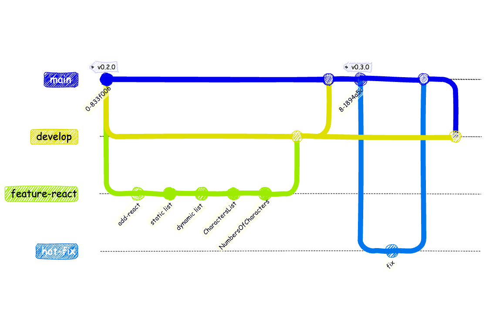

<!-- Add this CSS in your Markdown file to style the two-column layout -->
<style>
  .two-columns {
    display: flex;
  }
  .column {
    flex: 1;
    padding: 0 20px;
  }

  span {
    color: grey;
  }
</style>


# Marvel - Version 0.3.0

---

# D'une page statique à une application web

Le **html**, le **css** et le **javascript** sont les technologies de base du web. Elles permettent de créer des pages web statiques.

Elles sont suffisantes pour créer des pages web simples, mais deviennent rapidement difficiles à maintenir et à étendre pour des applications web plus complexes.

---

# D'une page statique à une application web (suite)

Par exemple en ajoutant des pages, des formulaires, des interactions avec l'utilisateur, des données dynamiques... on se retrouve rapidement avec 

- du code difficile à lire, 
- à maintenir et à étendre (duplication de code, logique métier dispersée, des données...)
- des bugs difficiles à corriger
- des performances médiocres (rechargement complet de la page, gestion des événements, gestion des états...)

---

# Librairies et Frameworks

Pour résoudre ces problèmes, il est courant d'utiliser des **librairies** ou des **frameworks** qui permettent de structurer le code, de le rendre plus lisible et plus maintenable.

Les problématiques rencontrées par un développeur web sont les mêmes depuis des années, et de nombreuses solutions ont été proposées pour y répondre.

---

# Librairies et Frameworks (suite)

Les **librairies** et **frameworks** permettent de:
* Structurer le code
    * séparation des préoccupations (HTML, CSS, JavaScript)
    * modularité (composants, modules, services...)
* Gérer les données
    * gestion des états (états locaux, globaux, partagés...)
    * gestion des données (API, stockage local, base de données...)
* Gérer les interactions avec l'utilisateur
    * gestion des événements (clics, saisie, navigation...)

---

# Librairies et Frameworks (suite)

* Gérer les performances
    * optimisation du rendu
* Gérer la navigation
    * gestion des routes (pages, URL, navigation...)
* Gérer la sécurité
    * protection contre les attaques (XSS, CSRF, injection SQL...) 

---

# Librairies et Frameworks (suite)


* Gérer l'accessibilité
    * rendre l'application accessible aux personnes en situation de handicap
* Gérer la compatibilité
    * compatibilité avec les navigateurs, les appareils, les systèmes d'exploitation...
* Gérer les tests
    * tests unitaires, tests d'intégration, tests de bout en bout... 

---

# Librairies et Frameworks (suite)

* La différence entre une **librairie** et un **framework** est que:
  * une **librairie** est un ensemble de fonctions ou de classes qui peuvent être utilisées
  * un **framework** est un ensemble de règles et de conventions qui définissent comment le code doit être structuré et organisé

* Un framework impose une architecture et des conventions à suivre, tandis qu'une librairie est plus flexible et peut être utilisée de manière indépendante.

---

# Librairies et Frameworks (suite)

* Il existe de nombreuses librairies et frameworks pour le développement web, chacun ayant ses propres avantages et inconvénients.
* Le choix d'une librairie ou d'un framework dépend des besoins du projet, des compétences de l'équipe, des contraintes techniques et des préférences personnelles.
* Il est important de bien comprendre les concepts de base du développement web avant de se lancer dans l'utilisation d'une librairie ou d'un framework.
* Il est également important de se tenir informé des évolutions des librairies et frameworks, car ils évoluent rapidement et de nouvelles solutions apparaissent régulièrement. 

---

# Librairies et Frameworks (suite)

Actuellement, les librairies et frameworks les plus populaires pour le développement web sont:
* __React__ : une librairie JavaScript développée par Facebook pour construire des interfaces utilisateurs
* __Angular__ : un framework JavaScript développé par Google pour construire des applications web
* __Vue.js__ : un framework JavaScript progressif pour construire des interfaces utilisateurs

---

# React

Sur le bassin Niortais, de nombreuses entreprises utilisent **React** pour leurs applications web. 

* **librairie** javascript développée par Facebook
* permet de construire des interfaces utilisateurs de manière déclarative et modulaire
* très populaire, utilisée par de nombreux sites web (Facebook, Instagram, Netflix, Airbnb...)
    * maintenue par une large communauté
    * nombreux tutoriels, exemples, articles
    * nombreux outils et librairies tierces

---

# Métiers de développeur web


En tant que développeur web, il est donc important de maîtriser **React** pour être compétitif sur le marché du travail, mais il faut être en capacité de travailler avec d'autres librairies et frameworks.

Le métier de développeur web est en constante évolution et il est important de se tenir informé des nouvelles technologies et des bonnes pratiques.

---

# Métiers de développeur web (suite)

Pour le développement de l'application Marvel, nous allons utiliser **React** pour construire l'interface utilisateur.
Nous allons découvrir les concepts de base de **React** et comment les utiliser pour construire une application web moderne et performante.

Nous n'irons pas dans les détails de **React** et nous ne verrons pas toutes les fonctionnalités avancées, mais nous allons nous concentrer sur les concepts de base et comment les utiliser pour construire une application web.

---

# React - Concepts

Les principaux concepts de **React** que nous allons aborder sont:

* composants
* états
* propriétés
* événements

---

# Composants

Le concept de base de **React** est le **composant**. Un **composant** est une partie de l'interface utilisateur qui peut être réutilisée et qui encapsule son propre code HTML, CSS et JavaScript.

Un **composant** peut être considéré comme une fonction qui retourne du code HTML. Il peut avoir des **propriétés** (props) et des **états** (state) qui lui sont propres.

---

# Composants (suite)

Un **composant** peut être composé d'autres **composants**. Par exemple, l'**App** **component** peut être composé de plusieurs **composants** enfants tels que **Header**, **Main** et **Footer**.

```text
+-----------------------+
|       App Component   |
|                       |
|   +---------------+   |
|   |   Header      |   |
|   +---------------+   |
|   |   Main        |   |
|   +---------------+   |
|   |   Footer      |   |
|   +---------------+   |
|                       |
+-----------------------+
```

---

# Composants (suite)

On peut le voir comme une brique de **lego** qui permet de construire l'interface utilisateur de manière modulaire et réutilisable.

* éléments de base de React
* permettent de découper l'interface en éléments indépendants
* réutilisables
* encapsulent le code html, css et javascript

---

# Propriétés (Props)

* données passées à un composant
* permettent de personnaliser le composant
* non modifiables

---

# Propriétés (suite)

* permettent de passer des données d'un composant parent à un composant enfant
* peuvent être utilisées pour configurer le comportement du composant
* peuvent être de n'importe quel type (chaîne de caractères, nombre, objet, tableau, fonction...)

---

# Propriétés (suite)

Par exemple, un composant qui afficherait "Hello {name}" d'une couleur {color} pourrait être utilisé de la manière suivante:

```javascript
<Hello name="Alexandre" color="blue" />
```

Le code du composant pourrait ressembler à ceci:

```javascript
function Hello(props) {
  return (
    <h1 style={{ color: props.color }}>Hello {props.name}</h1>
  );
}
```

--- 

# Propriétés (suite)

Les propriétés sont passées au composant via les **props**. Elles permettent de personnaliser le comportement du composant et de le rendre réutilisable avec différentes données.

Les **props** sont immuables, c'est-à-dire qu'elles ne peuvent pas être modifiées par le composant qui les reçoit. Elles sont utilisées pour configurer le composant et lui passer des données.

---

# Etat (state) et Evénements (events)

* Les deux autres concepts importants de **React** sont les **états** et les **événements**.
  * Les **états** (state) permettent de stocker des données qui peuvent changer au cours de la vie du composant.
  * Les **événements** (events) permettent de gérer les interactions de l'utilisateur avec l'interface utilisateur.

* Nous verrons comment utiliser les **états** et les **événements** pour rendre l'interface utilisateur dynamique et interactive.

---

# react - Installation

* Créer une branche **feature/react** à partir de la branche **develop** via la commande `git checkout -b feature/react develop`
* Installer React grâce à l'outil **vite** via la commande `npm create vite@latest . -- --template react`
    * Permet de créer un projet React avec un template de base minimal
    * Choisir l'option `Remove existing files and continue`
    * Installer les dépendances via la commande `npm install`
* Lancer l'application via la commande `npm run dev`

---

# react - Installation (suite)

Lancer l'application dans le navigateur à l'adresse `http://localhost:5173/`

Vous devriez voir une page avec le message `Vite + React` et un logo React

Ainsi qu'un composant de type Counter qui permet d'incrémenter et de décrémenter un compteur. Il utilise les concepts de base de React: composants, états et événements.

L'état du compteur est stocké dans le composant et est mis à jour lorsque l'utilisateur clique sur les boutons (événements de clic).

---

# react - Installation (suite)

L'installation de React a écrasé ou modifié les fichiers existants. Il est donc nécessaire de vérifier les modifications apportées par l'installation de React.

**git** nous permet de voir les modifications apportées par l'installation de React. 

Elle a supprimé nos fichiers `index.html`, `style.css` et `script.js`, nous allons tout de même les conserver pour les réutiliser dans la suite du projet. 

Pour cela nous allons les restaurer en annulant leur suppression.

---

# react - Installation (suite)


---

# react - Installation (suite)

Pour restaurer les fichiers supprimés, il faut utiliser la commande `git restore` suivie du nom des fichiers à restaurer. 

Par exemple, pour restaurer le fichier `src/index.html`, il faut utiliser la commande suivante:

```bash
git restore src/index.html
```

ou bien via l'interface graphique de votre éditeur de code.

---

# react - Installation (suite)

Une fois les fichiers restaurés, committer les modifications permettant d'ajouter React avec le message `Add React with vite`

```bash
git add .
git commit -m "Add React with vite"
```
---

# react - Structure du projet

Afin de comprendre la structure d'un projet React, on peut partir du fichier `index.html` qui est le point d'entrée de l'application.

```html
<!doctype html>
<html lang="en">
  <head>
    <meta charset="UTF-8" />
    <link rel="icon" type="image/svg+xml" href="/vite.svg" />
    <meta name="viewport" content="width=device-width, initial-scale=1.0" />
    <title>Vite + React</title>
  </head>
  <body>
    <div id="root"></div>
    <script type="module" src="/src/main.jsx"></script>
  </body>
</html>
```

---

# react - Structure du projet (suite)

On voit que le fichier `index.html` contient une balise `<div>` avec l'id `root`. C'est dans cette balise que React va injecter l'application.

On peut modifier le fichier `index.html` pour mettre le titre de la page à `Marvel App` et remplacer le logo Vite par le logo Marvel.

Et supprimer l'ancien logo Vite qui n'est plus utilisé.

---

# react - Structure du projet (suite)

Le logo Marvel doit être placé dans le dossier `public` du projet. 

Il est disponible à l'adresse `https://but-sd.github.io/prez/marvel.png`.

```html
...
<link rel="icon" type="image/png" href="/public/marvel.png" />
...
<title>Marvel App</title>
...
```

Puis committer les modifications avec le message `Update index.html for Marvel App`.

---

# react - Structure du projet (suite)

Le fichier `src/main.jsx` est le point d'entrée de l'application React. Il est chargé par le navigateur et il est responsable de l'initialisation de l'application.

Il va créer un élément React racine et le rendre dans la balise `<div id="root"></div>` du fichier `index.html`. 

Ce composant racine est généralement appelé `App`, c'est lui qui va contenir tous les autres composants de l'application.

---

# react - Hello World - Syntaxe JSX

Modifier le fichier `App.jsx` pour afficher le message `Hello World from react with JSX` en utilisant la syntaxe **JSX** (JavaScript Syntax Extension).

```javascript
import './App.css'

function App() {
  return (<h1>Hello World from react with JSX</h1>);
}

export default App;
```

La syntaxe JSX est très proche de la syntaxe HTML. Elle permet de créer des composants React (javascript) en utilisant des balises HTML.

--- 

# react - Syntaxe JSX

Pour plus de détails sur la syntaxe JSX, consulter la documentation officielle de React: [https://react.dev/learn](https://react.dev/learn)

Ou le guide simplifié [https://but-sd.github.io/guide-react/](https://but-sd.github.io/guide-react/)

---
# react - Liste des personnages Marvel - version statique

Modifier le fichier `App.jsx` pour afficher une liste statique des 3 premiers personnages Marvel (Beast, Captain America, Deadpool) dans une liste HTML en respectant la syntaxe JSX.

---

# react - Adapter le code existant (suite)

* Copier les styles css du fichier `style.css` dans le fichier `App.css`
* Supprimer le fichier `src/index.html` et le fichier `src/style.css` car ils ne sont plus utilisés
* Valider que tout fonctionne correctement puis créer un commit avec le message `Use static list for characters`

* Note: On aurait aussi pu séparer en 2 commits:
  * Un commit pour ajouter la liste statique des personnages Marvel
  * Un commit pour faire le ménage dans les fichiers inutiles (supprimer le fichier `src/index.html` et le fichier `src/style.css`)

---

# react - Adapter le code existant (suite)

* Modifier le fichier `App.jsx` pour afficher la liste des personnages à partir du fichier `characters.json`
    * `import characters from './data/characters.json';` permet d'importer le fichier JSON contenant la liste des personnages dans un objet JavaScript nommé `characters`
    * Utiliser la fonction `map` pour parcourir le tableau de personnages comme dans l'exemple présenté dans le guide React (https://but-sd.github.io/guide-react/#boucle)
* Valider que tout fonctionne correctement puis créer un commit avec le message `Use dynamic list for characters`

---

# react - Premier pas vers les composants

Nous allons modifier le fichier `App.jsx` pour extraire la liste des personnages dans une fonction séparée (pour l'instant, cette fonction sera définie dans le même fichier).

Attention, le nom de la fonction doit commencer par une majuscule pour être reconnu comme un composant React.

La fonction `CharactersList` va retourner la liste des personnages, elle prendra en paramètre la liste des personnages et utilisera la fonction `map` pour créer un élément `<li>` pour chaque personnage.

---

# react - Créer les premiers composants

L'implémentation actuelle de la liste des personnages est dans le fichier `App.jsx`, ce qui n'est pas idéal pour la lisibilité et la maintenabilité du code (même si pour l'instant il n'y a pas beaucoup de code).

Il est préférable de créer des composants pour séparer la logique et le rendu de l'interface utilisateur.

De plus, cela permet de réutiliser les composants dans d'autres parties de l'application si nécessaire.

Nous souhaitons aussi afficher le nombre de personnages, qui pourrait être utilisé dans d'autres parties de l'application et s'appuie sur la liste des personnages.

---

# react - Créer les premiers composants (suite)

Notre application commence à prendre forme et l'organisation fonctionnelle du code devient importante pour la lisibilité et la maintenabilité.

Nous allons donc créer des composants pour la liste des personnages et le nombre de personnages.

Créer un dossier `src/components` pour y placer les composants de l'application

Tous les composants de l'application seront placés dans ce dossier, ce qui permet de les organiser et de les retrouver facilement.

---

# react - Créer un composant - CharactersList

* Créer un composant `CharactersList.jsx` dans le dossier `src/components`
* Modifier le fichier `App.jsx` pour importer le composant `CharactersList.jsx` et l'utiliser pour afficher la liste des personnages
* Valider que tout fonctionne correctement puis créer un commit avec le message `Create CharactersList component`

---

# react - Créer un composant - NumberOfCharacters

* Créer un composant `NumberOfCharacters.jsx` dans le dossier `src/components`
    * Le composant doit afficher le nombre de personnages sous la forme `There is x characters` ou le message `There is no character` si la liste est vide
    * Il prend en paramètre une liste de personnages
* Modifier le fichier `App.jsx` pour importer le composant `NumberOfCharacters.jsx` et l'utiliser pour afficher le nombre de personnages
* Valider que tout fonctionne correctement puis créer un commit avec le message `Create NumberOfCharacters component`

---

# git - Etat de la branche feature/react

L'état actuel de la branche `feature/react` devrait ressembler à ceci:


---

# git

* Merger la branche `feature/react` dans la branche `develop` via la commande `git checkout develop` puis `git merge feature/react`

---

# git

* Modifier le numéro de version dans le fichier `package.json` pour `0.3.0`
* Vérifier que tout fonctionne correctement `npm install && npm run dev`
* Créer un commit avec le message `Release 0.3.0`
* Merger la branche `develop` dans la branche `main` via la commande `git checkout main` puis `git merge develop`
* Pousser les modifications sur le dépôt distant
* Créer un tag pour la version 0.3.0 avec la commande: `git tag -a v0.3.0 -m "Version 0.3.0"`
* Pousser le tag sur le dépôt distant avec la commande: `git push origin v0.3.0`

---

# git - Etat final


---

# Détection d'un bug dans la version 0.3.0

* Un bug a été détecté dans la version 0.3.0
* Si l'on ne passe pas de liste de personnages aux composants `CharactersList` et `NumberOfCharacters`, l'application affiche une page vide et renvoie une erreur dans la console
* Malheureusement, le bug n'a pas été détecté lors de la phase de test et a été déployé en production
* Il est nécessaire de corriger ce bug et de déployer une nouvelle version de type correctif (patch) 0.3.1

---

# gitflow - Créer une branche de type correctif

* Créer une branche `hotfix/0.3.1` à partir de la branche `main` via la commande `git checkout -b hotfix/0.3.1 main`
* Corriger le bug dans les composants `CharactersList` et `NumberOfCharacters` pour gérer le cas où la liste de personnages est vide
  * La correction ici peut-être assez simple, il suffit de mettre une valeur par défaut pour la liste de personnages dans les props des composants.


```javascript
function CharactersList({ characters = [] }) {
```
  
---

# gitflow - Créer une branche de type correctif (suite)

* Modifier le numéro de version dans le fichier `package.json` pour `0.3.1`
* Valider que tout fonctionne correctement puis créer un commit avec le message `Fix bug when no characters are provided`
* Merger la branche `hotfix/0.3.1` dans la branche `main` via la commande `git checkout main` puis `git merge hotfix/0.3.1`
* Pousser les modifications sur le dépôt distant

---

# gitflow - Créer une branche de type correctif (suite)

La modification a été faite sur la branche `hotfix/0.3.1` et a été mergée dans la branche `main`. L'état actuel des branches devrait ressembler à ceci:


---

# gitflow - Créer une branche de type correctif (suite)

* On constate que la branche `main` est en avance sur la branche `develop`
* La branche `develop`ne contient pas la correction du bug
* Il est nécessaire de merger la branche `main` dans la branche `develop` via la commande `git checkout develop` puis `git merge main`
* Pousser les modifications sur le dépôt distant

---

# gitflow - Créer une branche de type correctif (suite)

L'état final des branches devrait ressembler à ceci:


---

# git - Supprimer les branches obsolètes

Suite à nos modifications, il est temps de nettoyer les branches obsolètes car elles ne sont plus nécessaires (nous ne travaillons plus dessus).

* Supprimer la branche `hotfix/0.3.1` via la commande `git branch -d hotfix/0.3.1`
* Supprimer la branche `feature/react` via la commande `git branch -d feature/react`

---

# git - Supprimer les branches obsolètes (suite)

L'état des branches après suppression devrait ressembler à ceci:


---

# Version 0.3.x - Objectif

L'objectif de cette version était de mettre en place une application React, de manipuler les premiers concepts de React tels que les composants, les props et l'état, et de créer une interface utilisateur simple pour afficher des données.

Nous avons aussi vu le concept `gitflow` de `hotfix` pour gérer les corrections de bugs.

---

# Version 0.3.1 - Objectif (suite)




<!-- ```mermaid
gitGraph
    checkout main
    commit tag: "v0.2.0"
    branch develop
    checkout develop
    branch feature-react
    checkout feature-react
    commit id: "add-react"
    commit id: "static list"
    commit id: "dynamic list"
    commit id: "CharactersList"
    commit id: "NumbersOfCharacters"
    checkout develop
    merge feature-react
    checkout main
    merge develop
    commit tag: "v0.3.0"
    branch hot-fix
    commit id: "fix"
    checkout main
    merge hot-fix
    checkout develop
    merge main
``` --> 
