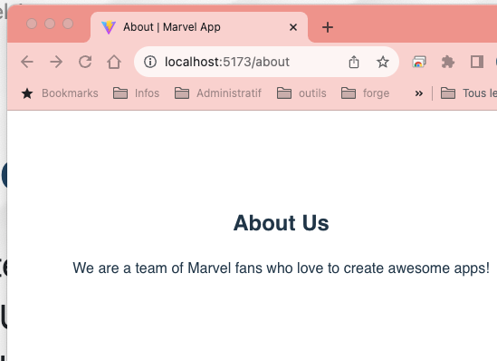
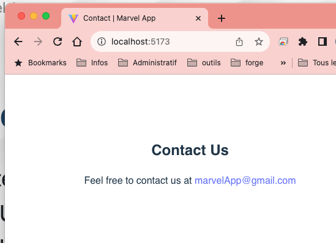
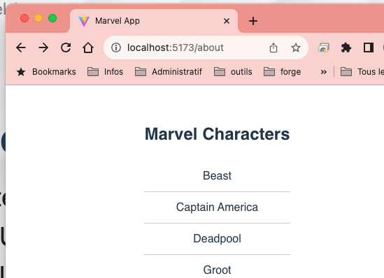
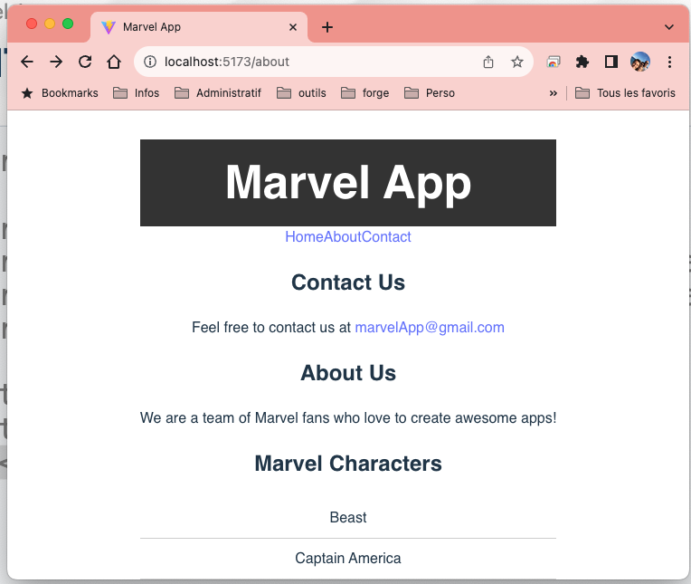
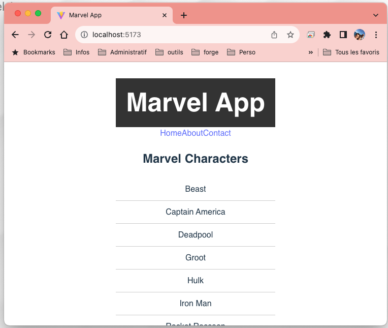
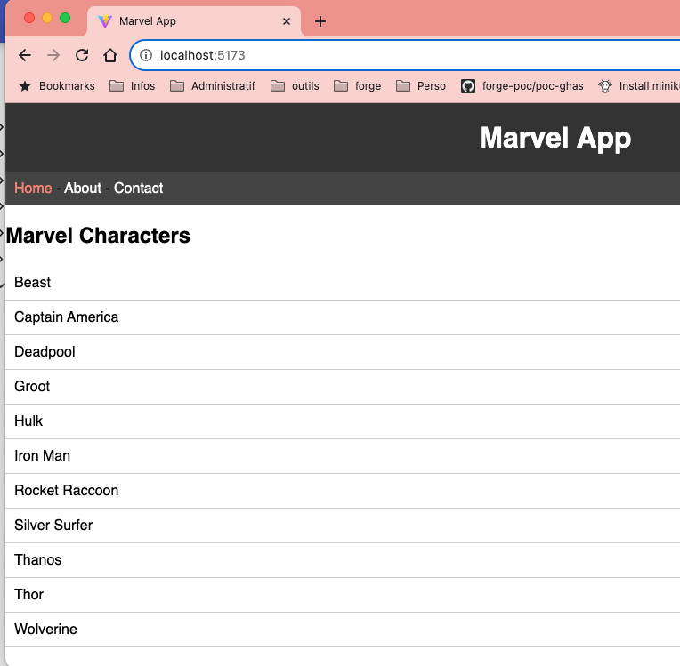
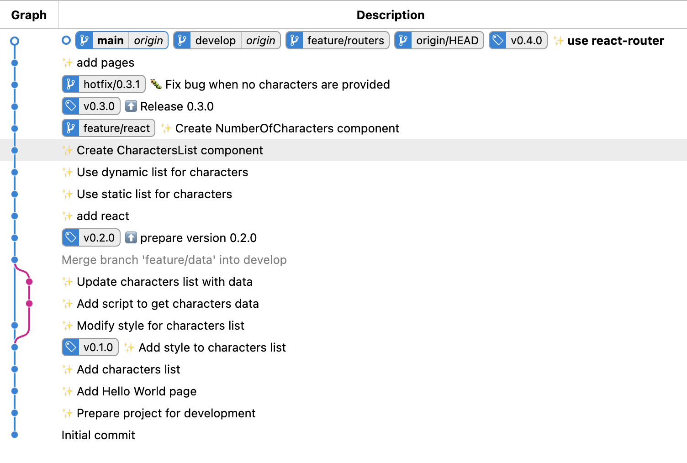

<!-- Add this CSS in your Markdown file to style the two-column layout -->
<style>
  .two-columns {
    display: flex;
  }
  .column {
    flex: 1;
    padding: 0 20px;
  }

  span {
    color: grey;
  }
</style>


# Marvel - Version 0.4.0

---

# Gestion de la navigation dans l'application

* installation et configuration de __React Router__, librairie tierce permettant de gérer la navigation
* Mise en place de la navigation dans l'application Marvel
    * définir les routes
    * définir les composants à afficher en fonction de la route
* Définir le layout de l'application
    * header, footer, menu, sidebar, contenu principal...

---

# git

A vous de faire le nécessaire pour travailler correctement avec git et générer la version 0.4.0 de l'application.

* Rappel: 
  * On ne travaille pas directement sur la branche principale.
  * On utilise des branches de fonctionnalités pour travailler sur des fonctionnalités spécifiques.
  * On commit régulièrement de manière atomique et avec des messages de commit explicites.
  * On ne commit pas du code rendant l'application inutilisable.
  * On ne merge pas une branche sans avoir testé le code.

---

# git

Nous verrons plus tard comment sécuriser nos branches de développement et de production. Pour l'instant c'est à nous de faire attention à ne pas commettre d'erreurs.

---

# Création des pages de l'application

* Création des pages de l'application
    * Home
    * Characters
    * Contact
    * About

---

# Création des pages de l'application (suite)

* Les pages sont des composants React
    * définis dans le dossier `src/pages`
    * importés dans le composant principal `App`

---

# Page About

Créez le composant `AboutPage` dans le dossier `src/pages` et ajoutez le contenu suivant:

<div class="two-columns">
  <div class="column">
    <ul>
        <li>Un système permettant de modifier le titre de la page (document.title)</li>
        <li>Un en-tête h2</li>
        <li>Un paragraphe</li>
    </ul>
    Pour tester cette page, modifier le fichier App.jsx pour utiliser le composant <b>AboutPage</b> (et supprimer l'affichage actuel).
  </div>
  <div class="column">
    
  </div>
</div>

---

# Page Contact

Créez le composant `ContactPage` dans le dossier `src/pages` et ajoutez le contenu suivant:

<div class="two-columns">
  <div class="column">
    <ul>
        <li>Un système permettant de modifier le titre de la page (document.title)</li>
        <li>Un en-tête h2</li>
        <li>Un message de contact avec un lien de type mailto</li>
    </ul>
    Pour tester cette page, modifier le fichier App.jsx pour afficher la page <b>Contact</b>.
  </div>
  <div class="column">
    
  </div>

---

# Page Characters

Créez le composant `CharactersPage` dans le dossier `src/pages` et ajoutez le contenu suivant:

<div class="two-columns">
  <div class="column">
    <ul>
        <li>Un système permettant de modifier le titre de la page (document.title)</li>
        <li>Le contenu qui était affiché sur la page d'accueil, attention au chemin d'accès aux imports</li>
    </ul>
    Pour tester cette page, modifier le fichier App.jsx pour afficher la page <b>Characters</b>.
  </div>
  <div class="column">
    
  </div>
</div>

---

# Page Home

Nous n'avons pas de contenu spécifique pour la page Home, nous afficherons le contenu de la page Characters. Nous traiterons la page Home plus tard.

---

# Problématique - Gestions des routes

* Comment gérer la navigation dans une application React ?
* Comment définir les routes de l'application ?
* Comment afficher les composants en fonction de la route ?

---

# React Router

* __React Router__ est une librairie tierce permettant de gérer la navigation dans une application React
* Quelques explications sur react-router :
    * [Guide React](https://but-sd.github.io/guide-react/react-router/) 
    * [React Router](https://reactrouter.com/en/main/start/overview)

---

# React Router - Layout

Le layout de l'application permet de définir la structure de l'application, c'est-à-dire les éléments qui seront affichés sur toutes les pages de l'application.

* __Header__ : en-tête de l'application
    * navigation entre les pages
* __Main__ : contenu principal de l'application
* __Footer__ : pied de page de l'application
    
---

# React Router - Layout (suite)

* Création du layout de l'application
    * Création du composant `Layout` dans le dossier `src` (nommé `Layout.jsx`)
    * Importation du composant `Layout` dans le composant `App`
    * Utilisation du composant `Layout` dans le composant `App`

---

# React Router - Layout (suite)

```javascript
import React from 'react';

const Layout = ({ children }) => {
    return (
        <>
            <header>
                <h1>Marvel App</h1>
                <nav>
                    <a href="/">Home</a>
                    <a href="/about">About</a>
                    <a href="/contact">Contact</a>
                </nav>
            </header>
            <main>
                {children}
            </main>
            <footer>
                <p>Marvel App - 2023</p>
            </footer>
        </>
    );
};

export default Layout;
```

---

# Router - Layout (suite)

Le composant `Layout` devient le composant principal de l'application. C'est lui qui va gérer l'affichage des pages de l'application.

Il prend en paramètre la prop `children` qui correspond au contenu principal de l'application. C'est ici que nous allons afficher les pages de l'application. 

Dans un premier temps, nous allons afficher toutes les pages de l'application dans le composant `Layout`.

---

# Router - Layout (suite)

```javascript
import './App.css'

import AboutPage from './pages/AboutPage'
import ContactPage from './pages/ContactPage'
import CharactersPage from './pages/CharactersPage'
import Layout from './Layout'

function App() {
  return (
    <Layout>
      <AboutPage /> 
      <ContactPage />
      <CharactersPage />
    </Layout>
  )
}

export default App
```

---

# Router - Layout (suite)

Cela n'est toujours pas la bonne solution, mais nous avançons étape par étape, nous allons maintenant utiliser __React Router__ pour gérer la navigation entre les pages.



---

# React Router - routes

* Création du composant `routes` dans le dossier `src`
    * Importation du composant `routes` dans le composant `App`
    * Utilisation du composant `routes` dans le composant `App`

---

# React Router - routes (suite)

```javascript
import Layout from "./Layout";
import AboutPage from "./pages/AboutPage";
import CharactersPage from "./pages/CharactersPage";
import ContactPage from "./pages/ContactPage";

const routes = [
    {
        path: "/",
        element: <Layout />,
        children: [
            { path: "/", element: <CharactersPage /> },
            { path: "/about", element: <AboutPage /> },
            { path: "/contact", element: <ContactPage /> },
        ],
    },
];

export default routes;
```

---

# React Router - routes - explications

__path__ : chemin de la route
__element__ : composant à afficher
__children__ : routes enfants

* Nous avons défini les routes de l'application
    * `/` : page d'accueil, affiche la liste des personnages
    * `/about` : page About
    * `/contact` : page Contact

* Les trois pages sont affichées dans le composant `Layout` qui contient le header, le main et le footer de l'application

---

# React Router - App

Afin d'utiliser __React Router__ dans notre application, nous devons importer les composants `RouterProvider` et `createBrowserRouter` de `react-router-dom` et envelopper l'application avec le composant `RouterProvider`.

Il s'agit de la configuration de base de __React Router__. Cela permet de laisser __React Router__ gérer la navigation de l'application. La navigation pourra se faire sans recharger la page si nous utilisons les composants `Link` ou `NavLink`.

---

```javascript
import './App.css'

import { RouterProvider, createBrowserRouter } from 'react-router-dom';
import routes from './routes'

// Create a router that uses the client side history strategy for
const router = createBrowserRouter(routes)

function App() {
  return (
    <RouterProvider router={router} />
  )
}

export default App
```

---

# React Router - App - explications

* Nous avons importé les composants `RouterProvider` et `createBrowserRouter` de `react-router-dom`
* Nous avons importé le composant `routes` que nous avons créé précédemment
* Nous avons créé un router avec la fonction `createBrowserRouter` en lui passant les routes de l'application
* Nous avons enveloppé l'application avec le composant `RouterProvider` en lui passant le router que nous avons créé

---

# React Router - Layout

```javascript
import React from 'react';
import { Outlet } from 'react-router';

const Layout = () => {
    return (
        <>
            <header>
                <h1>Marvel App</h1>
                <nav>
                    <a href="/">Home</a>
                    <a href="/about">About</a>
                    <a href="/contact">Contact</a>
                </nav>
            </header>
            <main>
                <Outlet />
            </main>
            <footer>
                <p>Marvel App - 2023</p>
            </footer>
        </>
    );
};

export default Layout;
```

---

# React Router - Layout - explications

* Nous avons importé le composant `Outlet` de `react-router`
* Nous avons remplacé le contenu principal de l'application qui était géré grâce à la prop `children` par le composant `Outlet`
* Le composant `Outlet` permet d'afficher le composant correspondant à la route

---

# React Router

Nous avons maintenant une application avec une gestion de la navigation grâce à __React Router__.




---

# React Router - NavLinks

* Nous avons utilisé des balises `a` pour les liens de navigation, ce qui n'est pas optimal, on perd le fonctionnement de __React Router__ et on recharge la page à chaque clic.
* Nous allons remplacer ces balises par des composants `NavLink` de __React Router__
    * Permet de gérer la navigation sans recharger la page
    * Permet de gérer les classes CSS pour les liens actifs
    
---

# React Router - NavLinks (suite)

```javascript
import React from 'react';
import { Outlet } from 'react-router';
import { NavLink } from 'react-router-dom';

const Layout = () => {
    return (
        <>
            <header>
                <h1>Marvel App</h1>
                <nav>
                    <NavLink to="/">Home</NavLink> - <NavLink to="/about">About</NavLink> - <NavLink to="/contact">Contact</NavLink>
                </nav>
            </header>
            <main>
                <Outlet />
            </main>
            <footer>
                <p>Marvel App - 2023</p>
            </footer>
        </>
    );
};

export default Layout;
```

---

# Ajout de css pour améliorer l'affichage

<div class="two-columns">
  <div class="column">
    <ul>
        <li>Remplacer le contenu du fichier `App.css` afin d'améliorer l'affichage de l'application</li>
        <li>Commenter la ligne `import './index.css'` dans le fichier `main.jsx`</li>
        <li><a href="./assets/css/App.css" download>Télécharger le fichier App.css</a></li>
    </ul>
  </div>
  <div class="column">
    
  </div>
</div>

---

# Fin de la version 0.4.0

* Nous avons ajouté la gestion de la navigation dans l'application
* Nous avons créé les pages de l'application
* Nous avons créé le layout de l'application
* Nous avons utilisé __React Router__ pour gérer la navigation
* Nous avons utilisé le composant `Outlet` pour afficher les composants correspondant à la route
* Nous avons utilisé les composants `NavLink` pour gérer la navigation sans recharger la page

---

# Fin de la version 0.4.0 (suite)

L'application est maintenant fonctionnelle, nous avons ajouté les fonctionnalités de base pour une application web permettant de naviguer entre les différentes pages de l'application de manière fluide.

Il est maintenant temps de générer une nouvelle version de l'application et de l'emmener jusqu'à la production. Faites le nécessaire pour générer la version 0.4.0 de l'application.

---

# git - Etat final


