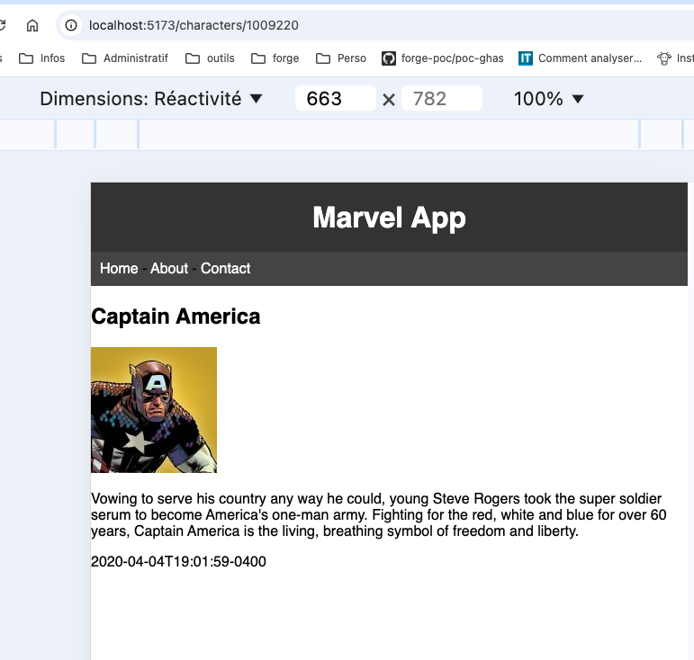

<!-- Add this CSS in your Markdown file to style the two-column layout -->
<style>
  .two-columns {
    display: flex;
  }
  .column {
    flex: 1;
    padding: 0 20px;
  }

  span {
    color: grey;
  }
</style>


# Marvel - Version 1.0.0

---

# git

Faite le nécessaire pour travailler sur une nouvelle fonctionnalité `Détail d'un personnage`

---

# Conventional Commits

Les **Conventional Commits** sont une convention de nommage pour les messages de commit qui permet de rendre l'historique des modifications plus lisible et structuré. Voici les types de commits les plus courants :

- **feat** : Une nouvelle fonctionnalité
- **fix** : Correction d'un bug
- **docs** : Modifications de la documentation
- **style** : Changements de style (formatage, espaces, etc.)
- **refactor** : Refactorisation du code (sans ajout de fonctionnalité ni correction de bug)
- **test** : Ajout ou modification de tests
- **chore** : Tâches diverses (mise à jour des dépendances, scripts, etc.)

---

# Conventional Commits (suite)

Le **Conventional Commits** permet de mieux comprendre l'historique des modifications et de faciliter la collaboration au sein de l'équipe.

Il permet aussi de générer automatiquement des **changelog** et de faciliter la publication de nouvelles versions. 

Par exemple la présence d'un tag `feat` dans un commit peut indiquer qu'une nouvelle fonctionnalité a été ajoutée, la version mineure du projet pourrait être incrémentée automatiquement.

De même la présence d'un tag `fix` pourrait indiquer qu'un bug a été corrigé, ce qui pourrait entraîner une incrémentation de la version patch.

---

# Conventional Commits (suite)

En respectant cette convention, chaque membre de l'équipe peut rapidement identifier le type de changement apporté par un commit donné.

Il est aussi possible d'automatiser le contrôle des messages de commit pour s'assurer qu'ils respectent bien la convention.

---

# git hooks

**git** met à disposition des hooks, qui sont des scripts exécutés à des moments clés du cycle de vie de **git**. 

Par exemple, on peut utiliser un hook `commit-msg` pour vérifier le message d'un commit avant qu'il ne soit enregistré.

Ou encore un hook `pre-commit` pour exécuter des tests ou des vérifications de code avant qu'un commit ne soit effectué.

Pour plus d'informations sur les hooks **git**, vous pouvez consulter la documentation officielle : https://git-scm.com/book/en/Customizing-Git-Git-Hooks

---

# husky

**husky** est un outil **Node.js** qui permet de gérer les hooks **git** de manière simple et efficace. Il s'intègre facilement dans les projets **JavaScript** et **TypeScript**. 

Pour installer **husky**, vous pouvez utiliser la commande suivante :

```bash
npm install --save-dev husky
```

Pour configurer **husky**, vous pouvez utiliser la commande suivante :

```bash
npx husky init
```

---

# husky (suite)

Par défaut cela va ajouter un hook `pre-commit` qui va exécuter les tests avant chaque commit. Nous n'avons pas encore vu la configuration des tests, nous verrons cela plus tard. Il est donc nécessaire de supprimer ce hook pour l'instant.

---

# API

Généralement, une application web moderne communique avec d'autres services pour récupérer des données ou effectuer des actions spécifiques (authentification, paiement, etc.) via des **A**pplication **P**rogramming **I**nterfaces (**API**).


La communication avec ces services se fait via des requêtes **HTTP** (GET, POST, PUT, DELETE) et des réponses **J**ava**S**cript **O**bject **N**otation (**JSON**).

Chaque verbe **HTTP** a une signification spécifique :

- **GET** : Récupérer des données
- **POST** : Envoyer des données
- **PUT** : Mettre à jour des données
- **DELETE** : Supprimer des données

---

# API (suite)

L'appel à une API peut être complexe et nécessite de gérer des erreurs, des temps de réponse, des données manquantes, du **caching** (afin d'améliorer les performances), etc.

Cela se fait généralement dans un module dédié, qui masque la complexité de l'appel à l'**API** et expose des fonctions plus simples à utiliser.

---

# API - characters

Pour simplifier notre travail, nous allons utiliser un fichier **JSON** qui contient les données des personnages, mais nous pourrions très bien utiliser une véritable **API**.

L'implémentation étant **mockée** (bouchonnée), nous pourrons facilement la remplacer par de vrais appels d'API.

---

# API - characters (suite)

Créez un fichier `characters-api.js` dans le dossier `src/api` qui expose deux fonctions:

- `getCharacters` qui retourne la liste des personnages
- `getCharacterById` qui retourne un personnage en fonction de son id

en récupérant les données du fichier `characters.json`

---

<!-- Remove header and footer for subsequent slides -->
<!-- _header: "" -->
<!-- _footer: "" -->

Modifier le fichier `CharactersPage.jsx` pour utiliser la fonction `getCharacters`

```javascript
import CharactersList from "../components/CharactersList";
import { getCharacters } from '../api/characters-api';
import NumberOfCharacters from "../components/NumberOfCharacters";

const CharactersPage = () => {
    // change the title of the page
    document.title = "Characters | Marvel App";

    // Get the list of characters from the API
    const characters = getCharacters();

    return (
        <>
            <h2>Marvel Characters</h2>
            <CharactersList characters={characters} />
            <br />
            <NumberOfCharacters characters={characters} />
        </>
    );
};

export default CharactersPage;
```

---

# CharactersPage (suite)

Cette façon de faire fonctionne, mais elle n'est pas optimale. Elle mélange la récupération des données et l'affichage des composants.

`react_router` nous permet de faire mieux en utilisant des `hooks` pour récupérer les données avant d'afficher le composant et ainsi de séparer récupération des données et affichage.

Adapter le code pour utiliser `react_router` et les `hooks` comme dans l'exemple de la documentation officielle (https://reactrouter.com/start/data/data-loading)

---

# CharacterDetailPage

Ajouter la route permettant d'afficher les détails d'un personnage en fonction de son id, en se basant sur l'exemple du [guide](https://but-sd.github.io/guide-react/react-router/#route-parametree) pour récupérer l'id du personnage puis les détails du personnage grâce à la fonction `getCharacterById`.

Note: Le paramètre `loader` peut récupérer les paramètres de l'URL, voir [ici](https://reactrouter.com/en/main/route/loader).

---

# CharacterDetailPage (suite)

Créez un composant `CharacterDetailPage` qui affiche la page de détail d'un personnage, qui elle-même utilise un composant `CharacterDetail` pour afficher les détails du personnage.

Une nouvelle version du fichier `characters.json` est disponible pour ajouter des détails sur les personnages (description, image, etc.) [characters.json](https://but-sd.github.io/prez/characters-full.json)

Attention, l'api peut ne pas renvoyer l'image du personnage, il faut donc vérifier que l'image n'est pas nulle avant de l'afficher.

---

# CharacterDetailPage (suite)

Le rendu de la page doit ressembler à ceci:



---

# CharactersList

Modifier le composant `CharactersList` pour ajouter un lien vers la page de détail d'un personnage en fonction de son id.

Attention de bien utiliser le bon type de lien pour ne pas recharger la page.

Ajouter ce bout de css pour améliorer l'affichage:

```css
li a {
    color: #333;
    text-decoration: none;
}
```

---

# Sécurisation du projet

Afin de sécuriser le projet, nous allons mettre en place des contrôles afin de valider les modifications appportées au code source des branches `main` et `develop`:
  - contrôle que le code build correctement (**C**ontinuous **I**ntegration)
  - contrôle que les modifications sont validées par un autre développeur avant d'être intégrées au projet (revue de code)

---

# Github Actions - **C**ontinuous **I**ntegration/**C**ontinuous **D**eployment)

github permet d'automatiser certaines tâches grâce aux __workflows__ et de réagir à certains événements comme un __push__ ou une __pull request__. Les executions du workflow sont visibles dans l'onglet __Actions__ du repository.

Nous verrons un peu plus tard ce qu'est une __pull request__.

---

<!-- Remove header and footer for subsequent slides -->
<!-- _header: "" -->
<!-- _footer: "" -->

# Github Actions - CI/CD (suite)

Créez un fichier `.github/workflows/build.yml` qui contient le workflow suivant:

```yaml
name: Build

on:
  push:
  pull_request:

jobs:
  build:

    runs-on: ubuntu-latest

    steps:
    - uses: actions/checkout@v4
    - uses: actions/setup-node@v4
      with:
        node-version: 20
        cache: 'npm'
    - run: npm ci
    - run: npm run build

```

---

# Github Actions - CI/CD (suite)

Ce workflow permet de vérifier que le code build correctement. Il est déclenché à chaque push et à chaque pull request quelque soit la branche. Il est composé d'un seul job build qui s'exécute sur une machine virtuelle ubuntu-latest.

Les étapes du job sont les suivantes:
  - récupération du code source avec `actions/checkout`
  - installation de node avec `actions/setup-node`
  - installation des dépendances avec `npm ci`
  - build du projet avec `npm run build`

Une fois le workflow créé, nous pouvons le tester en modifiant le code source et en poussant les modifications sur GitHub.

---

# Github Actions - CI/CD (suite)

Le résultat du workflow est visible sur la page des **actions** du projet sur GitHub.

Si le workflow échoue, il est possible de voir les logs d'exécution du workflow en cliquant sur le nom du workflow dans la page des actions du projet sur GitHub. Cela permet de voir les erreurs et de les corriger ensuite en local avant de pousser les modifications sur GitHub.

---

# Protection des branches

Nous allons protéger les branches **main** et **develop** :
  - afin d'éviter de les modifier directement et de forcer l'utilisation des pull requests
  - afin de mettre en oeuvre la revue de code
  - afin de vérifier que le code poussé sur ces branches build correctement avant d'être intégré

---

# Protection des branches (suite)

Une bonne pratique est de protéger la branche **main** pour éviter de la modifier directement et de forcer l'utilisation des pull requests. Il sera alors impossible de pousser (via un git push) directement sur la branche **main**.

Il peut être intéressant de protéger également la branche **develop** pour les mêmes raisons, mais cela dépend de la politique de développement de l'équipe.

---

# Protection des branches (suite)

Pour protéger une branche, il faut se rendre dans les paramètres du repository, puis dans l'onglet **Branches**.

A minima, il est intéressant de cocher les options suivantes:
  - Require pull request before merging: pour forcer l'utilisation des pull requests
  - Require status checks to pass before merging: pour vérifier que le code passe les étapes de CI/CD avant d'être intégré
  - Require branches to be up to date before merging: pour vérifier que la branche est à jour avant d'être intégrée

---

# Pull Request

La **Pull Request** est une fonctionnalité de GitHub qui permet de proposer la validation de modifications du code source d'un projet.

La **pull request** va permettre de :
  - discuter des modifications proposées avant de les intégrer au projet,
  - de mettre en oeuvre la revue de code, pratique qui consiste à faire relire son code par un autre développeur. Cela permet de s'assurer de la qualité du code et de partager les connaissances entre les développeurs. La revue de code est une pratique très répandue dans les entreprises.
  - de vérifier que le code répond aux critères de qualité définis par l'équipe (tests, documentation, etc.)
  - de vérifier que le code passe les étapes de CI/CD (build, tests, qualité du code, etc.)

---

# Pull Request (suite)

Pour créer une **pull request**, il faut se rendre sur la page du repository sur GitHub, puis cliquer sur le bouton **New pull request**.

Il est possible de choisir la branche source et la branche cible de la **pull request**. La branche source est la branche qui contient les modifications à intégrer, la branche cible est la branche sur laquelle les modifications doivent être intégrées.

Nous pouvons mettre en oeuvre une pull request pour intégrer les modifications de la branche `feature/character-detail` sur la branche `develop`.

---

# Pull Request (suite)

La **pull request** est un outil très puissant pour collaborer sur un projet et pour s'assurer de la qualité du code.

Il est possible de commenter les modifications, de demander des modifications, de valider les modifications, de demander une revue de code à un **reviewer**, etc.

La **pull request** permet de comparer les modifications entre la branche source et la branche cible, de voir les différences entre les deux branches, de voir les fichiers modifiés, etc. 

Les modifications sont affichées ligne par ligne, ce qui permet de commenter directement sur les lignes de code.

---

# Pull Request (suite)

Une fois que tout les `checks` sont passés, il est possible de valider la **pull request** en cliquant sur le bouton **Merge pull request**.

Il est possible de supprimer la branche source après l'intégration des modifications en cochant la case **Delete branch**. Cela permet de garder un historique propre et de ne pas encombrer le repository avec des branches inutiles.

---

# Deployment - Netifly

Nous allons déployer l'application sur **netlify**. **netlify** est un service cloud qui permet de déployer des applications web.

Créer un compte sur [netlify](https://app.netlify.com/signup) et se connecter avec son compte GitHub.

---

# Deployment - Netifly (suite)

Dans la partie `Site Configuration/Build & Deploy/Continuous Deployment`, dans la section `Branches and deploy contexts` cliquer sur configure. La Production branch doit être `main` et `Any pull request again your production branch` doit être cochée.

Cela va nous permettre d'avoir un déploiement automatique de l'application à chaque push sur la branche main et à chaque pull request sur la branche main. Nous pourrons ainsi avoir en parallèle la branche de production et les branches de "recette".

---

# git flow

Pour rappel, le workflow git flow est le suivant:
  - la branche `main` contient la version de production du projet
  - la branche `develop` contient la version de développement du projet
  - les branches `feature/*` contiennent les fonctionnalités en cours de développement
  - les branches `hotfix/*` contiennent les corrections de bugs en production

---

# git flow - release  

Pour préparer une nouvelle version du projet, il est possible de créer une branche `release/*` à partir de la branche `develop`. Cette branche va permettre de préparer la nouvelle version du projet en effectuant les dernières modifications avant de la déployer en production.

Cela permet de geler les fonctionnalités en cours de développement et de se concentrer sur la préparation de la nouvelle version du projet. Pour par exemple, mettre à jour la documentation, les dépendances, etc.

C'est cette branche **release** qui va être déployée en production après validation. C'est l'occasion par exemple d'effectuer une recette utilisateur avant de déployer la nouvelle version en production.

---

# git flow - release (suite)

Nous allons modifier le fichier package.json pour mettre à jour la version du projet, nous allons passer de la version 0.4.0 à la version 1.0.0.rc1.
`rc.` signifie **release candidate**, c'est une version de test avant la version finale.

```json
{
  "version": "1.0.0.rc1"
}
```

---

# git flow - release (suite)

Si cette version est validée, nous allons la déployer en production en la renommant en `1.0.0`, si ce n'est pas le cas nous allons corriger les problèmes et créer une nouvelle version de test `1.0.0.rc2`. 

Le processus est itératif jusqu'à ce que la version soit validée. Les corrections de bugs sont effectuées sur la branche `release/*` et seront à intégrer sur la branche `develop`.

On ne peut pas travailler depuis une feature branch à partir de la branche `develop` car la branche `develop` a potentiellement évoluée avec des fonctionnalités prévues pour la prochaine version.

---

# git flow - release (suite)

Il peut être intéressant de mettre en place les mêmes contrôles que pour les fonctionnalités, c'est à dire de créer une **pull request** pour intégrer les modifications sur la branche `release/*` et de valider la **pull request** avant de merger les modifications vers la branche `release/*`.

Les branches de corrections de bug sur la branche `release/*`  sont généralement appelées `bugfix/*` et devrait être des branches courtes et ciblées (une seule correction de bug par branche et ayant une durée de vie courte). 

Si ce n'est pas le cas c'est que le bug est plus complexe et nécessite une analyse plus approfondie, la fonctionnalité devrait peut-être être repensée et intégrée dans une prochaine version.

---

# git flow - release (suite)

La phase de **release** est l'occasion de mettre à jour la documentation. 

Nous allons ici mettre à jour le fichier `README.md` pour indiquer comment installer et lancer l'application. Nous utilisons le format **Markdown** pour écrire le fichier README.md. Nous verrons plus tard comment utiliser **Markdown**.

---

# git flow - release (suite)

```markdown
# Marvel App

## Installation

git clone url-du-projet
cd marvel-app

npm install

## Lancement

npm run dev

L'application est accessible à l'adresse affichée dans la console.


## Rechargement à chaud

L'application supporte le rechargement à chaud, ce qui signifie que les modifications du code source sont prises en compte sans avoir à recharger la page.


## Point d'entrée

Le point d'entrée de l'application est le fichier `index.html` situé à la racine du projet. C'est ce fichier qui est chargé dans le navigateur et qui charge ensuite le fichier `main.jsx` qui est le point d'entrée de l'application React.

```

--- 

# git - nettoyage des branches 

Une fois la version déployée en production, il est possible de nettoyer les branches de fonctionnalités et de corrections de bugs.

Il est possible de supprimer les branches de fonctionnalités qui ont été intégrées dans la branche `develop` et les branches de corrections de bugs qui ont été intégrées dans la branche `release/*`.

---

# git - nettoyage des branches (suite)

Il est possible de supprimer les branches de fonctionnalités et de corrections de bugs directement sur GitHub en cliquant sur le bouton **Delete branch** dans la page des branches du repository.

L'interface `branches` de GitHub permet de voir les branches qui ont été intégrées et celles qui ne le sont pas. Les branches de `feature/*` et de `bugfix/*` qui ont été intégrées peuvent être supprimées. Celà permet de garder un historique propre et de ne pas encombrer le repository avec des branches inutiles.

Note : Cela ne supprime pas les branches en local.

---

# git - nettoyage des branches (suite)

Afin de supprimer les branches en local, il est possible d'utiliser la commande `git branch -d <branch>` pour supprimer une branche en local.

Pour mettre à jour les branches en local, il est possible de récupérer les branches distantes avec la commande `git fetch --prune`.

Puis via la commande `git branch -vv` il est possible de voir les branches locales qui n'ont pas de correspondance avec les branches distantes. Il est possible de supprimer les branches locales qui n'ont pas de correspondance avec les branches distantes avec la commande `git branch -d <branch>`.

---

# git - nettoyage des branches (suite)

Il est possible de supprimer toutes les branches locales qui n'ont pas de correspondance avec les branches distantes avec une enchaînement de commandes.

  - `git fetch --prune` permet de récupérer les branches distantes et de supprimer les branches distantes qui n'existent plus en local
  - `git branch -vv` permet de voir les branches locales et distantes
  - `grep -v origin/` permet de filtrer les branches locales qui n'ont pas de correspondance avec les branches distantes
  - `awk '{print $1}'` permet de récupérer le nom de la branche
  - `xargs git branch -d` permet de supprimer la branche

---

# git - nettoyage des branches (suite)

```bash
git fetch --prune && git branch -vv | grep -v origin/ | awk '{print $1}' | xargs git branch -d
```

Le `|` permet de chaîner les commandes, le `&&` permet de chaîner les commandes et de les exécuter l'une après l'autre.

Attention cette commande supprime toutes les branches locales qui n'ont pas de correspondance avec les branches distantes, il est donc important de vérifier que les branches locales à supprimer ne sont pas des branches de fonctionnalités ou de corrections de bugs en cours de développement. 

A utiliser avec précaution pour ne pas perdre de travail uniquement présent en local.
