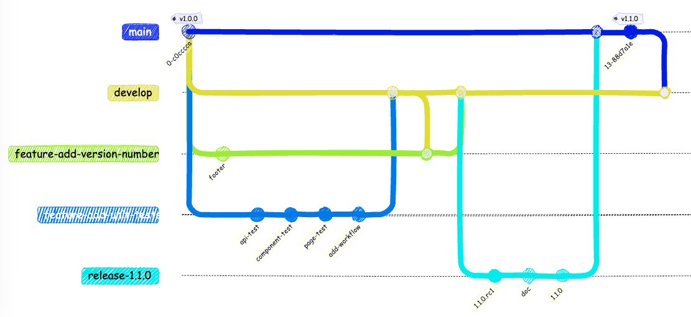
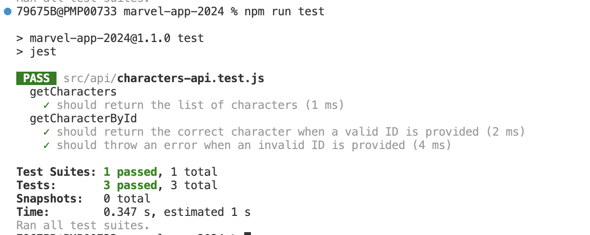
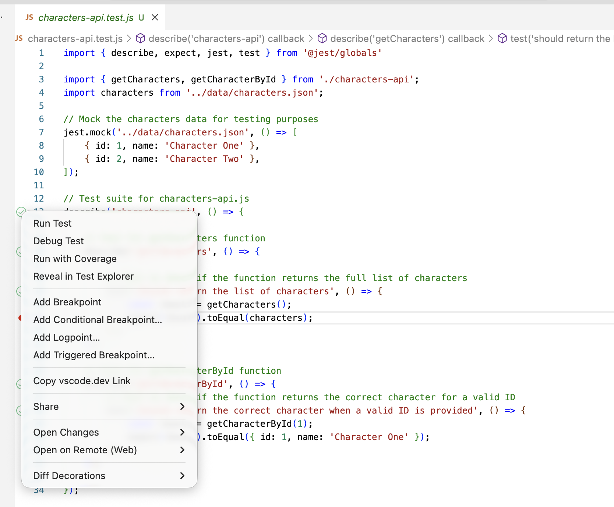
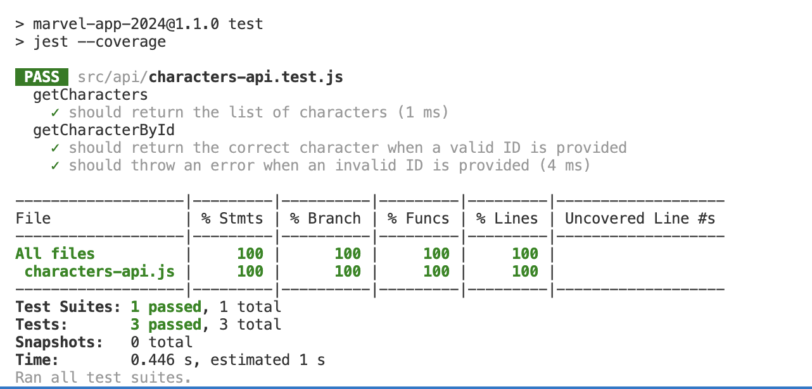
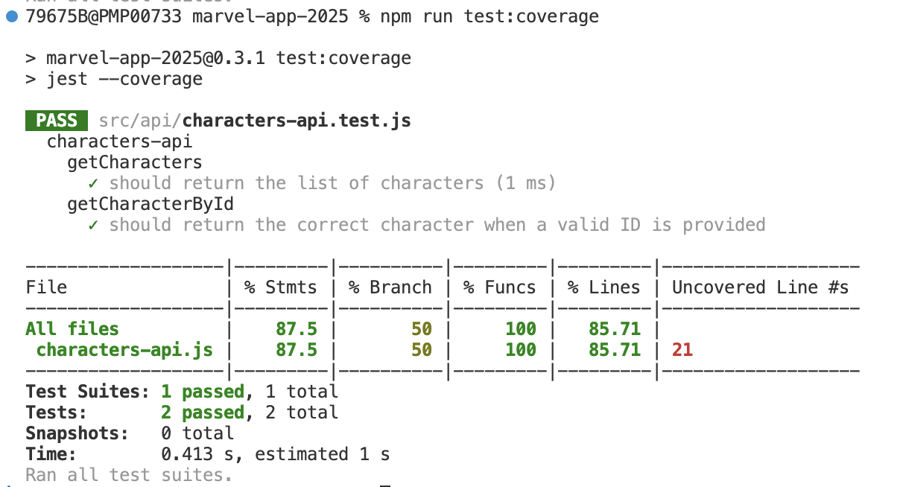
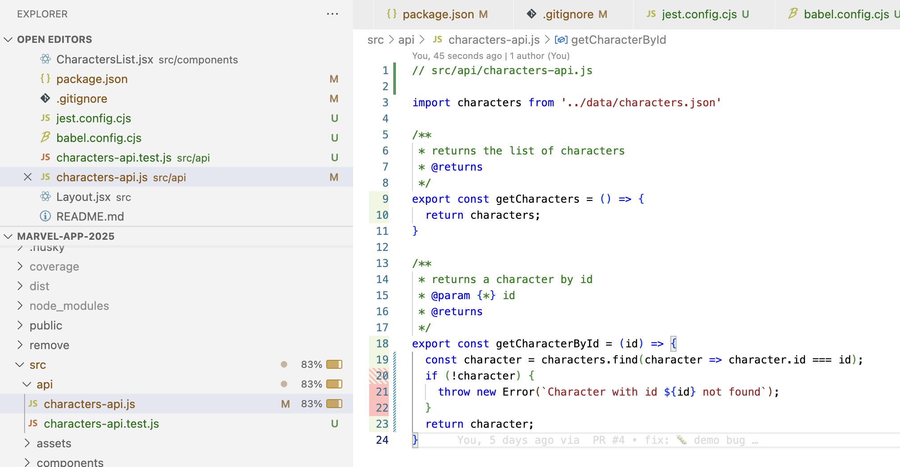
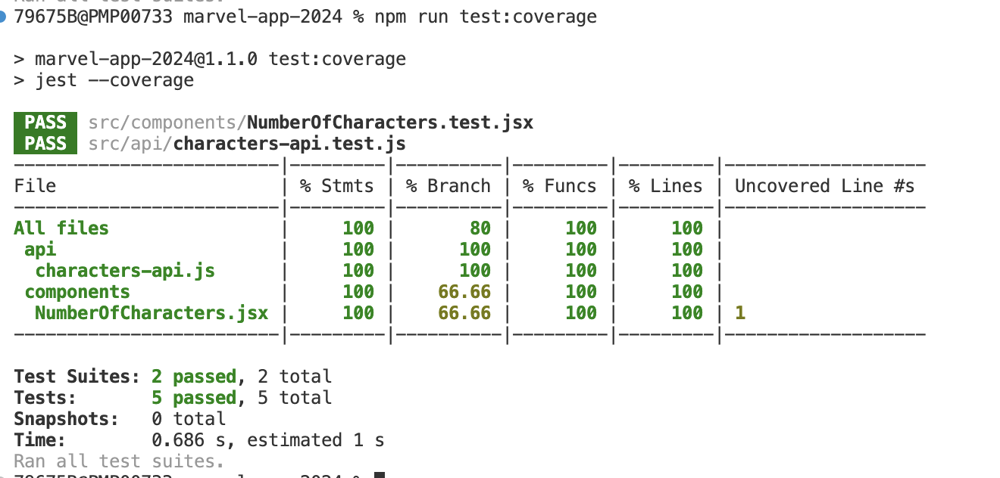
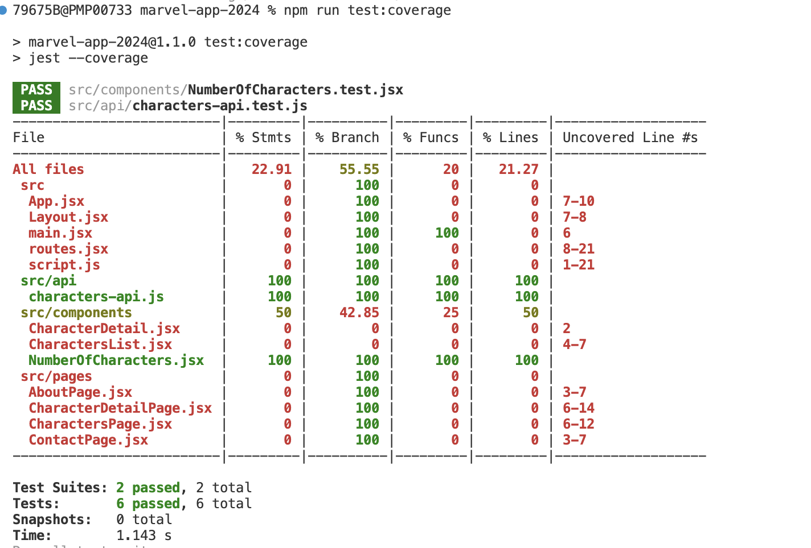

<!-- Add this CSS in your Markdown file to style the two-column layout -->
<style>
  .two-columns {
    display: flex;
  }
  .column {
    flex: 1;
    padding: 0 20px;
  }

  span {
    color: grey;
  }
</style>


# Marvel - Version 1.1.0

---

# Objectifs

- Evolution simple : ajout d'un numéro de version dans le footer
- Mise en oeuvre de tests unitaires
    - sur les composants et pages
    - sur les appels API
- Mise en oeuvre de la couverture de code et phase de test dans le pipeline d'intégration continue
---

<!-- ```mermaid
gitGraph
    checkout main
    commit tag: "v1.0.0"
    branch develop
    checkout develop
    branch feature-add-version-number
    checkout feature-add-version-number
    commit id:"footer"
    checkout develop
    branch feature-add-unit-tests
    commit id: "api-test"
    commit id: "component-test"
    commit id: "page-test"
    commit id: "add-workflow"
    checkout develop
    merge feature-add-unit-tests
    checkout feature-add-version-number
    merge develop
    checkout develop
    merge feature-add-version-number
    branch release-1.1.0
    checkout release-1.1.0
    commit id:"1.1.0.rc1"
    commit id:"doc"
    commit id:"1.1.0"
    checkout main
    merge release-1.1.0
    commit tag: "v1.1.0"
    checkout develop
    merge main
``` -->



---

# Ajout du numéro de version

- Créer la branche `feature/add-version-number` à partir de **develop**
- Ajouter le numéro de version dans le footer (défini dans le composant `Layout`)
    - Il est stocké dans un fichier `package.json`
    - Il est possible de le récupérer en effectuant un import

```javascript
import { version } from '../package.json';
```
---

# Ajout du numéro de version (suite)

Créer une Pull Request vers **develop**, sans la valider. Nous verrons ainsi comment prendre en compte les modifications venant d'une autre branche.

---

# Tests unitaires

Créer la branche `feature/add-unit-tests` à partir de **develop**

---

# Tests unitaires - Explications

Les tests unitaires sont des tests qui permettent de vérifier le bon fonctionnement d'une partie de code

Ils sont écrits par les développeurs en même temps que le code ou même avant (**T**est **D**riven **D**evelopment)

Ils permettent de vérifier que le code est toujours fonctionnel après une modification et de détecter d'éventuelles régressions

---

# Tests unitaires - Explications (suite)

- Les tests unitaires sont écrits avec un framework de test
    - Pour **React**, le framework de test est généralement **Jest**
    - En javascript, on a l'habitude d'écrire les tests dans des fichiers `.test.js` ou `.spec.js` à côté du fichier à tester (afin de simplifier la recherche)
    - Les tests sont exécutés avec la commande `npm test`
- Leur exécution doit être rapide pour être efficace, c'est pourquoi ils ne doivent pas dépendre de l'extérieur (appels API, base de données, etc.). On utilise des mocks (bouchons) pour simuler ces dépendances

---

# Tests unitaires - Mise en oeuvre

- Installer le framework **Jest** en tant que dépendance de développement. Pour plus d'informations, voir la [documentation](https://jestjs.io/docs/getting-started)

```bash
npm install --save-dev jest
```

- Ajouter la commande `test` dans le fichier `package.json`

```json
"scripts": {
    ...
    "test": "jest"
}
```

- L'exécution des tests se fera avec la commande `npm test`, pour l'instant nous n'avons pas encore de tests

---

# Tests unitaires - Mise en oeuvre (suite)

Afin que l'exécution des tests soit fonctionnelle, il est nécessaire de créer un fichier de configuration pour **Jest** et **Babel** afin de pouvoir exécuter les tests pour du code écrit en **ES6**.

Il n'est pas indispensable de comprendre cette configuration, mais il est nécessaire de l'ajouter pour que les tests fonctionnent. 

Cependant pour expliquer rapidement, **Jest** a besoin de **Babel** pour transformer le code **ES6** en code **ES5**, car il ne le fait pas nativement.

Installer les dépendances nécessaires :

```bash
npm install --save-dev @babel/preset-env
``` 
---

Contenu du fichier `jest.config.cjs` à créer à la racine du projet :

```javascript
module.exports = {
  transform: {
    "^.+\\.jsx?$": "babel-jest",
  },
};
```

Contenu du fichier `babel.config.cjs` à créer à la racine du projet :

```javascript
module.exports = {
  presets: ["@babel/preset-env"],
};
```
---

# Tests unitaires - Ajout de tests pour la partie API

**Github Copilot** pourra nous aider à générer les tests unitaires, mais il est important de comprendre ce qui est généré. Nous allons donc dans un premier temps écrire les tests manuellement.

Ouvrir le fichier `src/api/characters-api.js` et créer le fichier `src/api/characters-api.test.js` à côté.

---

```javascript

// src/api/characters-api.js

import characters from '../data/characters.json'

/**
 * returns the list of characters
 * @returns 
 */
export const getCharacters = () => {
  return characters;
}

/**
 * returns a character by id
 * @param {*} id 
 * @returns 
 */
export const getCharacterById = (id) => {
  return characters.find(character => character.id === id);
}

```

---

```javascript

// src/api/characters-api.test.js

import { describe, expect, jest, test } from '@jest/globals'

import { getCharacters, getCharacterById } from './characters-api';
import characters from '../data/characters.json';

// Mock the characters data for testing purposes
jest.mock('../data/characters.json', () => [
    { id: 1, name: 'Character One' },
    { id: 2, name: 'Character Two' },
]);

// Test suite for characters-api.js
describe('characters-api', () => {

    // Test for getCharacters function
    describe('getCharacters', () => {

        // Test to check if the function returns the full list of characters
        test('should return the list of characters', () => {
            const result = getCharacters();
            expect(result).toEqual(characters);
        });
    });

    // Test for getCharacterById function
    describe('getCharacterById', () => {
        // Test to check if the function returns the correct character for a valid ID
        test('should return the correct character when a valid ID is provided', () => {
            const result = getCharacterById(1);
            expect(result).toEqual({ id: 1, name: 'Character One' });
        });
    });

});
```

---

# Tests unitaires - Ajout de tests pour la partie API (suite)

Sauvegarder le fichier `src/api/characters-api.test.js` et exécuter les tests avec la commande `npm test`.

<div class="two-columns">
  <div class="column">
    Les tests devraient passer et afficher dans la console quelque chose ressemblant à ceci :
  </div>
  <div class="column">
    
  </div>
</div>

---

# Tests unitaires - Ajout de tests pour la partie API (suite)

Dans le résultat des tests, une ligne est affichée par `describe` et une sous-ligne par `test` avec le résultat du test. Cette organisation permet de savoir rapidement où se trouve le problème en cas d'échec. 

On organise les tests en `describe` pour regrouper les tests par fonctionnalité et en `test` pour décrire un test en particulier.
En nommant correctement les `describe` et les `test`, on peut rapidement comprendre ce qui est testé.

---

# Tests unitaires - Ajout de tests pour la partie API (suite)

La partie `jest.mock` permet de mocker le fichier `characters.json` pour simuler un appel à une API.

Cela signifie qu'au lieu de lire le fichier `characters.json`, on va utiliser le tableau fourni dans le `jest.mock`. On **mock** (bouchonne) les dépendances pour ne pas dépendre de l'extérieur. 

Ici on **mock** le fichier `characters.json` pour ne pas dépendre de son contenu. 

**Rappel:** Nous avons volontairement utilisé un fichier `characters.json` pour simuler un appel à une API, mais dans un vrai projet, on utiliserait une vraie API, c'est elle qu'il faudrait mocker.

---

# Test unitaires - extension Jest

<div class="two-columns">
  <div class="column">
    vs-code propose une extension qui permet de lancer les tests de manière unitaire directement depuis le fichier de test. Il est même possible de debugger un test.
    <br/><br/>
    Pour installer l'extension, il suffit de la rechercher (Jest) dans le marketplace de vs-code et de l'installer.
  </div>
  <div class="column">
    
  </div>
</div>

---

# Tests unitaires - Couverture de code

Savoir que nos tests passent est une chose, mais il est important de savoir quelle partie du code est testé. Pour cela, on utilise la couverture de code qui permet de savoir quelles parties de notre code sont testées et quelles parties ne le sont pas.

Pour afficher la couverture de code, il suffit d'exécuter la commande `npm test -- --coverage`. 

---

# Tests unitaires - Couverture de code (suite)

Il est aussi possible d'ajouter un script dans le fichier `package.json` pour exécuter cette commande plus simplement.

```json
"scripts": {
    ...
    "test:coverage": "jest --coverage"
}
```

Puis d'exécuter la commande `npm run test:coverage`.

---

# Tests unitaires - Couverture de code (suite)

La couverture de code est affichée dans la console et un rapport est généré dans le dossier `coverage` à la racine du projet, permettant de visualiser la couverture de code dans un navigateur.

**Note:** il faut ignore le dossier `coverage` dans le fichier `.gitignore` pour ne pas le versionner.

---

# Tests unitaires - Couverture de code (suite)



---

# Tests unitaires - Couverture de code (suite)

La couverture de code est affichée en pourcentage pour chaque fichier. 

On peut voir que le fichier `characters-api.js` est couvert à 100%, ce qui signifie que toutes les lignes de code sont testées.  

Attention, la configuration actuelle ne présente les résultats que sur les fichiers testés. Nous verrons plus tard comment avoir une vue d'ensemble de la couverture de code du projet.

---

# Tests unitaires - Couverture de code (suite)

Nous allons maintenant modifier le fichier `characters-api.js` pour ajouter un cas non testé et voir l'impact sur la couverture de code.

Nous allons modifier la fonction `getCharacterById` pour lever une erreur si il n'y a pas de personnage avec l'ID fourni. 

Par conséquent, nous n'avons pas de test pour ce cas. La couverture de code devrait donc diminuer. Nous allons donc aussi ajouter un test pour ce cas. **Github Copilot** pourra nous aider à générer ce test.

---

# Tests unitaires - Couverture de code (suite)

Une fois le fichier `characters-api.js` modifié, sauvegarder le fichier et exécuter la commande `npm run test:coverage`.

La couverture de code devrait diminuer, car nous n'avons pas de test pour le cas où il n'y a pas de personnage avec l'ID fourni.



---

# Tests unitaires - Couverture de code (suite)

L'extension **Jest** de vs-code permet aussi de voir la couverture de code directement dans l'éditeur.



---

# Tests unitaires - Couverture de code (suite)

Ajoutez un test pour le cas où il n'y a pas de personnage avec l'ID fourni afin de faire passer la couverture de code à 100%.

---

# Tests unitaires - Bonnes pratiques

Le découpage des tests en **describe** et **test** permet de mieux organiser les tests et de les rendre plus lisibles.

Il est important de nommer correctement les **describe** et les **test** pour faciliter la compréhension des tests.

Un **decribe** doit regrouper les tests par fonctionnalité et un **test** doit décrire un test en particulier.

Un **test** doit être clair et concis, il doit décrire ce qui est testé et ce qui est attendu.

Le nombre de **test** correspond généralement aux différentes valeurs possibles des paramètres d'une fonction et aux différents cas possibles traités

---

# Tests unitaires - Bonnes pratiques (suite)

Il est important de tester les cas normaux, les cas limites et les cas d'erreurs pour s'assurer que le code fonctionne dans toutes les situations.

Un test doit être indépendant des autres tests et ne doit pas dépendre de l'ordre d'exécution des tests.

Le découpage du code en petites fonctions permet de faciliter les tests unitaires, car il est plus facile de tester une petite fonction qu'une grande fonction. Cela permet aussi de rendre le code plus lisible et plus maintenable.

---

Faire un premier commit pour les tests unitaires de la partie API.

---

# Tests unitaires - Ajout de tests pour les composants

Nous allons maintenant ajouter des tests pour les composants. 

Etant donné qu'il s'agit de composants React écrit en **JSX**, il est nécessaire d'ajouter une configuration pour `Jest` afin de pouvoir les exécuter.

Installer les dépendances nécessaires :

```bash
npm install --save-dev jest-environment-jsdom jest-fixed-jsdom @testing-library/react @testing-library/jest-dom @babel/plugin-syntax-jsx @babel/preset-react
```

---

# Tests unitaires - Ajout de tests pour les composants (suite)

Modifier le fichier `jest.config.cjs` pour ajouter la configuration nécessaire pour les tests de composants.

```javascript
module.exports = {
  testEnvironment: "jest-fixed-jsdom", // Use jsdom environment for testing React components
  transform: {
    "^.+\\.jsx?$": "babel-jest",
  },
};

```

---

# Tests unitaires - Ajout de tests pour les composants (suite)

Modifier le fichier `babel.config.cjs` pour ajouter la configuration nécessaire pour les tests de composants.

```javascript
module.exports = {
  presets: ["@babel/preset-env", "@babel/preset-react"],
  plugins: [
    ["@babel/plugin-transform-react-jsx", { "runtime": "automatic" }] // Transform JSX into React.createElement calls with automatic runtime import
  ]
};
```

---

# Tests unitaires - NumberOfCharacters.jsx

Le composant `NumberOfCharacters` est un composant simple qui affiche le nombre de personnages passés en paramètre.

Il gère deux cas :
- Si le tableau de personnages est vide, il affiche "There is no character"
- Si le tableau de personnages contient des personnages, il affiche "There is X characters" où X est le nombre de personnages dans le tableau.

---

```javascript
// src/components/NumberOfCharacters.jsx 

/**
 * NumberOfCharacters component
 * @param {*} Array of characters, default is an empty array
 * @returns 
 */
export default function NumberOfCharacters({ characters = [] }) {
    // If no characters are provided or the array is empty
    if (characters.length === 0) {
      return <p>There is no character</p>;
    }

    // If there are characters in the array
    return <p>There is {characters.length} characters</p>;
}
```
---

```javascript
// src/components/NumberOfCharacters.test.jsx

import { describe, expect, test } from '@jest/globals'
import '@testing-library/jest-dom';
import { render, screen } from '@testing-library/react';
import NumberOfCharacters from './NumberOfCharacters';

describe('NumberOfCharacters component', () => {

    test('renders "There is no character" when characters array is empty', () => {
        render(<NumberOfCharacters characters={[]} />);
        expect(screen.getByText('There is no character')).toBeInTheDocument();
    });

    test('renders "There is 1 character" when characters array has one character', () => {
        const characters = ['Character 1'];
        render(<NumberOfCharacters characters={characters} />);
        expect(screen.getByText('There is 1 characters')).toBeInTheDocument();
    });
});
```

---

# Tests unitaires - Ajout de tests pour les composants (suite)

Sauvegarder le fichier `src/components/NumberOfCharacters.test.jsx` et exécuter les tests avec la commande `npm test`.

<div class="two-columns">
  <div class="column">
    Les tests devraient passer et afficher dans la console quelque chose ressemblant à ceci :
  </div>
  <div class="column">
    
  </div>

---

# Tests unitaires - Ajout de tests pour les composants (suite)

On constate que la couverture de code est de 100% pour le fichier `NumberOfCharacters.jsx` sur les lignes de code testées, mais uniquement de 66,66% sur les branches de code testées, avec la ligne 1 en  **Uncovered Line**.

Ce qui signifie que la ligne 1 n'est pas complètement testée, il y a un cas non testé. Il s'agit du cas où l'on ne passe pas de paramètre `characters` à notre composant.

---

# Tests unitaires - Ajout de tests pour les composants (suite)

Pour corriger ce problème, il suffit d'ajouter un test pour ce cas.

```javascript
test('renders "There is no character" when no characters are provided', () => {
  render(<NumberOfCharacters />);
  expect(screen.getByText('There is no character')).toBeInTheDocument();
});
```

**Note:** Il est possible de tester uniquement un fichier en ajoutant le nom du fichier à la commande `npm test`, par exemple `npm run test:coverage NumberOfCharacters`.

---

# Tests unitaires - Ajout de tests pour les composants (suite)

Pour les tests de composants, on utilise la librairie `@testing-library/react` qui permet de tester les composants React de manière simple et efficace.

On utilise la fonction `render` pour afficher le composant et la fonction `screen.getByText` pour récupérer un élément du DOM et vérifier qu'il est bien présent.

Pour plus d'informations, voir la [documentation](https://testing-library.com/docs/queries/about).

---

# Tests unitaires - Ajout de tests pour les composants (suite)

Par exemple, `screen.getByText('There is no character')` permet de récupérer un élément du DOM contenant le texte `There is no character`.

Durant la phase de mise en oeuvre du test, il est possible de voir le composant s'afficher dans la console pour vérifier qu'il est bien rendu grâce à la fonction `debug`.

```javascript
test('renders "There is no character" when no characters are provided', () => {
  render(<NumberOfCharacters />);
  screen.debug();
  expect(screen.getByText('There is no character')).toBeInTheDocument();
});
```

---

# Tests unitaires - Ajout de tests pour les composants (suite)

L'implémentation des tests unitaires permet ici de se rendre compte que l'on a un bug dans le composant `NumberOfCharacters`, le texte affiché est `There is 1 characters` au lieu de `There is 1 character` (sans le "s") lorsqu'il y a un seul personnage dans le tableau.

---

# Tests unitaires - Ajout de tests pour les composants (suite)

Afin de corriger ce bug, deux possibilités :
- Modifier le composant pour gérer le cas où il y a un seul personnage puis ajouter un test pour ce cas
- Modifier le test pour ajouter ce cas de test, qui sera forcément en échec, puis modifier le composant pour que le test passe. Cette approche est celle du **T**est **D**riven **D**evelopment.

---

# **T**est **D**riven **D**evelopment

Le **T**est **D**riven **D**evelopment (TDD) est une approche de développement logiciel qui consiste à écrire les tests avant d'écrire le code.

L'idée est de commencer par écrire un test qui échoue, puis d'écrire le code nécessaire pour que le test passe, et enfin de refactoriser le code si nécessaire.

Cette approche permet de s'assurer que le code est toujours testé et que les tests sont pertinents.

Elle permet aussi de mieux comprendre les besoins et les fonctionnalités à implémenter.

---

Corriger le bug dans le composant `NumberOfCharacters` en utilisant l'approche du **T**est **D**riven **D**evelopment.

Puis faire un second commit pour les tests unitaires du composant `NumberOfCharacters`.

---

# Tests unitaires - Non régression

Les tests unitaires permettent de vérifier que le code est toujours fonctionnel après une modification.

Si les tests passent, c'est que le code est toujours fonctionnel, sinon cela signifie qu'il y a une régression ou une évolution.

Il peut s'agir d'un bug introduit par la modification du code, d'un test qui n'est plus pertinent ou d'un test qui n'est plus à jour suite à une modification du code (refactorisation, changement de fonctionnalité, etc.).

Si l'on a une couverture de code suffisante, on peut faire évoluer le code en toute confiance. Cela permet de réduire le risque de régression et de garantir la qualité du code.

---

# Tests unitaires - Couverture de code de l'ensemble du projet

La configuration actuelle ne présente les résultats que sur les fichiers testés.

Pour avoir une vue d'ensemble de la couverture de code du projet, il est possible de modifier la configuration de **Jest** pour afficher la couverture de code de l'ensemble du projet.

---

# Tests unitaires - Couverture de code de l'ensemble du projet (suite)

Modifier le fichier `jest.config.cjs` pour ajouter la configuration nécessaire pour afficher la couverture de code de l'ensemble du projet.

```javascript
module.exports = {
  testEnvironment: "jsdom", // Use jsdom environment for testing React components
  // Transform jsx files using babel-jest
  transform: {
    "^.+\\.jsx?$": "babel-jest",
  },
  collectCoverageFrom: [
    "src/**/*.{js,jsx}", // Collect coverage from all js or jsx files in src folder
  ],
};
```

---



---

# Tests unitaires - Couverture de code de l'ensemble du projet (suite)

Nous avons maintenant une vue d'ensemble de la couverture de code du projet et pouvons voir les fichiers qui ne sont pas testés.

Nous allons maintenant commencer à tester un composant de type **Page** et voir l'incidence sur la couverture de code et le bonnes pratiques à suivre.

---

# Tests unitaires - Tests d'un composant de type **Page**

Nous allons tester le composant `CharactersPage`.

Pour tester ce composant, nous allons devoir simuler le chargement des données, le composant **createRoutesStub** permet de redéfinir la route pour simuler le chargement des données.

---

```javascript
// src/pages/CharactersPage.test.jsx

import { expect, test } from '@jest/globals'
import '@testing-library/jest-dom'
import { render, screen } from '@testing-library/react'
import { createRoutesStub } from 'react-router'
import CharactersPage from './CharactersPage'

// Mock data for characters
const characters = [
    {
        id: "1",
        name: "Thor"
    },
    {
        id: "2",
        name: "Captain America"
    }
];

test('render CharactersPage component', async () => {
    // Create a stub for the routes to include CharactersPage
    const Stub = createRoutesStub([
        {
            path: '/characters',
            Component: CharactersPage,
            HydrateFallback: () => null, // No fallback needed for this test
            loader: () => ({ characters: characters }),
        },
    ])

    // Render the CharactersPage component within the routing context
    render(<Stub initialEntries={['/characters']} />)

    // Wait for the heading to appear to ensure routing/render updates are settled
    const heading = await screen.findByRole('heading', { level: 2, name: 'Marvel Characters' })
    expect(heading).toBeInTheDocument()

    // expect the document title to be "Characters | Marvel App"
    expect(document.title).toBe('Characters | Marvel App')

    // expect the character Thor to be in the document
    const thorElement = screen.getByText(characters[0].name);
    expect(thorElement).toBeInTheDocument();

    // expect the charater Captain America to be in the document
    const captainAmericaElement = screen.getByText(characters[1].name);
    expect(captainAmericaElement).toBeInTheDocument();
    
    // expect the number of characters to be in the document
    const numberOfCharactersElement = screen.getByText(`There are ${characters.length} characters`);
    expect(numberOfCharactersElement).toBeInTheDocument();

    // uncomment to see the full DOM output
    // screen.debug()
})

```
---

# # Tests unitaires - Tests du composant **CharactersPage**

L'appel à la fonction `createRoutesStub` permet de simuler le chargement des données pour le composant `CharactersPage`. On redéfinit la route `/characters` pour qu'elle utilise le composant `CharactersPage` et qu'elle charge les données mockées.

Nous pouvons ensuite rendre le composant dans le contexte de routage avec la fonction `render` et vérifier que les éléments attendus sont bien présents dans le DOM.

---

# Tests unitaires - Tests d'un composant de type **Page** (suite)

La fonction `findByRole` permet d'attendre qu'un élément soit présent dans le DOM avant de continuer le test. Cela est utile pour les composants qui effectuent des opérations asynchrones, comme le chargement de données.

La fonction `getByText` permet de récupérer un élément du DOM contenant le texte spécifié. Si l'élément n'est pas trouvé, une erreur est levée.

La fonction `debug` permet d'afficher le DOM dans la console pour vérifier que le composant est bien rendu et que les éléments attendus sont bien présents et ainsi faciliter le débogage.

---

# Tests unitaires - Tests d'un composant de type **Page** (suite)

Sauvegarder le fichier `src/pages/CharactersPage.test.jsx` et exécuter les tests avec la commande `npm test`.

Nous testons ici que le composant `CharactersPage` est bien rendu et que les éléments attendus sont bien présents dans le DOM.

Nous devons ici faire attention à la portée de nos tests, devons-nous tester tout les cas possibles ?

---

# Tests unitaires - Tests d'un composant de type **Page** (suite)

Si nous exécutons la commande ` npm run test:coverage CharactersPage`, nous pouvons voir que la couverture de code est de 100% pour le fichier `CharactersPage.jsx` mais couvre d'autres composants, tel que `NumberOfCharacters.jsx` ou `CharactersList.jsx`.

Doit-on donc tester tous les cas possibles pour avoir une couverture de code de 100% des composants `NumberOfCharacters` et `CharactersList` ?

---

# Tests unitaires - Tests d'un composant de type **Page** (suite)

La réponse est non, il est inutile de tester tous les cas possibles pour ces composants, car ils sont déjà testés (ou devrait être testé) dans leur propre fichier de test. 

Il est important de tester les cas spécifiques à chaque composant, mais il n'est pas nécessaire (voir déconseiller) de tester tout les cas possible des composants inclus. 

Sinon, on risque de tester plusieurs fois la même chose, mais surtout si le composant inclus change, il faudra changer les tests de tous les composants qui l'utilisent.

Il faut voir le composant inclu comme une boîte noire, on teste ce qu'il fait, pas comment il le fait.

---

Faire un troisième commit pour les tests unitaires de la page `CharactersPage`.

---

# Tests unitaires - Intégration continue

Les tests unitaires sont exécutés localement, mais il est important de les exécuter automatiquement à chaque modification du code afin de détecter rapidement une régression.

Nous allons donc ajouter la phase de test unitaire dans le pipeline d'intégration continue.

Créer le fichier `.github/workflows/unit-tests.yml` à la racine du projet avec le contenu présent sur le slide suivant.

---

```yaml
name: Unit Tests

on:
  push:
  pull_request:

jobs:
  unit-tests:

    runs-on: ubuntu-latest

    steps:
    - uses: actions/checkout@v4
    - uses: actions/setup-node@v4
      with:
        node-version: 20
        cache: 'npm'
    - run: npm ci
    - run: npm run test:coverage
```

---

# Tests unitaires - Intégration continue (suite)

Faire un dernier commit pour ajouter le workflow de tests unitaires et pousser les modifications sur le dépôt distant.

Créez une Pull Request pour la branche `feature/add-unit-tests` et attendez que le pipeline d'intégration continue se déclenche.

Vous devriez voir une nouvelle étape dans le pipeline d'intégration continue qui exécute les tests unitaires.

Ajouter la protection de branche pour empêcher la fusion de la branche `feature/add-unit-tests` si les tests unitaires ne passent pas (option `Require status checks to pass`).

---

# Pull Request

Nous avons maintenant 2 Pull Request en attente de validation :

- La première pour ajouter le numéro de version dans le footer
- La seconde pour ajouter les tests unitaires

La première Pull Request est bloquée car la branche `feature/add-version-number` ne contient pas le worklow de tests unitaires qui est nécessaire pour valider la Pull Request.

La seconde Pull Request, quant à elle, peut-être validée et fusionnée vers **develop**.

---

# Pull Request (suite)

Notre première Pull Request est toujours bloquée, car elle dépend de quelque chose (le workflow de tests unitaires) qui n'est pas présent dans la branche `feature/add-version-number`, mais maintenant présent dans la branche **develop**.

Il faudrait mettre à jour la branche `feature/add-version-number` avec les modifications de la branche **develop** pour que la Pull Request puisse être validée. 

---

# Pull Request (suite)

**Github** propose une fonctionnalité pour mettre à jour une branche avec les modifications d'une autre branche, c'est le bouton `Update branch` qui permet de fusionner les modifications de la branche **develop** dans la branche `feature/add-version-number`.

Dans la protection de branche, il est possible de définir que la branche doit être mise à jour avant de pouvoir être fusionnée (option `Require status checks to pass / Require branches to be up to date before merging`).

Une fois la branche mise à jour, le workflow de tests unitaires est exécuté et la Pull Request peut être validée.

---

# Release 1.1.0

Faire le nécessaire pour créer une version 1.1.0 de l'application :

- Créer une branche `release-1.1.0` à partir de **develop**
- Mettre à jour le numéro de version dans le fichier `package.json` en `1.1.0-rc1`
- Mettre à jour la documentation pour expliquer comment lancer les tests unitaires
- Créer une Pull Request vers **main** pour la branche `release-1.1.0`
- Vérifier que la pull request est valide, que le déploiement **netflyx** est ok et que l'application fonctionne correctement
- Modifier le numéro de version dans le fichier `package.json` en `1.1.0`
- Valider la Pull Request
- Mettre à jour la branche **develop** avec les modifications de la branche `main`

---

# Conclusion

La mise en oeuvre des tests unitaires permet de fiabiliser l'application, de vérifier que le code source est valide et que les fonctionnalités de l'application fonctionnent correctement. 

Cela permet aussi de détecter les régressions, c'est à dire les bugs qui apparaissent suite à une modification du code source.

Selon les applications, le langage utilisé, la complexité... il n'est pas toujours possible d'atteindre une couverture de code de 100%. Cependant, il est important d'atteindre une couverture de code la plus élevée possible. Cela permet de fiabiliser l'application et de détecter les bugs le plus tôt possible.

---

# Conclusion (suite)

Attention toutefois à ne pas chercher à atteindre une couverture de code de 100% à tout prix. 

Il est parfois plus pertinent de ne pas tester certaines parties du code, car cela demande trop d'effort pour un gain de fiabilité faible. Il est important de trouver le bon équilibre entre la fiabilité et le coût de mise en oeuvre des tests unitaires.

De plus ce qui ne peut pas être testé (ou difficillement) par des tests unitaires peut être testé par d'autres types de tests, comme les tests d'intégration ou les tests end-to-end. Nous verrons cela dans les prochaines versions de l'application.

---

# Conclusion (suite)

Attention aussi, une couverture de code à 100% ne veut pas dire que l'application est sans bug.

Cela veut dire que le code source est valide, mais cela ne veut pas dire que le code source est pertinent.

Pour aller plus loin
  - [Jest](https://jestjs.io/docs/getting-started)
  - [Testing Library](https://testing-library.com/docs/)
  - **T**est **D**riven **D**evelopment - [Wikipedia](https://fr.wikipedia.org/wiki/Test_driven_development) 