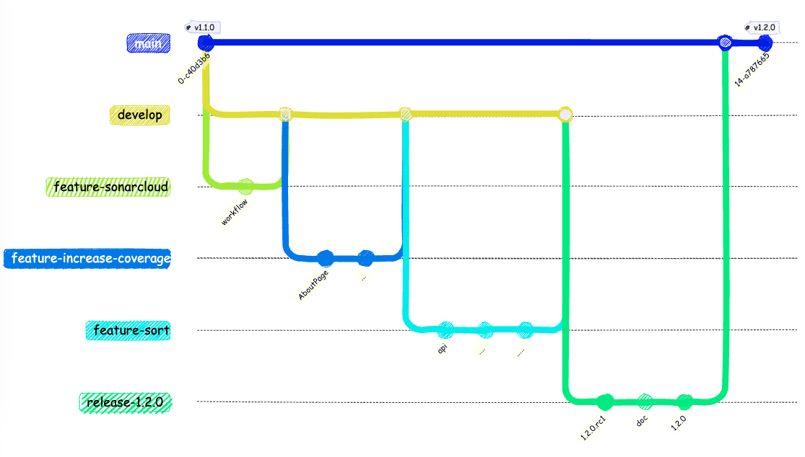
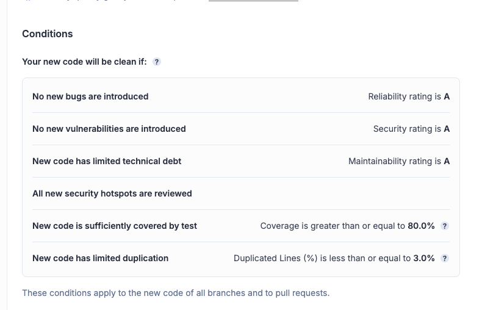

<!-- Add this CSS in your Markdown file to style the two-column layout -->
<style>
  .two-columns {
    display: flex;
  }
  .column {
    flex: 1;
    padding: 0 20px;
  }

  span {
    color: grey;
  }
</style>


# Marvel - Version 1.2.0

---

# Objectifs

- Améliorer la qualité de l'application grâce à l'analyse de code **SonarCloud**
- Augmentation de la couverture de tests unitaires pour les composants React (components, pages)
- Ajout d'une nouvelle fonctionnalité : **Tri des personnages par nom ou date de modification**

---

<!-- ```mermaid
gitGraph
    checkout main
    commit tag: "v1.1.0"
    branch develop
    checkout develop
    branch feature-sonarcloud
    checkout feature-sonarcloud
    commit id: "workflow"
    checkout develop
    merge feature-sonarcloud
    branch feature-increase-coverage
    checkout feature-increase-coverage
    commit id: "AboutPage"
    commit id: "..."
    checkout develop
    merge feature-increase-coverage
    branch feature-sort
    commit id: "api"
    commit id: "...."
    commit id: "....."
    checkout develop
    merge feature-sort
    branch release-1.2.0
    checkout release-1.2.0
    commit id: "1.2.0.rc1"
    commit id: "doc"
    commit id: "1.2.0"
    checkout main
    merge release-1.2.0
    commit tag: "v1.2.0"
-->



---

# Qualimétrie du code

La qualité du code est un élément important dans le développement d'une application. Elle permet de s'assurer que le code est lisible, maintenable et évolutif. Elle permet aussi de s'assurer que le code est conforme aux bonnes pratiques de développement.

Il existe de nombreux outils pour mesurer la qualité du code. Dans le cadre de ce projet, nous allons utiliser [SonarCloud](https://www.sonarsource.com/products/sonarcloud/), service cloud qui permet d'analyser la qualité du code d'un projet. Il est gratuit pour les projets open source.

---

# Qualimétrie du code (suite)

**SonarCloud** permet de mesurer la qualité du code en se basant sur un ensemble de règles prédéfinies. Ces règles sont définies par des experts en développement logiciel et sont basées sur les bonnes pratiques de développement.

**SonarCloud** analyse le code source d'un projet et génère un rapport détaillé sur la qualité du code. Ce rapport contient des informations sur les erreurs, les avertissements et les bonnes pratiques de développement.

---

# Qualimétrie du code (suite)

Créer un compte sur [SonarCloud](https://sonarcloud.io/), puis y ajouter le projet **Marvel App**.

---

# Qualimétrie du code (suite)

Créer la branche `feature/sonarcloud` à partir de la branche `develop`.

Ajouter le workflow ci-dessous dans le fichier `.github/workflows/quality.yml` :

---

```yaml
name: Quality
on:
  push:
  pull_request:
jobs:
  sonarcloud:
    name: SonarCloud
    runs-on: ubuntu-latest
    steps:
      - uses: actions/checkout@v4
        with:
          fetch-depth: 0  # Shallow clones should be disabled for a better relevancy of analysis
      - uses: actions/setup-node@v4
        with:
          node-version: 18
          cache: 'npm'
      - run: npm ci
      - run: npm run test:coverage
      - name: SonarCloud Scan
        uses: SonarSource/sonarcloud-github-action@master
        env:
          GITHUB_TOKEN: ${{ secrets.GITHUB_TOKEN }}  # Needed to get PR information, if any
          SONAR_TOKEN: ${{ secrets.SONAR_TOKEN }}
      # Check the Quality Gate status.
      - name: SonarQube Quality Gate check
        id: sonarqube-quality-gate-check
        uses: sonarsource/sonarqube-quality-gate-action@master
        env:
          SONAR_TOKEN: ${{ secrets.SONAR_TOKEN }}

```

---

# Qualimétrie du code (suite)

Ce fichier définit une action Quality qui va être lancée à chaque **push** ou **pull_request**. 

Cette action va :
- récupérer le code source
- installer l'environnement node
- installer les dépendances
- lancer les tests unitaires avec la couverture de code
- lancer l'analyse sonarcloud
- vérifier que la qualité du code est bonne grâce à une Quality Gate

---

# Qualimétrie du code (suite)

Cette action utilise 2 secrets :
- **GITHUB_TOKEN** : ce token est automatiquement créé par **GitHub** et permet d'accéder aux informations du repository
- **SONAR_TOKEN** : ce token est créé sur **SonarCloud** et permet d'accéder aux informations du projet

---

# Qualimétrie du code (suite)

Afin de générer le token **SonarCloud**, il faut se rendre sur **SonarCloud** et aller dans My Account > Security > Generate Tokens.

Il faut ensuite ajouter le token dans les secrets du repository **GitHub** (Settings > Secrets and variables > Actions > New repository secret).

Il faut aussi décocher la case Automatic Analysis dans Administration > Analysis Method sur SonarCloud.

---

Afin de faire le lien entre projet **GitHub** et projet **SonarCloud**, il faut ajouter un fichier `sonar-project.properties` à la racine du projet avec le contenu suivant :

```properties
sonar.projectKey=nom-du-projet
sonar.organization=nom-de-compte-github

sonar.javascript.lcov.reportPaths=./coverage/lcov.info
sonar.coverage.exclusions=**/*.test.js
```

Ce fichier définit les propriétés du projet **SonarCloud** :
- sonar.projectKey : identifiant du projet **SonarCloud**
- sonar.organization : organisation **SonarCloud**
- sonar.javascript.lcov.reportPaths : chemin vers le fichier de couverture de code
- sonar.coverage.exclusions : fichiers à exclure de la couverture de code

---

Afin que **SonarCloud** puisse avoir les informations sur la couverture de code, il faut ajouter le plugin **jest-sonar-reporter** au projet.

```bash
npm install jest-sonar-reporter --save-dev
```

Il faut ensuite ajouter le plugin dans le fichier de configuration de **Jest** (`jest.config.js`):

```javascript
module.exports = {
  testEnvironment: "jsdom",
  transform: {
    "^.+\\.jsx?$": "babel-jest",
  },
  collectCoverageFrom: [
    "src/**/*.{js,jsx}", // Collect coverage from all js or jsx files in src folder
    "!src/**/*.test.{js,jsx}", // Exclude test files from coverage
  ],
  testResultsProcessor: 'jest-sonar-reporter',
};
```

---

# Qualimétrie du code (suite)

A chaque push, une analyse de la qualité du code est lancée. 

Elle est visible dans l'onglet **Actions** du repository, si le code ne passe pas la **Quality Gate**, l'action est en erreur. Il faut alors corriger les problèmes de qualité du code. On peut aussi voir l'analyse sur **SonarCloud**.

Nous n'avons pas défini de **Quality Gate** personnalisée, nous utilisons donc la **Quality** Gate par défaut de **SonarCloud**. Il serait possible de définir une **Quality Gate** personnalisée, mais cela n'est pas nécessaire dans le cadre de ce projet.

---



---

# Qualimétrie du code (suite)

Une fois la configuration de **SonarCloud** terminée, nous pouvons merger la branche `feature/sonarcloud` dans la branche `develop` via une **Pull Request**. Nos prochains commits seront analysés par **SonarCloud** et devront respecter les règles de qualité définies.

---

# Augmentation de la couverture de tests unitaires

Créer une branche `feature/increase-coverage` à partir de la branche `develop`.

Faire le nécessaire pour augmenter la couverture de tests unitaires pour les composants React (components, pages), puis merger la branche `feature/increase-coverage` dans la branche `develop`.

---

# Tri des personnages

Nous allons ajouter une nouvelle fonctionnalité à l'application : le tri des personnages par nom ou date de modification. 

Créer une branche `feature/sort-characters` à partir de la branche `develop`.

Puis, implémenter la fonctionnalité suivante : 

- faire en sorte de pouvoir via une url trier les personnages par nom ou date de modification.
- modifier l'api pour prendre en compte ces informations.
- ajouter 2 listes déroulantes dans l'interface utilisateur : une pour le tri et une pour l'ordre du tri, les valeurs par défaut seront le tri par nom et l'ordre croissant ou les valeurs passées dans l'url.

---

# Tri des personnages (suite)

Pour ce développement, il peut y avoir plusieurs approches dans l'ordre de mise en oeuvre:
- Partir de l'interface utilisateur et ajouter les listes déroulantes pour le tri et l'ordre du tri.
- Modifier l'api pour prendre en compte ces informations.

ou 

- Partir de l'api pour prendre en compte ces informations.
- Modifier l'interface utilisateur pour ajouter les listes déroulantes pour le tri et l'ordre du tri.

---

Proposition, partir de la partie **api** pour prendre en compte ces informations.
- ajouter des paramètres de tri et d'ordre avec gestion des valeurs par défaut.
- ajouter les tests unitaires nécessaires pour valider le bon fonctionnement de l'api.

Modifier la partie **routes** pour prendre en compte les paramètres de tri et d'ordre et les passer à l'api.

Modifier la partie **components** pour ajouter les listes déroulantes pour le tri et l'ordre du tri.
- s'assurer que les valeurs par défaut sont bien prises en compte et que la modification des listes déroulantes entraîne bien le rechargement des personnages avec les nouveaux paramètres de tri et d'ordre.
- ajouter les tests unitaires nécessaires pour valider le bon fonctionnement de l'interface utilisateur.

---

# Tri des personnages (suite)

Quelques pistes pour la mise en oeuvre de cette fonctionnalité :

- La méthode `sort` d'un tableau permet de trier les éléments d'un tableau en fonction d'une fonction de comparaison. Voir documentation [sort](https://developer.mozilla.org/fr/docs/Web/JavaScript/Reference/Global_Objects/Array/sort)
- Exemple de paramètres d'url : `http://localhost:port?sort=name&order=desc`
- Récupérer les paramètres de tri et d'ordre dans l'url depuis un router, voir documentation [request](https://reactrouter.com/en/main/route/loader#request)
- Gestion des états dans React, voir documentation [state](https://react.dev/learn/state-a-components-memory)

---

# Tri des personnages (suite)

Pour rappel on ne commit que du code fonctionnel, on peut donc faire plusieurs commits pour cette fonctionnalité. Il se peut que l'on ait besoin de faire des modifications en cours de route, c'est normal.

Il est aussi possible de faire une **Pull Request** en mode **Draft** pour avoir les premiers résultats de l'analyse de code et de la couverture de tests unitaires par **SonarCloud**, et de demander des reviews pour avoir des retours sur le code par les autres membres de l'équipe.

---

# Tri des personnages (suite)

Une fois la fonctionnalité terminée et que la **Pull Request** respecte les différents critères (tests unitaires, couverture de code, qualité du code), on peut merger la branche `feature/sort-characters` dans la branche `develop`.

---

# Release 1.2.0

Faire le nécessaire pour créer une version 1.2.0 de l'application
