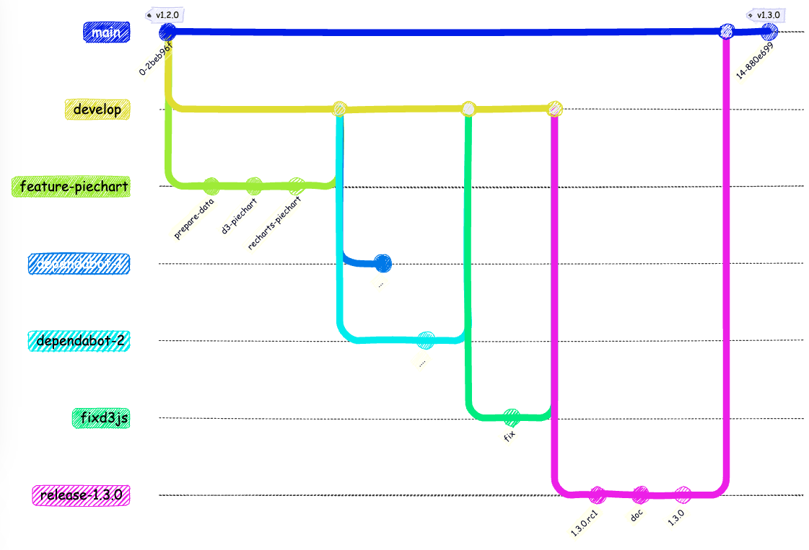
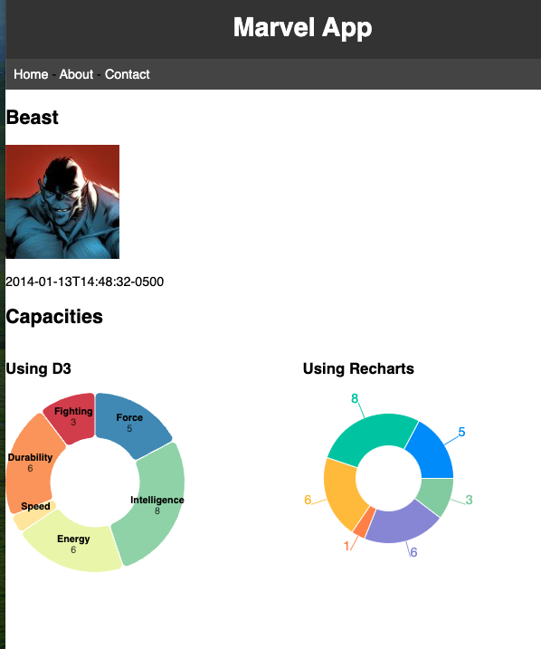

<!-- Add this CSS in your Markdown file to style the two-column layout -->
<style>
  .two-columns {
    display: flex;
  }
  .column {
    flex: 1;
    padding: 0 20px;
  }

  span {
    color: grey;
  }
</style>


# Marvel - Version 1.3.0

---

# Objectifs

Ajout de graphiques pour visualiser les données
- Utilisation de la librairie `d3.js`
- Utilisation de la librairie `recharts`

Quelle librairie choisir ?
- utilisation adaptée à notre besoin
- maintenabilité
- popularité
- licence...

Gestion des dépendances

---

<!-- ```mermaid
gitGraph
    checkout main
    commit tag: "v1.1.0"
    branch develop
    checkout develop
    branch feature-sonarcloud
    checkout feature-sonarcloud
    commit id: "workflow"
    checkout develop
    merge feature-sonarcloud
    branch feature-increase-coverage
    checkout feature-increase-coverage
    commit id: "AboutPage"
    commit id: "..."
    checkout develop
    merge feature-increase-coverage
    branch feature-sort
    commit id: "api"
    commit id: "...."
    commit id: "....."
    checkout develop
    merge feature-sort
    branch release-1.2.0
    checkout release-1.2.0
    commit id: "1.2.0.rc1"
    commit id: "doc"
    commit id: "1.2.0"
    checkout main
    merge release-1.2.0
    commit tag: "v1.2.0"
-->



---

# Visualisation des données

Créer la branche `feature/pie-chart`

Modifier le fichiers `src/data/characters.json` pour ajouter des données permettant de générer un graphique en camembert en récupérant le fichier [characters.json](https://but-sd.github.io/prez/characters-full-with-capacities.json)

Le fichier contient les nouvelles données **capacities** qui montrent les capacités des personnages (intelligence, force, vitesse, endurance, etc.)

---

# Visualisation des données (suite)



---

# Préparation des données

Mettre en place une fonction pour transformer les données en un format utilisable par `recharts` ou `d3.js`.

Nous allons utiliser la méthode **T**est-**D**riven **D**evelopment pour créer cette fonction. On commence par écrire les tests, la fonction n'existe pas encore. Les tests doivent échouer.

L'objectif est d'implémenter la fonction pour que les tests passent, si les tests passent, on peut être sûr que la fonction fait ce qu'on attend d'elle.

---
<!-- header: "" -->
<!-- footer: "" -->

Créer le fichier `src/components/chart-utils.test.js` et ajouter les tests suivants :

```javascript
import { prepareData } from './chart-utils';

describe('prepareData', () => {
    it('should return an empty array when no data is provided', () => {
        const result = prepareData();
        expect(result).toEqual([]);
    });

    it('should return the correct transformed data when all values are provided', () => {
        const data = {
            force: 10,
            intelligence: 8,
            energy: 7,
            speed: 9,
            durability: 6,
            fighting: 5,
        };
        const expected = [
            { name: 'Force', value: 10 },
            { name: 'Intelligence', value: 8 },
            { name: 'Energy', value: 7 },
            { name: 'Speed', value: 9 },
            { name: 'Durability', value: 6 },
            { name: 'Fighting', value: 5 },
        ];
        const result = prepareData(data);
        expect(result).toEqual(expected);
    });

    it('should filter out elements with undefined values', () => {
        const data = {
            force: 10,
            intelligence: undefined,
            energy: 7,
            speed: undefined,
            durability: 6,
            fighting: 5,
        };
        const expected = [
            { name: 'Force', value: 10 },
            { name: 'Energy', value: 7 },
            { name: 'Durability', value: 6 },
            { name: 'Fighting', value: 5 },
        ];
        const result = prepareData(data);
        expect(result).toEqual(expected);
    });

    it('should handle partial data correctly', () => {
        const data = {
            force: 10,
            energy: 7,
        };
        const expected = [
            { name: 'Force', value: 10 },
            { name: 'Energy', value: 7 },
        ];
        const result = prepareData(data);
        expect(result).toEqual(expected);
    });
});
```

---

# Visualisation des données - d3.js

**d3.js** est une librairie JavaScript pour manipuler des documents basés sur des données. Elle permet de manipuler le DOM pour créer des visualisations de données. Elle est très utilisée dans le monde du web pour créer des graphiques, des cartes, des diagrammes, etc.

Installer la librairie `d3.js` :

```bash
npm install d3@6
```

Nous installons ici la version 6 de `d3.js`, car la version 7 n'est pas compatible avec notre projet. Nous verrons plus tard comment gérer ce genre de problèmes.

---

# Visualisation des données - d3.js (suite)

Créer le fichier `src/components/D3PieChart.jsx`

En vous basant sur l'exemple [donut-chart](https://observablehq.com/@d3/donut-chart/2) adapté le composant ci-dessous, pour afficher un graphique en camembert des capacités des personnages.

---

```javascript
import { useEffect } from "react";
import * as d3 from "d3";
import { prepareData } from './chart-utils';

// Define the diameter of the pie
const diameter = 100;

// Define the margin
const margin = {
    top: 10, right: 10, bottom: 10, left: 10,
};

// Define the width and height using the margin conventions
const width = 2 * diameter + margin.left + margin.right;
const height = 2 * diameter + margin.top + margin.bottom;

// Define the radius
const radius = Math.min(width, height) / 2;

const drawChart = (data) => {
    // Remove the old svg if it exists (in development)
    d3.select('#pie-container')
        .select('svg')
        .remove();

    // TODO: draw the chart here base on example https://observablehq.com/@d3/donut-chart/2
        // Create the color scale
        // Create the pie chart
            // Create the arc
            // Create the pie
            // Create the svg, with the right dimensions
        // draw the donut
        // add labels over the donut

};

export default function D3PieChart({
    data,
}) {
    // useEffect is a hook that will run the code inside it only once when data is loaded
    useEffect(() => {
        // transform data
        const preparedData = prepareData(data);

        // draw the chart
        drawChart(preparedData);
    }, [data]);

    return (
        // Return the div that will contain the chart
        <div id="pie-container" />
    );
}
```

---

# Visualisation des données - d3.js (suite)

Le composant `D3PieChart` génère une div avec l'id `pie-container` qui sera utilisée pour afficher le graphique. Le hook `useEffect` permet d'executer le code de la fonction `drawChart` uniquement lorsque les données sont chargées. Le composant défini également les dimensions du graphique.

La fonction `drawChart` permet de dessiner le graphique, elle prend en paramètre les données à afficher. Il n'y a pas de spécificité React dans cette fonction.

Tout d'abord, on supprime le graphique précédent, s'il existe (en mode développement la fonction `useEffect` est appelée 2 fois).

On utilise ensuite les fonctions prédéfinies de `d3.js` pour créer le graphique en camembert, voir la documentation pour plus de détails.

---

# Visualisation des données - d3.js (suite)

Modifier le fichier `src/pages/CharacterDetailPage.jsx` pour afficher le graphique en camembert des capacités des personnages.

Dans un premier temps, commentez la partie permettant d'afficher le composant `RechartsPieChart`.

---

```javascript
import React, { useEffect } from 'react';

import { useLoaderData } from 'react-router';
import CharacterDetail from '../components/CharacterDetail';
import D3PieChart from '../components/D3PieChart';
import RechartsPieChart from '../components/RechartsPieChart';

const CharacterDetailPage = () => {
    // retrieve the character using the useLoaderData hook
    const character = useLoaderData();

    useEffect(() => {
        document.title = `${character.name} | Marvel App`;
    }, [character]);

    return (
        <>
            <CharacterDetail character={character} />

            <h2>Capacities</h2>
            <div style={{ display: 'flex'}}>
                <div style={{flex: '50%'}}>
                    <h3>Using D3</h3>
                    <D3PieChart data={character.capacities} />
                </div>
                <div style={{flex: '50%'}}>
                    <h3>Using Recharts</h3>
                    <RechartsPieChart data={character.capacities} />
                </div>
            </div>
        </>
    );
};

export default CharacterDetailPage;
```

---

# Visualisation des données - d3.js (suite)

Le test `src/components/D3PieChart.test.jsx` ci-dessous permet de vérifier que le composant `D3PieChart` affiche bien les données passées en paramètre avec l'affichage des noms et des valeurs. Faites en sorte que ce test passe.

---

```javascript
import '@testing-library/jest-dom';
import { render, screen } from '@testing-library/react';
import D3PieChart from './D3PieChart';
import { prepareData } from './chart-utils';

// Mock the prepareData function
jest.mock('./chart-utils', () => ({
    prepareData: jest.fn(),
}));

describe('D3PieChart', () => {
    const data = [
        { name: 'Force', value: 10 },
        { name: 'Intelligence', value: 8 },
        { name: 'Energy', value: 7 },
        { name: 'Speed', value: 9 },
        { name: 'Durability', value: 6 },
        { name: 'Fighting', value: 5 },
    ];

    beforeEach(() => {
        prepareData.mockReturnValue(data);
    });

    test('renders D3PieChart with label and value', () => {
        render(<D3PieChart data={data} />);

        screen.debug();

        expect(document.getElementById('pie-container')).toBeInTheDocument();

        // Check if the data is displayed
        data.forEach((item) => {
            const nameLabel = screen.getByText(item.name);
            expect(nameLabel).toBeInTheDocument();
            const valueLabel = screen.getByText(item.value);
            expect(valueLabel).toBeInTheDocument();
        });
    });
});
```
---

# Visualisation des données - recharts

**recharts** est une librairie React pour créer des graphiques. Elle est basée sur `d3.js` et permet de créer des graphiques de manière simple et rapide en manipulant des composants React. Cela peut être plus simple à utiliser que d3.js pour des développeurs React, mais elle est moins flexible que **d3.js**.

Installer la librairie `recharts` :

```bash
npm install recharts
```

Décommenter le composant RechartsPieChart dans le fichier `src/pages/CharacterDetailPage.jsx` et implémenter le composant `RechartsPieChart` dans le fichier `src/components/RechartsPieChart.jsx`, en se basant sur l'exemple [PieChart](https://recharts.org/en-US/api/Cell).

---

# Visualisation des données - recharts (suite)

Faire en sorte que le test `src/components/RechartsPieChart.test.jsx` ci-dessous passe.

Du fait que le composant `RechartsPieChart` est basé sur **recharts**, on ne doit pas tester le graphique directement. En effet, recharts est une librairie externe, on ne doit pas tester son code, on n'en a pas la responsabilité et le code pourrait changer à tout moment.

On peut par contre tester que le composant est bien rendu.

---

```javascript
import '@testing-library/jest-dom';
import { render, screen } from '@testing-library/react';
import RechartsPieChart from './RechartsPieChart';
import { prepareData } from './chart-utils';

// Mock the prepareData function
jest.mock('./chart-utils', () => ({
    prepareData: jest.fn(),
}));

describe('RechartsPieChart', () => {
    const data = [
        { name: 'Force', value: 10 },
        { name: 'Intelligence', value: 8 },
        { name: 'Energy', value: 7 },
        { name: 'Speed', value: 9 },
        { name: 'Durability', value: 6 },
        { name: 'Fighting', value: 5 },
    ];

    beforeEach(() => {
        prepareData.mockReturnValue(data);
    });

    test('renders RechartsPieChart', () => {
        render(<RechartsPieChart data={data} />);

        // expect to have a div with the class "recharts-wrapper"
        expect(document.querySelector('.recharts-wrapper')).toBeInTheDocument();
    });
});
```
---

# Comparaison des deux approches

L'avantage de **d3.js** est qu'elle est très flexible du fait qu'elle manipule directement le DOM. On peut donc faire des graphiques très personnalisés. Par contre, il faut avoir des connaissances en **d3.js** pour pouvoir l'utiliser. Elle n'est pas liée à React, il faut donc faire attention à bien intégrer le graphique dans le cycle de vie de React, mais à contrario, on peut l'utiliser dans d'autres frameworks ou même sans framework (avec du JavaScript pur).

**recharts** est plus simple à utiliser que **d3.js** et permet de créer des graphiques rapidement, toute la complexité est cachée dans les composants React. Par contre, elle est moins flexible que **d3.js** et il peut être difficile de faire des graphiques très personnalisés. Elle est liée à React, il n'est donc pas possible de l'utiliser dans d'autres frameworks ou avec du JavaScript pur.

---

# Librairies tierces

Lors de l'utilisation d'une librairie externe, il faut bien vérifier la documentation et les exemples fournis afin de bien comprendre comment l'utiliser.

- Est-ce que la librairie est bien adaptée à notre besoin ? Est-ce que la librairie est facile à utiliser ? 
- Est-ce que la librairie est bien maintenue ? Est-ce que la librairie est utilisée par la communauté ? 
- Est-ce que je peux utiliser la librairie dans mon projet ? Est-ce que la librairie est payante ?

---

# Librairies tierces - Maintenance / Communauté

Si la librairie n'est plus maintenue, elle peut devenir obsolète, poser des problèmes de sécurité, de  compatibilité et ne plus fonctionner avec les nouvelles versions des navigateurs et rendre notre application obsolète. C'est un risque à prendre en compte lors de l'utilisation d'une librairie externe.

Si la librairie est utilisée par la communauté, cela signifie qu'elle est utilisée par d'autres développeurs et qu'il y a donc plus de chance qu'elle soit maintenue, que les bugs soient corrigés et que de nouvelles fonctionnalités soient ajoutées.

Il est plus facile de trouver de l'aide sur internet, de même que des exemples d'utilisation. 

---

# Librairies tierces - Licence

Il faut également faire attention à la licence de la librairie. Certaines licences peuvent être restrictives et ne pas permettre l'utilisation de la librairie dans un projet commercial. Il faut donc bien lire la licence de la librairie avant de l'utiliser.

Par exemple, la licence **MIT** est une licence très permissive qui permet d'utiliser la librairie dans un projet commercial. La licence **GPL** est une licence plus restrictive qui oblige à rendre le code source de l'application disponible si on utilise la librairie dans un projet commercial.

---

# Librairies tierces - Licence (suite)

Pour des projets hébergés sur **GitHub**, il est possible de voir la licence sur la page du projet. **Github** affiche ainsi quelques informations sur le type de licence et les conditions d'utilisation liées à la licence.

Par exemple la licence de d3.js est une licence **ISC**, qui est une licence **MIT** modifiée. Elle permet d'utiliser la librairie dans un projet commercial. https://github.com/d3/d3/blob/main/LICENSE

La licence de recharts est une licence **MIT**. https://github.com/recharts/recharts/blob/master/LICENSE

---

# Librairies tierces - Sécurité

Il est important de vérifier la sécurité des librairies tierces que l'on utilise dans notre projet. En effet, une librairie tierce peut contenir des failles de sécurité qui peuvent être exploitées par des attaquants pour compromettre notre application.

Pour un projet **Node.js**, il est possible d'utiliser la commande `npm audit` pour vérifier la sécurité des dépendances de notre projet. Cette commande va analyser les dépendances de notre projet et nous indiquer s'il y a des failles de sécurité connues dans ces dépendances. 

Des commandes équivalentes existent pour d'autres langages et frameworks.

---

# Librairies tierces - Sécurité (suite)

Dans notre projet, la commande `npm audit` nous indique qu'il y a une faille de sécurité de sévérité `high` dans la librairie `d3.js`. La faille de sécurité est de type `vulnerable to (ReDoS)`. Cela signifie que la librairie `d3.js` est vulnérable à une attaque par déni de service régulier (ReDoS). 

Une attaque par déni de service régulier (ReDoS) est une attaque qui exploite une faiblesse dans l'implémentation d'une expression régulière pour provoquer un déni de service en faisant en sorte que l'expression régulière prenne un temps d'exécution anormalement long pour traiter une entrée donnée. 

L'attaquant peut ainsi provoquer un déni de service en envoyant des requêtes malveillantes qui exploitent cette faiblesse. Le deni de service peut être utilisé pour rendre un service indisponible ou pour ralentir le service.

---

# Librairies tierces - Sécurité (suite)

Il est donc important de corriger cette faille de sécurité dans notre projet. Cependant cette correction entraine une montée de version majeure de la librairie `d3.js`, cette montée de version contient une rupture de compatibilité avec notre projet. Nous ne pouvons donc pas simplement mettre à jour la librairie `d3.js` sans risquer de casser notre projet.

Il est donc nécessaire de corriger la faille de sécurité dans une branche dédiée, de tester la correction et de s'assurer qu'elle ne casse pas notre projet avant de la fusionner dans la branche principale. Nous n'allons pas corriger cette faille de sécurité afin de tester une autre fonctionnalité de **GitHub**, appelée **Dependabot**.

---

# Librairies tierces - Sécurité - Dependabot

Github propose l'outil **dependabot alerts**  pour détecter les failles de sécurité dans les dépendances de notre projet. Cet outil est accessible dans l'onglet `Security` de notre projet. Il permet de voir les dépendances vulnérables de notre projet et de voir les dépendances qui ont été corrigées.

Il permet aussi de générer automatiquement des pull requests pour corriger les failles de sécurité dans notre projet, si nous avons mis en place suffisament de contrôles (tests, CI/CD), nous pouvons être confiants que la correction ne va pas casser notre projet. Pour cela il suffit d'activer la fonctionnalité **Dependabot security updates** dans les paramètres de notre projet (Settings > Security)

--- 

# Librairies tierces - Sécurité - Dependabot

**Dependabot** analyse la branche principale de notre projet, afin de ne pas impacter directement la branche de production ```main```, nous allons définir la branche de développement ```develop``` comme branche par défaut, cela évitera aussi de créer des pull requests directement sur la branche ```main``` par défaut.

Pour cela, il suffit de se rendre dans les paramètres de notre projet (Settings > Branches) et de définir la branche ```develop``` comme branche par défaut.

---

# Librairies tierces - Sécurité - Dependabot (suite)

Le fait d'avoir activer **Dependabot security updates** dans notre projet à créé une pull request pour corriger la faille de sécurité dans la librairie `d3.js`. Cette pull request n'est pas fusionnable directement car elle entraine une montée de version majeure de la librairie `d3.js` qui contient une rupture de compatibilité avec notre projet.

Il convient donc de corriger le problème. La modification pouvant être importante, il est préférable de créer une branche dédiée pour corriger le problème.

Une fois le problème corrigé et fusionné sur la branche principale, la pull request de **Dependabot** sera automatiquement fermée par **Dependabot**.

---

# Librairies tierces - Sécurité - Dependabot (suite)

Créer une branche `fix-d3-security` pour corriger la faille de sécurité dans la librairie `d3.js`.

Modifier le fichier `package.json` pour mettre à jour la version de la librairie `d3.js` vers la version `7.9.0`, puis lancer la commande `npm install` pour mettre à jour la librairie.

Démarrer le serveur de développement avec la commande `npm run dev` et vérifier que le projet fonctionne correctement.

Executer les tests avec la commande `npm test` pour vérifier que la correction ne casse pas les tests.

---

# Librairies tierces - Sécurité - Dependabot (suite)

On constate que les tests ne passent plus, la montée de version de la librairie `d3.js` a entrainé une rupture de compatibilité avec notre projet. Afin de corriger le problème il suffit de modifier le fichier de configuration de jest `jest.config.cjs` pour ajouter la ligne suivante :

```javascript
  moduleNameMapper: {
    "d3": "<rootDir>/node_modules/d3/dist/d3.min.js",
  }
```

Les tests passent à nouveau, on peut donc fusionner la branche `fix-d3-security` dans la branche **develop**. La pull request de **Dependabot** devrait se fermer automatiquement.

---

# Librairies tierces - Dependabot (suite)

**Dependabot** permet aussi de mettre à jour automatiquement les dépendances de notre projet, au delà des failles de sécurité. Il permet de garder les dépendances de notre projet à jour et de bénéficier des dernières fonctionnalités et des dernières corrections de bugs.

Il est possible de configurer **Dependabot** pour qu'il mette à jour automatiquement les dépendances de notre projet en fonction de certains critères (type de dépendance, fréquence de mise à jour, etc.).

Dans le cas d'un projet **Node.js**, il est possible par exemple de regrouper les mises à jour par type (devDependencies, dependencies).

---

# Librairies tierces - Dependabot (suite)

Pour activer **Dependabot** pour les dépendances de notre projet, il suffit de se rendre dans les paramètres de notre projet (Settings > Security > Code security) et d'activer la fonctionnalité **Dependabot version updates**.

---

# Librairies tierces - Dependabot (suite)

```yaml
# To get started with Dependabot version updates, you'll need to specify which
# package ecosystems to update and where the package manifests are located.
# Please see the documentation for all configuration options:
# https://docs.github.com/code-security/dependabot/dependabot-version-updates/configuration-options-for-the-dependabot.yml-file

version: 2
updates:
  - package-ecosystem: "npm" # See documentation for possible values
    directory: "/" # Location of package manifests
    schedule:
      interval: "weekly"

    groups:
      # group dev dependencies together
      development-dependencies:
        dependency-type: "development"
```    

---

# Release 1.3.0

Faire le nécessaire pour créer une version 1.3.0 de l'application