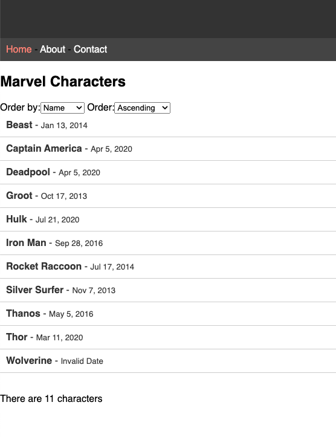
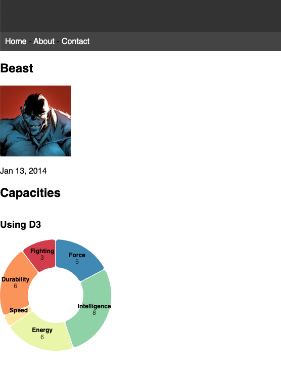
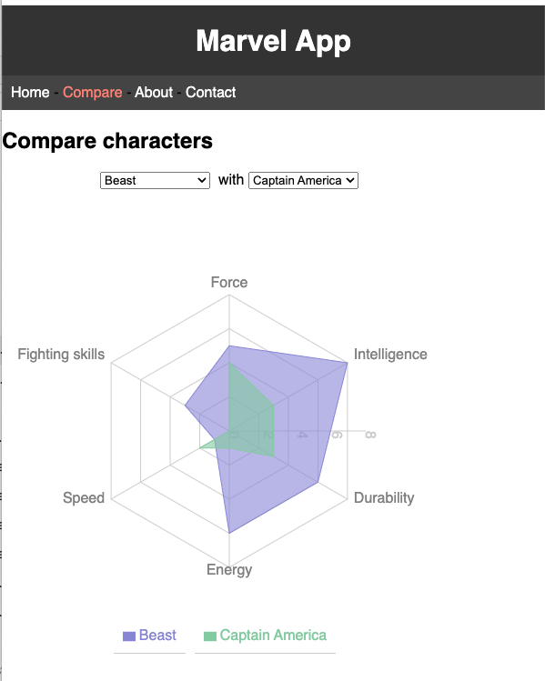

<!-- Add this CSS in your Markdown file to style the two-column layout -->

# Marvel - Version 1.5.0 - Evaluation

---

# Objectifs

- Evaluation des compétences acquises en développement web
- Evaluation des compétences acquises en bonnes pratiques de développement

---

# Fonctionnalité - Affichage date - Session 1 - Lundi 2 Décembre 2024

- Afficher la date de modification du personnage (donnée **modified** d'un personnage) dans un format lisible par un humain
  - la date de modification est au format ISO 8601 et ne doit pas être modifiée dans le fichier JSON (sauf éventuellement sur un personnage pour tester le cas d'une date non conforme)
- Ajouter l'affichage de cette date dans la liste des personnages et dans le détail d'un personnage
- Appliquer la bonne pratique permettant d'avoir le même comportement sur les deux pages

---

# Fonctionnalité - Affichage date (suite)

  

    
  

  

    
  

---

# Fonctionnalité - Affichage date (suite)

- La librairie [**date-fns**](https://date-fns.org/v4.1.0/docs/format) permet de manipuler des dates en JavaScript de manière simple et efficace
- Les balises `<strong>` et `<small>` peuvent être utilisées pour mettre en avant le nom du personnage et en retrait la date de modification
- Les tests unitaires devront sûrement être adaptés pour prendre en compte cette nouvelle fonctionnalité

---

# Fonctionnalité - Affichage date - Mise à disposition du code

- Les bonnes pratiques de développement doivent être respectées (commit, nommage, formatage, ...) afin de faciliter la relecture du code et seront évaluées,
- Proposer cette modification à l'équipe de développement (alex1dregirard) pour une éventuelle intégration au projet si elle est jugée pertinente, c'est cette modification qui sera évaluée,
  - Il est nécessaire d'inviter l'utilisateur `alex1dregirard` sur le dépôt GitHub pour qu'il puisse accéder au code
- Les modifications doivent être finalisées en fin de session 1, aucune modification ne sera acceptée après la fin de la session.

<!-- ---

# Fonctionnalité - Comparaison des personnages - Session 2 - Mardi 3 Décembre 2024

- Ajouter une fonctionnalité permettant de comparer deux personnages
  - Ajouter un élément de menu `Compare` permettant d'accéder à cette fonctionnalité
  - Ajouter une page de comparaison permettant d'afficher les deux personnages sélectionnés
    - Intégrer un graphique `recharts` permettant de comparer les caractéristiques des deux personnages

---

# Fonctionnalité - Comparaison des personnages (suite)

--- -->