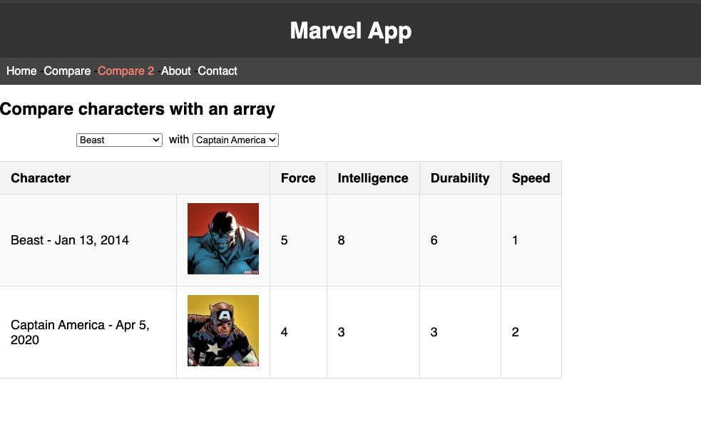

<!-- Add this CSS in your Markdown file to style the two-column layout -->
<style>
  .two-columns {
    display: flex;
  }
  .column {
    flex: 1;
    padding: 0 20px;
  }

  span {
    color: grey;
  }
</style>


# Marvel - Version 1.5.1 - Evaluation rattrapage

---

# Objectifs

- Evaluation des compétences acquises en développement web
- Evaluation des compétences acquises en bonnes pratiques de développement

---

# Prise en main

- Cloner le dépôt [**marvel-app**](https://github.com/but-sd/marvel-app-alessandraDiMauro)
- Voir le fichier README.md pour les instructions d'installation et de lancement de l'application
---

# Fonctionnalité - Page de comparaison des personnages version tableau

- Faire le nécessaire pour proposer la fonctionnalité de comparaison des personnages sous forme de tableau
- Ajouter un élément de menu `Compare 2` permettant d'accéder à une page de comparaison des personnages sous forme de tableau
- La page de comparaison doit permettre de sélectionner deux personnages parmi la liste des personnages et afficher un tableau comparatif des caractéristiques des deux personnages

La page ci-dessous présente le rendu attendu de cette fonctionnalité, la suivante présente un squelette de code pour démarrer le développement de cette fonctionnalité.

---



---

```javascript
import React from 'react';

const Compare2CharactersPage = () => {
    // change the title of the page
    document.title = "Compare | Marvel App";

    // A supprimer, permet de rendre le composant fonctionnel dans un premier temps
    const characters = [
        {
            name: '...'
        },{
            name: '---'
        }
    ]
    // Fin de la partie à supprimer

    // transform the characters to array of label/value objects
    const options = characters.map((character, index) => ({
        value: index,
        label: character.name,
    }));

    // set the default options to the first two characters
    const [option1, setOption1] = React.useState(options[0]);
    const [option2, setOption2] = React.useState(options[1]);

    const centerStyle = {
        textAlign: 'center',
        width: 500,
    };

    return (
        <>
            <h2>Compare characters with an array</h2>

            <p style={centerStyle}>
                <select
                    data-testid='select-character-1'
                    value={option1.value}
                    onChange={(event) => setOption1(options[event.target.value])}
                >
                    {options.map((option) => (
                        <option key={option.value} value={option.value}>
                            {option.label}
                        </option>
                    ))}
                </select>&nbsp; {/* Fix the ambiguous spacing */}
                with&nbsp;
                <select
                    data-testid='select-character-2'
                    value={option2.value}
                    onChange={(event) => setOption2(options[event.target.value])}
                >
                    {options.map((option) => (
                        <option key={option.value} value={option.value}>
                            {option.label}
                        </option>
                    ))}
                </select>
            </p>

            { /* A supprimer, permet le voir comment récupérer les éléments selectionnés */ }
            <p style={centerStyle}>
                {characters[option1.value].name} vs {characters[option2.value].name}
            </p>
            { /* Fin de la partie à supprimer */ }
        </>
    );
};

export default Compare2CharactersPage;
```

---

# Fonctionnalité - Comparaison des personnages (suite)

Quelques informations pour vous aider dans le développement de cette fonctionnalité :

- Il existe déjà des bouts de code dans l'application pour la navigation et l'affichage des personnages, vous pouvez vous appuyer sur ces éléments pour développer cette fonctionnalité
- Pour l'écriture de la fonctionnalité et la génération des tests unitaires, il est surement plus simple de se baser sur le code existant plutôt que de demander à `github copilot` de générer le code à partir de rien

---

Une proposition de mise en oeuvre de cette fonctionnalité par étapes :
- Ajouter un élément de menu `Compare 2` pour accéder à la page de comparaison 
  - Appuyer vous sur ce qui existe déjà dans l'application pour la navigation et l'affichage des personnages
- Faite en sorte d'alimenter correctement les deux zones de liste déroulante
- Mettre en oeuvre le tableau de comparaison des personnages
- Ajouter des tests unitaires pour valider le bon fonctionnement de la page de comparaison

---

# Fonctionnalité - Comparaison des personnages (suite)

- L'application et les exemples fournis devraient vous permettre de produire une solution fonctionnelle et de qualité, `github copilot` pourra vous aider 🪄 mais il ne remplacera pas votre réflexion 🧠 sur la mise en oeuvre de la fonctionnalité et pourrait même être contre productif si vous lui en demander trop. C'est un assistant, pas un développeur à part entière . 

---

# Fonctionnalité - Comparaison des personnages - Mise à disposition du code

- Les différentes étapes de mise en oeuvre pourraient être séparées en commits distincts pour vous aider à structurer votre travail et faciliter la relecture 😉 du reviewer, mais aussi de fournir du code fonctionnel mais pas forcément complet en cas de difficultés

---

# Fonctionnalité - Comparaison des personnages - Mise à disposition du code

- Petit rappel, une `Pull Request` est un moyen de proposer des modifications à un projet, elle permet de discuter des modifications apportées et de les faire valider avant de les intégrer au projet. 
- Une `Pull Request` peut-être en mode `draft` le temps de la finaliser, elle peut-être mise à jour autant de fois que nécessaire avant de la finaliser pour relecture.
