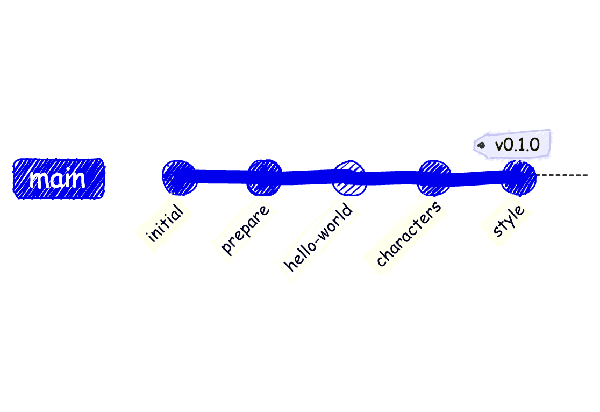
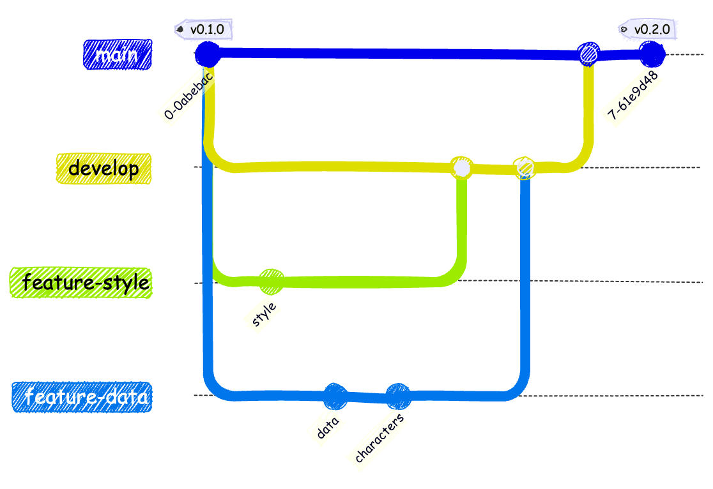
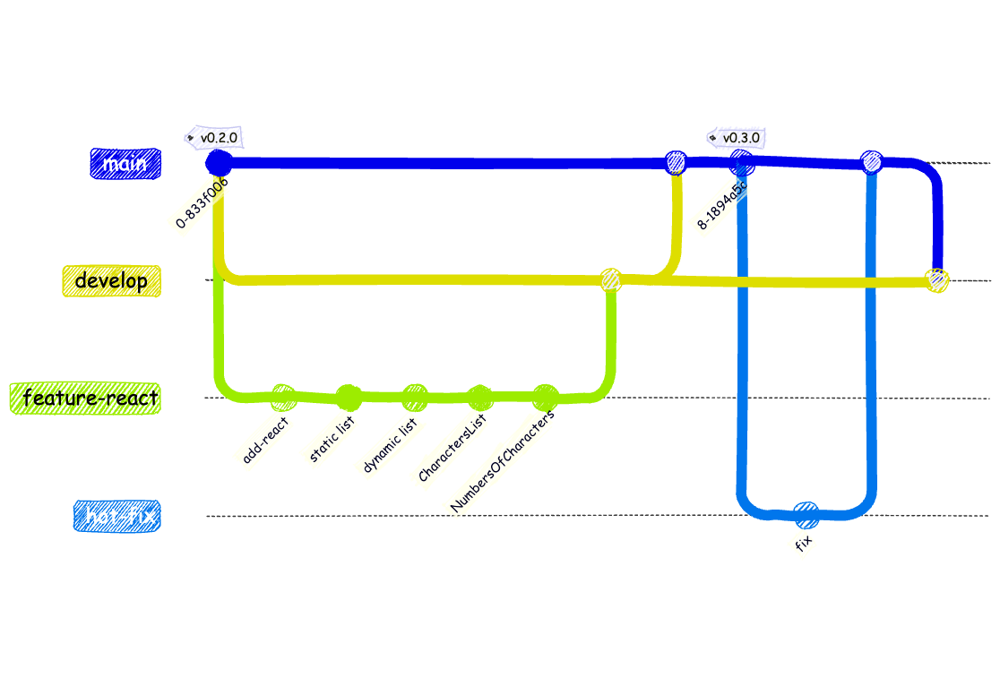

<!-- Add this CSS in your Markdown file to style the two-column layout -->
<style>
  .two-columns {
    display: flex;
  }
  .column {
    flex: 1;
    padding: 0 20px;
  }

  span {
    color: grey;
  }
</style>

<!-- Add script to support mermaid -->
<script src="https://unpkg.com/pako@1.0.10/dist/pako_deflate.min.js" async></script>
<script>
document.addEventListener('DOMContentLoaded', function() {
    setTimeout(function() {
        Array.from(document.querySelectorAll('.language-mermaid')).map(function(pre) {
            const encoded = new TextEncoder('utf-8').encode(pre.textContent);
            const compressed = window.pako.deflate(encoded, { level: 9, to: 'string' });
            const urlencoded = btoa(compressed).replace(/\+/g, '-').replace(/\//g, '_');
            const url = `https://kroki.io/mermaid/svg/${urlencoded}`;
            const img = document.createElement('img');
            img.src = url;
            pre.replaceWith(img);
        });
    // Give marp some time to load itself etc...
    }, 1000);
});
</script>


# Construction de l'application Marvel

Mettre en oeuvre les différents concepts manipulés au cours du développement d'une application web moderne.

---

# Objectifs

## Travailler de manière professionnelle
    
* Travailler en équipe: agilité, versionning, historique, branches, tags, issues, pull requests...
* Utiliser les bons outils: IDE, Source Control, linters, formatters... 
* Respecter les bonnes pratiques et normes : qualité, tests, CI/CD...
* Documenter son travail: README, Documentation...
    
---

# Concepts manipulés

- __agilité__ : méthode de développement
- __développement web__ : html, css, javascript, typescript, react
- __aide au développement__: vscode, github copilot, eslint, prettier
- __travail collaboratif__: git, github
- __tests unitaires, tests d'intégration__: jest, cypress, playwright
- __intégration continue__: github actions
- __déploiement continu__: github actions
- __documentation__: markdown, mkdocs
- __qualimétrie__: sonarqube

---

# Initialisation du projet marvel-app
    
* Créer un dépôt sur GitHub avec le nom `marvel-app`. Cocher la case `Initialize this repository with a README`
    * Le fichier README.md permet de décrire le projet, son objectif, son fonctionnement, les prérequis, les étapes d'installation, de configuration et de lancement. Nous y reviendrons plus tard.

* Cloner le dépôt sur votre machine locale avec la commande:
    * `git clone https://github.com/<votre-login>/marvel-app.git`
    * Ne pas utiliser le lecteur réseau __Z:__ pour travailler sur le projet. Utiliser un répertoire local sur votre machine pour éviter les problèmes.

---

# Version 0.1.0 - Objectif


<!-- ```mermaid
gitGraph
    checkout main
    commit id:"initial"
    commit id:"prepare"
    commit id:"hello-world"
    commit id:"characters"
    commit id:"style" tag: "v0.1.0"
``` -->



* Gestion de version - __semver__
* Préparation du projet
    * Utilisation de __npm__ pour gérer les dépendances du projet
    * Utilisation de __browser-sync__ pour créer un serveur web local
* Implémentation d'une page web
    * Contenu statique de la page __HTML__ (**H**yper**T**ext **M**arkup **L**anguage)
    * Application du style avec __CSS__ (**C**ascading **S**tyle **S**heets)

---

# Version 0.2.0 - Objectif

* Utilisation de **git** pour travailler sur plusieurs fonctionnalités en même temps
  * Gestion des branches
  * git flow
* Ajout de contenu **J**ava**S**cript pour récupérer des données depuis un fichier __JSON__
* Ajout de style **CSS** pour améliorer l'affichage

---

# Version 0.2.0 - Objectif (suite)



<!-- ```mermaid
gitGraph
    checkout main
    commit tag: "v0.1.0"
    branch develop
    checkout develop
    branch feature-style
    branch feature-data
    checkout feature-style
    commit id: "style"
    checkout feature-data
    commit id: "data"
    commit id: "characters"
    checkout develop
    merge feature-style
    merge feature-data
    checkout main
    merge develop
    commit tag: "v0.2.0"
``` -->

---

# Version 0.3.0 - Objectif

* Transformation de la page statique en application web dynamique
  * Utilisation de __React__ pour créer des composants réutilisables
* Détection d'un bug dans la version 0.3.0
  * Création d'une branche de type correctif

---

# Version 0.3.1 - Objectif (suite)



<!-- ```mermaid
gitGraph
    checkout main
    commit tag: "v0.2.0"
    branch develop
    checkout develop
    branch feature-react
    checkout feature-react
    commit id: "add-react"
    commit id: "static list"
    commit id: "dynamic list"
    commit id: "CharactersList"
    commit id: "NumbersOfCharacters"
    checkout develop
    merge feature-react
    checkout main
    merge develop
    commit tag: "v0.3.0"
    branch hot-fix
    commit id: "fix"
    checkout main
    merge hot-fix
    checkout develop
    merge main
``` -->

---

